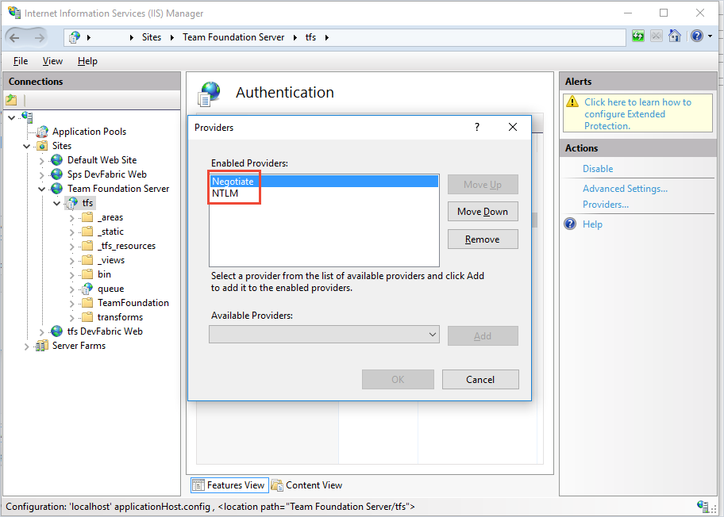

# Configure TFS authentication for your private build and release agents

**TFS 2018 | TFS 2017 | TFS 2015 | [Previous versions (XAML builds)](https://msdn.microsoft.com/en-us/library/ms252495%28v=vs.120%29.aspx)**

When you deploy a self-hosted agent, you choose how the agent will authenticate to your Team Foundation Server (TFS). Here we'll show you how to configure TFS to enable your agents to use different authentication methods.

## Log on to your server

Log on to the machine where you are running TFS.

## Configure authentication

### Alternate

Configure basic authentication. See https://github.com/Microsoft/tfs-cli/blob/master/docs/configureBasicAuth.md.

### Integrated

Start Internet Information Services (IIS) Manager. Select your TFS site and make sure Windows Authentication is enabled with a valid provider such as NTLM or Kerberos.

### Negotiate

Start Internet Information Services (IIS) Manager. Select your TFS site and make sure Windows Authentication is enabled with the Negotiate provider and with another method such as NTLM or Kerberos.

### PAT

Personal access token (PAT) authentication is available in TFS 2015.3 and newer. To use a PAT, your server must be configured with HTTPS. See [Web site settings and security](../../security/websitesettings.md).

## Deploy your agent

::: moniker range=">= tfs-2017"

### TFS 2017 and newer

* [Windows agent v2](v2-windows.md)
* [macOS agent](v2-osx.md)
* [Ubuntu 14.04 agent](v2-linux.md)
* [Ubuntu 16.04 agent](v2-linux.md)
* [Red Hat agent](v2-linux.md)

::: moniker-end

::: moniker range="tfs-2015"

### TFS 2015

* [Windows agent v1](v1-windows.md)
* [macOS agent](v2-osx.md)
* [Ubuntu 14.04 agent](v2-linux.md)
* [Ubuntu 16.04 agent](v2-linux.md)
* [Red Hat agent](v2-linux.md)

::: moniker-end
