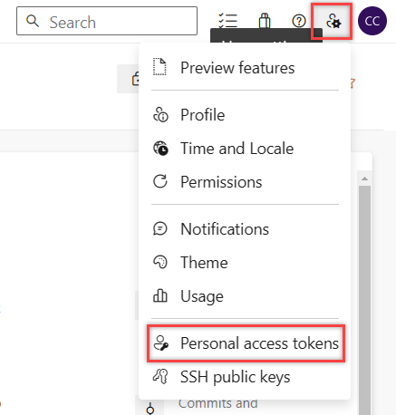
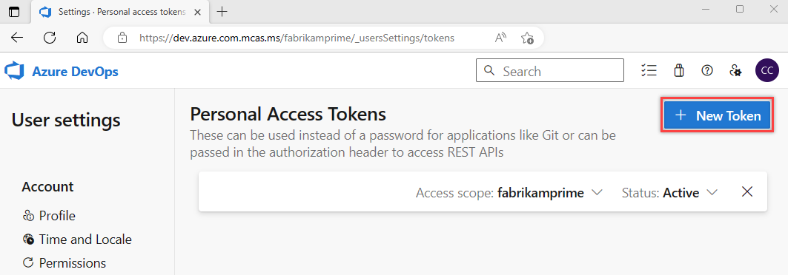

# Register an agent using a personal access token (PAT)

Specify **PAT** for authentication type during agent configuration to use a personal access token to authenticate during agent registration, then specify a personal access token (PAT) with **Agent Pools (read, manage)** scope (or **Deployment group (read, manage)** scope for a [deployment group](../release/deployment-groups/index.md) agent) can be used for agent registration.

A single PAT can be used for registering multiple agents, the PAT is used only at the time of registering the agent, and not for subsequent [communication](./agents.md#communication). 

To use a PAT with Azure DevOps Server, your server must be configured with HTTPS. See [Web site settings and security](/azure/devops/server/admin/websitesettings).

## Create a personal access token for agent registration

::: moniker range="<azure-devops"

1. Sign in with the user account you plan to use in your Azure DevOps Server web portal (`https://{your-server}/DefaultCollection/`).

::: moniker-end

::: moniker range="azure-devops"

1. Sign in with the user account you plan to use in your Azure DevOps organization (`https://dev.azure.com/{Your_Organization}`).

::: moniker-end

::: moniker range="< azure-devops"

2. From your home page, open your profile. Go to your security details.

   

3. [Create a personal access token](../../organizations/accounts/use-personal-access-tokens-to-authenticate.md).

   

   > [!NOTE]
   > If you are configuring a deployment group agent, or if you see an error when registering a VM environment resource, you must set the PAT scope to **All accessible organizations**. 
   > :::image type="content" source="media/prepare-permissions-pat-scope.png" alt-text="Screenshot of setting PAT scope to all accessible organizations.":::

::: moniker-end

::: moniker range="azure-devops"

2. From your home page, open your user settings, and then select **Personal access tokens**.

   

3. [Create a personal access token](../../organizations/accounts/use-personal-access-tokens-to-authenticate.md).

   

::: moniker-end

::: moniker range="<= azure-devops"

4. For the scope select **Agent Pools (read, manage)** and make sure all the other boxes are cleared.
   If it's a [deployment group](../release/deployment-groups/index.md) agent, for the scope select **Deployment group (read, manage)** and make sure all the other boxes are cleared.

   Select **Show all scopes** at the bottom of the **Create a new personal access token window** window to see the complete list of scopes.

5. Copy the token. You'll use this token when you configure the agent.

::: moniker-end

> [!NOTE]
> When using PAT as the authentication method, the PAT token is used only for the initial configuration of the agent. Learn more at [Communication with Azure Pipelines or TFS](./agents.md#communication).

## Next steps

* [Self-hosted Windows agents](./windows-agent.md)
* [Self-hosted Linux agents](./linux-agent.md)
* [Self-hosted macOS agents](./osx-agent.md)
