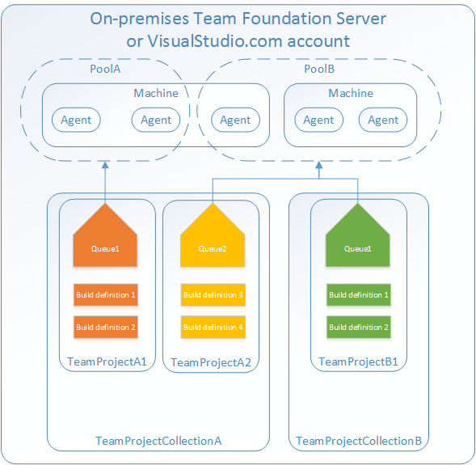
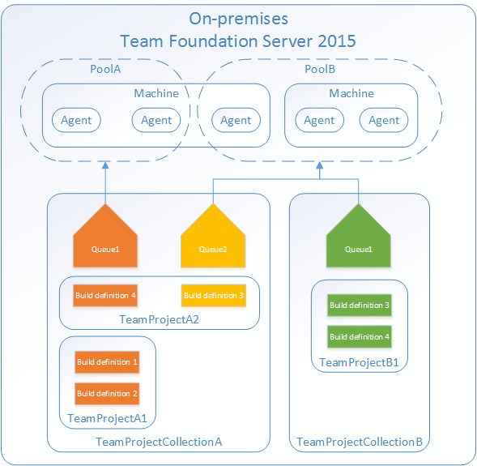

# Agent pools

[!INCLUDE [version-tfs-2015-rtm](../_shared/version-tfs-2015-rtm.md)]

::: moniker range="<= tfs-2018"
[!INCLUDE [temp](../_shared/concept-rename-note.md)]
::: moniker-end

Instead of managing each [agent](agents.md) individually, you organize agents into **agent pools**. An agent pool defines the sharing boundary for all agents in that pool. In TFS, pools are scoped across all of Team Foundation Server (TFS); so you can share an agent pool across project collections and projects. In Azure Pipelines, agent pools are scoped to the Azure DevOps organization; so you can share an agent pool across projects.

A **project agent pool** provides access to an **organization agent pool**. When you create a build or release pipeline, you specify which pool it uses. Pools are scoped to your project in TFS 2017 and newer and in Azure Pipelines, so you can only use them across build and release pipelines within a project.

To share an agent pool with multiple projects, in each of those projects, you create a project agent pool pointing to an organization agent pool. While multiple pools across projects can use the same organization agent pool, multiple pools within a project cannot use the same organization agent pool. Also, each project agent pool can use only one organization agent pool.

::: moniker range=">= tfs-2017"

#### Azure Pipelines and TFS 2017 and newer

::: moniker-end

::: moniker range="tfs-2015"

#### TFS 2015

In TFS 2015 agent pools are scoped to project collections.

You create and manage organization agent pools from the agent pools tab in admin settings.

[!INCLUDE [agent-pools](_shared/agent-pools-tab.md)]

You create and manage project agent pools from the agent pools tab in project settings.

[!INCLUDE [agent-pools](_shared/agent-queues-tab.md)]

::: moniker-end

## Default agent pools

The following organization agent pools are provided by default:

* **Default** pool: Use it to register [self-hosted agents](agents.md) that you've set up.

::: moniker range="azure-devops"

* **Hosted Ubuntu 1604** pool (Azure Pipelines only): Enables you to build and release on
  Linux machines without having to configure a self-hosted Linux agent. Agents in this pool do not
  run in a container, but the Docker tools are available for you to use if you want to
  run [container jobs](../process/container-phases.md).

* **Hosted macOS** pool (Azure Pipelines only): Enables you to build and release on
  macOS without having to configure a self-hosted macOS agent. This option affects where your data is stored. [Learn more](https://www.microsoft.com/trustcenter/privacy/vsts-location)

* **Hosted VS2017** pool (Azure Pipelines only): The **Hosted VS2017** pool is another built-in pool in Azure Pipelines. Machines in this pool have Visual Studio 2017 installed on Windows Server 2016 operating system. For a complete list of software installed on these machines, see [Microsoft-hosted agents](hosted.md).

* **Hosted** pool (Azure Pipelines only): The **Hosted** pool is the built-in pool that is a collection of Microsoft-hosted agents. For a complete list of software installed on Microsoft-hosted agents, see [Microsoft-hosted agents](hosted.md).

* **Hosted Windows Container** pool (Azure Pipelines only): Enabled you to build and release
  inside [Windows containers](/virtualization/windowscontainers/about/). Unless you're building
  using containers, Windows builds should run in the **Hosted VS2017** or **Hosted** pools.

Each of these Microsoft-hosted organization agent pools is exposed to each project through a corresponding project agent pool. By default, all contributors in a project are members of the **User** role on each hosted pool. This allows every contributor in a project to author and run build and release pipelines using Microsoft-hosted pools.

::: moniker-end

Pools are used to run jobs. Learn about [specifying pools for jobs](../process/phases.md).

If you've got a lot of agents intended for different teams or purposes, you might want to create additional pools as explained below.

## Creating agent pools

Here are some typical situations when you might want to create agent pools:

* You're a member of a project and you want to use a set of machines owned by your team for running build and deployment jobs. First, make sure you're a member of a group in **All Pools** with the **Administrator** role. Next create a **New project agent pool** in your project settings and select the option to **Create a new organization agent pool**. As a result, both an organization and project-level agent pool will be created. Finally [install](agents.md#install) and configure agents to be part of that agent pool.

* You're a member of the infrastructure team and would like to set up a pool of agents for use in all projects. First make sure you're a member of a group in **All Pools** with the **Administrator** role. Next create a **New organization agent pool** in your admin settings and select the option to **Auto-provision corresponding project agent pools in all projects** while creating the pool. This setting ensures all projects have a pool pointing to the organization agent pool. The system creates a pool for existing projects, and in the future it will do so whenever a new project is created. Finally [install](agents.md#install) and configure agents to be part of that agent pool.

* You want to share a set of agent machines with multiple projects, but not all of them. First create a project agent pool in one of the projects and select the option to **Create a new organization agent pool** while creating that pool. Next, go to each of the other projects, and create a pool in each of them while selecting the option to **Use an existing organization agent pool**. Finally, [install](agents.md#install) and configure agents to be part of the shared agent pool.

<h2 id="security">Security of agent pools</h2>

Understanding how security works for agent pools helps you control sharing and use of agents.

::: moniker range=">= tfs-2017"

### Azure Pipelines and TFS 2017 and newer

In Azure Pipelines and TFS 2017 and newer, **roles** are defined on each agent pool, and **membership** in these roles governs what operations you can perform on an agent pool.

| Role on an organization agent pool | Purpose |
|------|---------|
| Reader | Members of this role can view the organization agent pool as well as agents. You typically use this to add operators that are responsible for monitoring the agents and their health.  |
| Service Account | Members of this role can use the organization agent pool to create a project agent pool in a project. If you follow the guidelines above for creating new project agent pools, you typically do not have to add any members here. |
| Administrator | In addition to all the above permissions, members of this role can register or unregister agents from the organization agent pool. They can also refer to the organization agent pool when creating a project agent pool in a project. Finally, they can also manage membership for all roles of the organization agent pool. The user that created the organization agent pool is automatically added to the Administrator role for that pool. |

The **All agent pools** node in the Agent Pools tab is used to control the security of _all_ organization agent pools. Role memberships for individual organization agent pools are automatically inherited from those of the 'All agent pools' node. By default, TFS administrators are also administrators of the 'All agent pools' node.

Roles are also defined on each organization agent pool, and memberships in these roles govern what operations you can perform on an agent pool.

| Role on a project agent pool | Purpose |
|------|---------|
| Reader | Members of this role can view the project agent pool. You typically use this to add operators that are responsible for monitoring the build and deployment jobs in that project agent pool.  |
| User | Members of this role can use the project agent pool when authoring build or release pipelines. |
| Administrator | In addition to all the above operations, members of this role can manage membership for all roles of the project agent pool. The user that created the pool is automatically added to the Administrator role for that pool.

The **All agent pools** node in the Agent pools tab is used to control the security of _all_ project agent pools in a project. Role memberships for individual project agent pools are automatically inherited from those of the 'All agent pools' node. By default, the following groups are added to the Administrator role of 'All agent pools': Build Administrators, Release Administrators, Project Administrators.

::: moniker-end

::: moniker range="tfs-2015"

<h3 id="security-tfs2015">TFS 2015</h3>

In TFS 2015, special **groups** are defined on agent pools, and membership in these groups governs what operations you can perform.

Members of **Agent Pool Administrators** can register new agents in the pool and add additional users as administrators or service accounts.

Add people to the Agent Pool Administrators group to grant them permission manage all the agent pools. This enables people to create new pools and modify all existing pools. Members of Team Foundation Administrators group can also perform all these operations.

Users in the **Agent Pool Service Accounts** group have permission to listen to the message queue for the specific pool to receive work.  In most cases you should not have to manage members of this group. The agent registration process takes care of it for you. The service account you specify for the agent (commonly Network Service) is automatically added when you register the agent.

::: moniker-end

## Q & A

### If I don't schedule a maintenance window, when will the agents run maintenance?

If no window is scheduled, then the agents in that pool will not run the maintenance job.

### I'm trying to create a project agent pool that uses an existing organization agent pool, but the controls are grayed out. Why?

On the 'Create a project agent pool' dialog box, you can't use an existing organization agent pool if it is already referenced by another project agent pool. Each organization agent pool can be referenced by only one project agent pool within a given project collection.

::: moniker range="azure-devops"

### I can't select a Microsoft-hosted pool and I can't queue my build. How do I fix this?

Ask the owner of your Azure DevOps organization to grant you permission to use the pool. See [Security of agent pools](#security).

::: moniker-end

::: moniker range="azure-devops"

### I need more hosted build resources. What can I do?

A: The Microsoft-hosted pools provide all Azure DevOps organizations with cloud-hosted build agents and free build minutes each month. If you need more Microsoft-hosted build resources, or need to run more jobs in parallel, then you can either:

* [Host your own agents on infrastructure that you manage](agents.md).
* [Buy additional parallel jobs](../../organizations/billing/buy-more-build-vs.md#buy-build-release).

::: moniker-end
