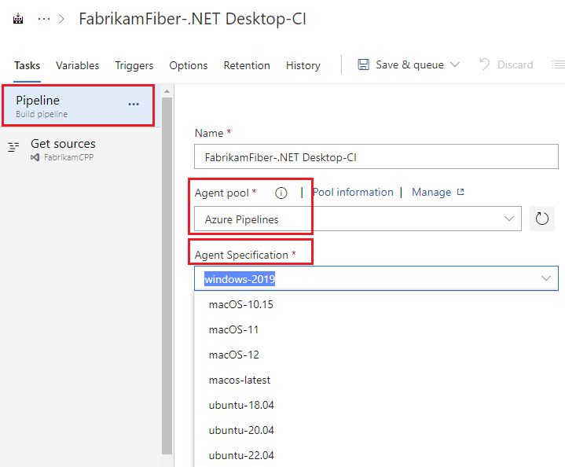

# Agent pools

[!INCLUDE [version-tfs-2015-rtm](../includes/version-tfs-2015-rtm.md)]

::: moniker range="<= tfs-2018"

[!INCLUDE [temp](../includes/concept-rename-note.md)]

::: moniker-end

::: moniker range="<= tfs-2018"

Instead of managing each [agent](agents.md) individually, you organize agents into **agent pools**. In TFS, pools are scoped to the entire server; so you can share an agent pool across project collections and projects.

An **agent queue** provides access to an **agent pool** within a project. When you create a build or release pipeline, you specify which queue it uses. Queues are scoped to your project in TFS 2017 and newer, so you can only use them across build and release pipelines within a project.

To share an agent pool with multiple projects, in each of those projects, you create an agent queue pointing to the same agent pool. While multiple queues across projects can use the same agent pool, multiple queues within a project cannot use the same agent pool. Also, each agent queue can use only one agent pool.

::: moniker-end

::: moniker range=">= tfs-2017 <= tfs-2018"


::: moniker-end

::: moniker range="tfs-2015"

Agent pools are scoped to project collections.


::: moniker-end

::: moniker range=">= azure-devops-2019"

Instead of managing each [agent](agents.md) individually, you organize agents into **agent pools**. In Azure Pipelines, pools are scoped to the entire organization; so you can share the agent machines across projects. In Azure DevOps Server, agent pools are scoped to the entire server; so you can share the agent machines across projects and collections.

When you configure an agent, it is registered with a single pool, and when you create a pipeline, you specify which pool the pipeline uses. When you run the pipeline, it runs on an agent from that pool that meets the [demands](../process/demands.md) of the pipeline.

::: moniker-end


::: moniker range="<= tfs-2018"
You create and manage agent pools from the agent pools tab in admin settings.
::: moniker-end

::: moniker range=">= azure-devops-2019"
If you are an organization administrator, you create and manage agent pools from the agent pools tab in admin settings.
::: moniker-end

[!INCLUDE [agent-pools-tab](includes/agent-pools-tab.md)]

::: moniker range="<= tfs-2018"
You create and manage agent queues from the agent queues tab in project settings.
::: moniker-end

::: moniker range=">= azure-devops-2019"
If you are a project team member, you create and manage agent queues from the agent pools tab in project settings.
::: moniker-end

[!INCLUDE [agent-queues-tab](includes/agent-queues-tab.md)]


## Default agent pools

The following agent pools are provided by default:

* **Default** pool: Use it to register [self-hosted agents](agents.md) that you've set up.

::: moniker range="azure-devops"

* **Azure Pipelines** hosted pool with various Windows, Linux, and macOS images. For a complete list of the available images and their installed software, see [Microsoft-hosted agents](hosted.md#use-a-microsoft-hosted-agent).

   > [!NOTE]
   > The Azure Pipelines hosted pool replaces the previous hosted pools that had names that mapped to the corresponding images. Any jobs you had in the previous hosted pools are automatically redirected to the correct image in the new Azure Pipelines hosted pool. In some circumstances, you may still see the old pool names, but behind the scenes the hosted jobs are run using the Azure Pipelines pool. For more information, see the [Single hosted pool](/azure/devops/release-notes/2019/sprint-154-update#single-hosted-pool) release notes from the [July 1 2019 - Sprint 154 release notes](/azure/devops/release-notes/2019/sprint-154-update).


By default, all contributors in a project are members of the **User** role on hosted pools. This allows every contributor in a project to author and run pipelines using Microsoft-hosted agents.

::: moniker-end

### Choosing a pool and agent in your pipeline

# [YAML](#tab/yaml)

To choose a Microsoft-hosted agent from the Azure Pipelines pool in your Azure DevOps Services YAML pipeline, specify the name of the image, using the **YAML VM Image Label** from [this](hosted.md#use-a-microsoft-hosted-agent) table.

```yaml
pool:
  vmImage: ubuntu-16.04
```

To use a private pool with no demands:

```yaml
pool: MyPool
```

For more information, see the [YAML schema](../yaml-schema.md) for [pools](../yaml-schema.md#pool).

# [Classic](#tab/classic)

To choose a pool and agent in the classic editor, navigate to the pipeline settings, select the desired **Agent pool**, and then the desired image from the **Agent Specification** drop-down. For more information about the software installed on the Microsoft-hosted images, see the corresponding entry in the **Classic Editor Pool** column from [this](hosted.md#use-a-microsoft-hosted-agent) table.



* * *

### Managing pools and queues

#### [Browser](#tab/browser)

::: moniker range="<= tfs-2018"
You create and manage agent pools from the agent pools tab in admin settings.
::: moniker-end

::: moniker range=">= azure-devops-2019"
If you are an organization administrator, you create and manage agent pools from the agent pools tab in admin settings.
::: moniker-end

[!INCLUDE [agent-pools-tab](includes/agent-pools-tab.md)]

::: moniker range="<= tfs-2018"
You create and manage agent queues from the agent queues tab in project settings.
::: moniker-end

::: moniker range=">= azure-devops-2019"
If you are a project team member, you create and manage agent queues from the agent pools tab in project settings.
::: moniker-end

[!INCLUDE [agent-queues-tab](includes/agent-queues-tab.md)]

#### [Azure DevOps CLI](#tab/azure-devops-cli/)

::: moniker range="> azure-devops-2019"

[List agent pools](#list-agent-pools) | [Show agent pool details](#show-agent-pool-details) | [List agent queues](#list-agent-queues) | [Show agent queue details](#show-agent-queue-details)

> [!NOTE]
> At this time you can view information about agent pools and queues, but not edit them, using the Azure CLI.
>
> If this is your first time using `az devops pipelines` commands, see [Get started with Azure DevOps CLI](../../cli/index.md).

### List agent pools

```azurecli
az pipelines pool list [--action {manage, none, use}]
                       [--detect {false, true}]
                       [--org]
                       [--pool-name]
                       [--pool-type {automation, deployment}]
```

#### Parameters

- **action**: Filter the list with user action permitted. Accepted values: **manage**, **none**, **use**
- **detect**: Automatically detect organization. Accepted values: **false**, **true**
- **org** or **organization**: Azure DevOps organization URL. You can configure the default organization using az devops configure -d organization=ORG_URL. Required if not configured as default or picked up via git config. Example: `https://dev.azure.com/MyOrganizationName/`.
- **pool-name**: Filter the list with matching pool name.
- **pool-type**: Filter the list with type of pool. Accepted values: **automation**, **deployment**

#### Example

The following example lists all pools in table format. This example uses the following default configuration: `az devops configure --defaults organization=https://dev.azure.com/fabrikam-tailspin project=FabrikamFiber`

```azurecli
az pipelines pool list --output table

ID    Name                             Is Hosted    Pool Type
----  -------------------------------  -----------  -----------
1     Default                          False        automation
2     Hosted                           True         automation
3     Hosted VS2017                    True         automation
4     Hosted Windows 2019 with VS2019  True         automation
5     Hosted Windows Container         True         automation
6     Hosted macOS                     True         automation
7     Hosted macOS High Sierra         True         automation
8     Hosted Ubuntu 1604               True         automation
9     Azure Pipelines                  True         automation
10    MyAgentPool                      False        automation
```

### Show agent pool details

```azurecli
az pipelines pool show --id
                       [--action {manage, none, use}]
                       [--detect {false, true}]
                       [--org]
```

#### Parameters

- **id** or **pool-id**: (Required) ID of the pool to list the details.
- **action**: Filter the list with user action permitted. Accepted values: **manage**, **none**, **use**
- **detect**: Automatically detect organization. Accepted values: **false**, **true**
- **org** or **organization**: Azure DevOps organization URL. You can configure the default organization using az devops configure -d organization=ORG_URL. Required if not configured as default or picked up via git config. Example: `https://dev.azure.com/MyOrganizationName/`.

#### Example

The following example displays pool details for the Hosted Windows 2019 with VS2019 pool. This example uses the following default configuration: `az devops configure --defaults organization=https://dev.azure.com/fabrikam-tailspin project=FabrikamFiber`

```azurecli
az pipelines pool show --id 4

{
  "agentCloudId": 1,
  "autoProvision": true,
  "autoSize": null,

  <Some properties omitted for space>

  "poolType": "automation",
  "properties": null,
  "scope": "941fcaeb-be37-4309-b7b0-5cf156e1236e",
  "size": 1,
  "targetSize": 1
}
```

You can also use `--output table` which returns the same information as the `list` command.

```azurecli
az pipelines pool show --id 4 --output table

ID    Name                             Is Hosted    Pool Type
----  -------------------------------  -----------  -----------
4     Hosted Windows 2019 with VS2019  True         automation
```

### List agent queues

```azurecli
az pipelines queue list [--action {manage, none, use}]
                        [--detect {false, true}]
                        [--org]
                        [--project]
                        [--queue-name]
```

#### Parameters

- **action**: Filter the list with user action permitted. Accepted values: **manage**, **none**, **use**
- **detect**: Automatically detect organization. Accepted values: **false**, **true**
- **org** or **organization**: Azure DevOps organization URL. You can configure the default organization using az devops configure -d organization=ORG_URL. Required if not configured as default or picked up via git config. Example: `https://dev.azure.com/MyOrganizationName/`.
- **project** or **p**: Name or ID of the project. You can configure the default project using `az devops configure -d project=NAME_OR_ID`. Required if not configured as default or picked up via git config.
- **queue-name**: Filter the list with matching queue name regex. e.g. *ubuntu* for queue with name 'Hosted Ubuntu 1604'.

#### Example

The following example lists all queues in table format. This example uses the following default configuration: `az devops configure --defaults organization=https://dev.azure.com/fabrikam-tailspin project=FabrikamFiber`

```azurecli
az pipelines queue list --output table
This command group is in preview. It may be changed/removed in a future release.
ID    Name                             Pool IsHosted    Pool Type
----  -------------------------------  ---------------  -----------
11    Default                          False            automation
12    Hosted                           True             automation
13    Hosted VS2017                    True             automation
14    Hosted Windows 2019 with VS2019  True             automation
15    Hosted Windows Container         True             automation
16    Hosted macOS                     True             automation
17    Hosted macOS High Sierra         True             automation
18    Hosted Ubuntu 1604               True             automation
19    Azure Pipelines                  True             automation
```

### Show agent queue details

```azurecli
az pipelines queue show --id
                        [--action {manage, none, use}]
                        [--detect {false, true}]
                        [--org]
                        [--project]
```

#### Parameters

- **id** or **queue-id**: ID of the agent queue to get information about.
- **action**: Filter the list with user action permitted. Accepted values: **manage**, **none**, **use**
- **detect**: Automatically detect organization. Accepted values: **false**, **true**
- **org** or **organization**: Azure DevOps organization URL. You can configure the default organization using az devops configure -d organization=ORG_URL. Required if not configured as default or picked up via git config. Example: `https://dev.azure.com/MyOrganizationName/`.
- **project** or **p**: Name or ID of the project. You can configure the default project using `az devops configure -d project=NAME_OR_ID`. Required if not configured as default or picked up via git config.

#### Example

The following example displays queue details for the Hosted Windows 2019 with VS2019 queue. This example uses the following default configuration: `az devops configure --defaults organization=https://dev.azure.com/fabrikam-tailspin project=FabrikamFiber`

```azurecli
az pipelines queue show --id 14

{
  "id": 14,
  "name": "Hosted Windows 2019 with VS2019",
  "pool": {
    "id": 4,
    "isHosted": true,
    "isLegacy": true,
    "name": "Hosted Windows 2019 with VS2019",
    "poolType": "automation",
    "scope": "941fcaeb-be37-4309-b7b0-5cf156e1236e",
    "size": 1
  },
  "projectId": "16836457-4ce1-4e77-b97a-e7e0c6508e84"
}
```

::: moniker-end

[!INCLUDE [temp](../../includes/note-cli-not-supported.md)] 

* * *


Pools are used to run jobs. Learn about [specifying pools for jobs](../process/phases.md).

If you've got a lot of self-hosted agents intended for different teams or purposes, you might want to create additional pools as explained below.

## Creating agent pools

Here are some typical situations when you might want to create self-hosted agent pools:

::: moniker range="azure-devops"
* You're a member of a project and you want to use a set of machines owned by your team for running build and deployment jobs. First, make sure you've the permissions to create pools in your project by selecting **Security** on the agent pools page in your project settings. You must have **Administrator** role to be able to create new pools. Next, select **Add pool** and select the option to create a **new** pool at the organization level. Finally [install](agents.md#install) and configure agents to be part of that agent pool.

* You're a member of the infrastructure team and would like to set up a pool of agents for use in all projects. First make sure you're a member of a group in **All agent pools** with the **Administrator** role by navigating to agent pools page in your organization settings. Next create a **New agent pool** and select the option to **Auto-provision corresponding agent pools in all projects** while creating the pool. This setting ensures all projects have access to this agent pool. Finally [install](agents.md#install) and configure agents to be part of that agent pool.

* You want to share a set of agent machines with multiple projects, but not all of them. First, navigate to the settings for one of the projects, add an agent pool, and select the option to create a **new** pool at the organization level. Next, go to each of the other projects, and create a pool in each of them while selecting the option to **Use an existing agent pool from the organization**. Finally, [install](agents.md#install) and configure agents to be part of the shared agent pool.
::: moniker-end

::: moniker range="<= azure-devops-2019"
* You're a member of a project and you want to use a set of machines owned by your team for running build and deployment jobs. First, make sure you're a member of a group in **All Pools** with the **Administrator** role. Next create a **New project agent pool** in your project settings and select the option to **Create a new organization agent pool**. As a result, both an organization and project-level agent pool will be created. Finally [install](agents.md#install) and configure agents to be part of that agent pool.

* You're a member of the infrastructure team and would like to set up a pool of agents for use in all projects. First make sure you're a member of a group in **All Pools** with the **Administrator** role. Next create a **New organization agent pool** in your admin settings and select the option to **Auto-provision corresponding project agent pools in all projects** while creating the pool. This setting ensures all projects have a pool pointing to the organization agent pool. The system creates a pool for existing projects, and in the future it will do so whenever a new project is created. Finally [install](agents.md#install) and configure agents to be part of that agent pool.

* You want to share a set of agent machines with multiple projects, but not all of them. First create a project agent pool in one of the projects and select the option to **Create a new organization agent pool** while creating that pool. Next, go to each of the other projects, and create a pool in each of them while selecting the option to **Use an existing organization agent pool**. Finally, [install](agents.md#install) and configure agents to be part of the shared agent pool.
::: moniker-end

<h2 id="security">Security of agent pools</h2>

Understanding how security works for agent pools helps you control sharing and use of agents.

::: moniker range=">= tfs-2017"

**Roles** are defined on each agent pool, and **membership** in these roles governs what operations you can perform on an agent pool.

| Role on an agent pool in organization settings | Purpose |
|------|---------|
| Reader | Members of this role can view the agent pool as well as agents. You typically use this to add operators that are responsible for monitoring the agents and their health.  |
| Service Account | Members of this role can use the organization agent pool to create a project agent pool in a project. If you follow the guidelines above for creating new project agent pools, you typically do not have to add any members here. |
| Administrator | In addition to all the above permissions, members of this role can register or unregister agents from the organization agent pool. They can also refer to the organization agent pool when creating a project agent pool in a project. Finally, they can also manage membership for all roles of the organization agent pool. The user that created the organization agent pool is automatically added to the Administrator role for that pool. |

The **All agent pools** node in the Agent Pools tab is used to control the security of _all_ organization agent pools. Role memberships for individual organization agent pools are automatically inherited from those of the 'All agent pools' node. When using TFS or Azure DevOps Server, by default, TFS and Azure DevOps Server administrators are also administrators of the 'All agent pools' node.

Roles are also defined on each project agent pool, and memberships in these roles govern what operations you can perform on an agent pool at the project level.

| Role on an agent pool in project settings | Purpose |
|------|---------|
| Reader | Members of this role can view the project agent pool. You typically use this to add operators that are responsible for monitoring the build and deployment jobs in that project agent pool.  |
| User | Members of this role can use the project agent pool when authoring pipelines. |
| Administrator | In addition to all the above operations, members of this role can manage membership for all roles of the project agent pool. The user that created the pool is automatically added to the Administrator role for that pool.

::: moniker-end

::: moniker range="<= azure-devops-2019"

The **All agent pools** node in the Agent pools tab is used to control the security of _all_ project agent pools in a project. Role memberships for individual project agent pools are automatically inherited from those of the 'All agent pools' node. By default, the following groups are added to the Administrator role of 'All agent pools': Build Administrators, Release Administrators, Project Administrators.

::: moniker-end

::: moniker range="azure-devops"

The **Security** action in the Agent pools tab is used to control the security of _all_ project agent pools in a project. Role memberships for individual project agent pools are automatically inherited from what you define here. By default, the following groups are added to the Administrator role of 'All agent pools': Build Administrators, Release Administrators, Project Administrators.

::: moniker-end

::: moniker range="tfs-2015"

<h3 id="security-tfs2015">TFS 2015</h3>

In TFS 2015, special **groups** are defined on agent pools, and membership in these groups governs what operations you can perform.

Members of **Agent Pool Administrators** can register new agents in the pool and add additional users as administrators or service accounts.

Add people to the Agent Pool Administrators group to grant them permission manage all the agent pools. This enables people to create new pools and modify all existing pools. Members of Team Foundation Administrators group can also perform all these operations.

Users in the **Agent Pool Service Accounts** group have permission to listen to the message queue for the specific pool to receive work.  In most cases you should not have to manage members of this group. The agent registration process takes care of it for you. The service account you specify for the agent (commonly Network Service) is automatically added when you register the agent.

::: moniker-end

## FAQ

### If I don't schedule a maintenance window, when will the agents run maintenance?

If no window is scheduled, then the agents in that pool will not run the maintenance job.

### What is a maintenance job?

You can configure agent pools to periodically clean up stale working directories and repositories. This should reduce the potential for the agents to run out of disk space. Maintenance jobs are configured at the project collection or organization level in agent pool settings.

To configure maintenance job settings:

[!INCLUDE [agent-pools-tab](includes/agent-pools-tab.md)]

Choose the desired pool and choose **Settings** to configure maintenance job settings for that agent pool. 

> [!IMPORTANT]
> You must have the [Manage build queues](../../organizations/security/permissions-access.md) permission to configure maintenance job settings. If you don't see the **Settings** tab or the **Maintenance History** tab, you don't have that permission, which is granted by default to the **Administrator** role. For more information, see [Security of agent pools](#security).

:::moniker range="> tfs-2018"

:::image type="content" source="media/maintenance-job-settings.png" alt-text="Maintenance job settings":::

:::moniker-end

:::moniker range="<= tfs-2018"

:::image type="content" source="media/maintenance-job-settings-tfs.png" alt-text="Maintenance job settings for TFS":::

:::moniker-end

Configure your desired settings and choose **Save**.

Select **Maintenance History** to see the maintenance job history for the current agent pool. You can download and review logs to see the cleaning steps and actions taken.

:::moniker range="> tfs-2018"

:::image type="content" source="media/maintenance-job-history.png" alt-text="Maintenance job history":::

:::moniker-end

The maintenance is done per agent pool, not per machine; so if you have multiple agent pools on a single machine, you may still run into disk space issues.

### I'm trying to create a project agent pool that uses an existing organization agent pool, but the controls are grayed out. Why?

On the 'Create a project agent pool' dialog box, you can't use an existing organization agent pool if it is already referenced by another project agent pool. Each organization agent pool can be referenced by only one project agent pool within a given project collection.

::: moniker range="azure-devops"

### I can't select a Microsoft-hosted pool and I can't queue my build. How do I fix this?

Ask the owner of your Azure DevOps organization to grant you permission to use the pool. See [Security of agent pools](#security).

::: moniker-end

::: moniker range="azure-devops"

### I need more hosted build resources. What can I do?

A: The Azure Pipelines pool provides all Azure DevOps organizations with cloud-hosted build agents and free build minutes each month. If you need more Microsoft-hosted build resources, or need to run more jobs in parallel, then you can either:

* [Host your own agents on infrastructure that you manage](agents.md)
* [Buy additional parallel jobs](../../pipelines/licensing/concurrent-jobs.md#how-much-do-parallel-jobs-cost)

::: moniker-end
