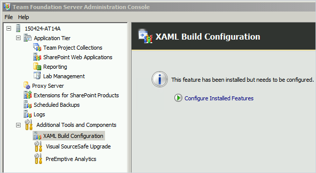

# Deploy an agent on Windows for TFS 2015

**[Azure Pipelines](v2-windows.md) | [TFS 2018](v2-windows.md) | [TFS 2017](v2-windows.md) | TFS 2015 | [Previous versions (XAML builds)](https://msdn.microsoft.com/library/ms252495%28v=vs.120%29.aspx)**

To build and deploy Windows, Azure, and other Visual Studio solutions you may need a Windows agent. Windows agents can also build and deploy Java and Android apps.

> Before you begin:
 * If you use [Azure Pipelines](https://visualstudio.microsoft.com/products/visual-studio-team-services-vs) or TFS 2017 and newer, then you need to use a newer agent. See [Deploy an agent on Windows](v2-windows.md).
 * If you use TFS, you might already have a build and release agent running. An agent is automatically or optionally deployed in some cases when you [set up Team Foundation Server](/azure/devops/server/install/single-server).
 *  Otherwise, you've come to the right place to set up an agent on Windows for TFS 2015. Continue to the next section.

[!INCLUDE [include](_shared/concepts.md)]

## Check prerequisites

Before you begin, make sure your agent machine is prepared with these prerequisites:

* An [operating system that is supported by Visual Studio 2013](http://visualstudio.microsoft.com/products/visual-studio-2013-compatibility-vs) or newer

* Visual Studio 2013 or Visual Studio 2015

* PowerShell 3 or newer ([Where can I get a newer version of PowerShell?](#powershell-version))

## Download and configure the agent

1. Make sure you're logged on the machine as an agent pool administrator. See [Agent pools](pools-queues.md#security-tfs2015).

2. Navigate to the **Agent pools** tab: `http://{your_server}:8080/tfs/_admin/_AgentPool`

3. Click **Download agent**.

4. Unzip the .zip file into the folder on disk from which you would like to run the agent.  To avoid "path too long" issues on the file system, keep the path short. For example: `C:\Agent\`

5. Run Command Prompt as Administrator, and then run:
 ```
ConfigureAgent.cmd
 ```

6. Respond to the prompts.

### Choose interactive or service mode

For guidance on whether to run the agent in interactive mode or as a service, see [Agents: Interactive vs. service](agents.md#interactive-or-service).

#### Run as a service

If you chose to run the agent as a Windows service, then the agent running status can be controlled from the Services snap-in. Run services.msc and look for "VSO Agent (&lt;name of your agent&gt;)".

If you need to change the logon account, don't do it from the services snap-in. Instead, from an elevated Command Prompt, run:

```
C:\Agent\Agent\VsoAgent.exe /ChangeWindowsServiceAccount
```

#### Run interactively

If you chose to run interactively, then to run the agent:

```
C:\Agent\Agent\VsoAgent.exe
```

## Command-line parameters

You can use command-line parameters when you configure the agent (```ConfigureAgent.cmd```) and when you run the agent (```Agent\VsoAgent.exe```). These are useful to avoid being prompted during unattended installation scripts and for power users.

### Common parameters

*/Login:UserName,Password[;AuthType=(AAD|Basic|PAT)]*  
Used for configuration commands against an Azure DevOps organization. The parameter is used to specify the pool administrator credentials. The credentials are used to perform the pool administration changes and are not used later by the agent.  

When using personal access tokens (PAT) authentication type, specify anything for the user name and specify the PAT as the password.

If passing the parameter from PowerShell, be sure to escape the semicolon or encapsulate the entire argument in quotes. For example: '/Login:user,password;AuthType=PAT'. Otherwise the semicolon will be interpreted by PowerShell to indicate the end of one statement and the beginning of another.

*/NoPrompt*  
Indicates not to prompt and to accept the default for any values not provided on the command-line.

*/WindowsServiceLogonAccount:WindowsServiceLogonAccount*  
Used for configuration commands to specify the identity to use for the Windows service. To specify a domain account, use the form Domain\SAMAccountName or the user principal name (for example user@fabrikam.com). Alternatively a built-in account can be provided, for example /WindowsServiceLogonAccount:"NT AUTHORITY\NETWORK SERVICE".

*/WindowsServiceLogonPassword:WindowsServiceLogonPassword*  
Required if the /WindowsServiceLogonAccount parameter is provided.

---

### /Configure

Configure supports the /NoPrompt switch for automated installation scenarios and will return a non-zero exit code on failure.

For troubleshooting configuration errors, detailed logs can be found in the \_diag folder under the agent installation directory.

*/ServerUrl:ServerUrl*  
The server URL should not contain the collection name. For example, `http://example:8080/tfs` or `https://dev.azure.com/example`

*/Name:AgentName*  
The friendly name to identify the agent on the server.

*/PoolName:PoolName*  
The pool that will contain the agent, for example: */PoolName:Default*

*/WorkFolder:WorkFolder*  
The default work folder location is a *_work* folder directly under the agent installation directory. You can change the location to be outside of the agent installation directory, for example: */WorkFolder:C:\_work*. One reason you may want to do this is to avoid "path too long" issues on the file system.

*/Force*  
Replaces the server registration if a conflicting agent exists on the server. A conflict could be encountered based on the name. Or a conflict could be encountered if based on the ID a previously configured agent is being reconfigured in-place without unconfiguring first.

*/NoStart*  
Used when configuring an interactive agent to indicate the agent should not be started after the configuration completes.

*/RunningAsService*  
Used to indicate the agent should be configured to run as a Windows service.

*/StartMode:(Automatic|Manual|Disabled)*  

---

### /ChangeWindowsServiceAccount

Change Windows service account supports the /NoPrompt switch for automated installation scenarios and will return a non-zero exit code on failure.

For troubleshooting errors, detailed logs can be found in the \_diag folder under the agent installation directory.

---

### /Unconfigure

---

### /Version

Prints the version number.

---

<h3 id="?">/?</h3>

Prints usage information.

---

[!INCLUDE [include](_shared/capabilities.md)]

## Q & A

<!-- BEGINSECTION class="md-qanda" -->

[!INCLUDE [temp](_shared/qa-windows-agent-powershell-version.md)]

[!INCLUDE [temp](_shared/qa-no-agent-with-capabilities.md)]

### What version of the agent runs with my version of TFS?

| TFS version | Agent version
|-|-
| 2015 RTM | 1.83.2
| 2015.1 | 1.89.0
| 2015.2 | 1.95.1
| 2015.3 | 1.95.3

#### Can I still configure and use XAML build controllers and agents?

Yes. If you are an existing customer with custom build processes you are not yet ready to migrate, you can continue to use XAML builds, controllers, and agents.



::: moniker range="< azure-devops"
[!INCLUDE [temp](../_shared/qa-versions.md)]
::: moniker-end

<!-- ENDSECTION -->
