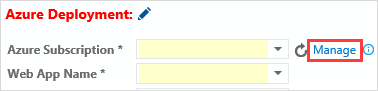

If a subscription is not available, then add a service connection:

<ol>

<li>

</li>

<li>Click New service connection, and then click Azure.</li>

<li>
On the Add Azure Subscription dialog box:
<ol><li>Select Certificate.</li><li>Click the link to download your publishsettings xml file and then open the file.</li><li>Copy the ID and certificate values from the file and paste them into the Add Azure Subscription dialog box.</li></ol></li>

</ol>

<pre style="margin-bottom: 0px;"><code class="language-xml collapsed">&lt;?xml version="1.0" encoding="utf-8"?&gt; 
&lt;PublishData&gt; 
&nbsp;&nbsp;&lt;PublishProfile 
&nbsp;&nbsp;&nbsp;&nbsp;SchemaVersion="2.0" 

&nbsp;&nbsp;&nbsp;&nbsp;PublishMethod="AzureServiceManagementAPI"&gt; 
&nbsp;&nbsp;&nbsp;&nbsp;&lt;Subscription 
&nbsp;&nbsp;&nbsp;&nbsp;&nbsp;&nbsp;ServiceManagementUrl="https://management.core.windows.net" 
&nbsp;&nbsp;&nbsp;&nbsp;&nbsp;&nbsp;Id="{Copy_and_Paste_into_Subscription_id_field}" 
&nbsp;&nbsp;&nbsp;&nbsp;&nbsp;&nbsp;Name="{Copy_and_paste_into_Name_field_or_use_another_name}" 
 
ManagementCertificate="{Copy_and_paste_into_Subscription_certificate_field}" /&gt; 
&nbsp;&nbsp;&lt;/PublishProfile&gt; 
&lt;/PublishData&gt;
</code></pre>
