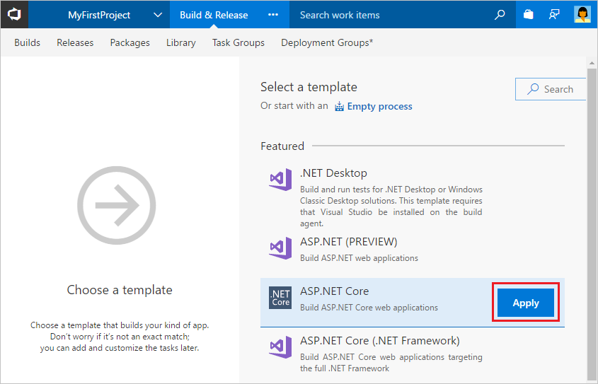

1. On the **Files** tab of the **Code** hub, click **Set up build**.

 

 You are taken to Azure Pipelines and asked to **Choose a template**.

1. In the right panel, click **ASP.NET Core**, and then click **Apply**.

 

 You now see all the tasks that were automatically added to the build pipeline by the template. These are the steps that will automatically run every time you push code changes.

1. For the **Agent pool**, select _Hosted VS2017_. This is how you can use our pool of agents that have the software you need to build your app.
