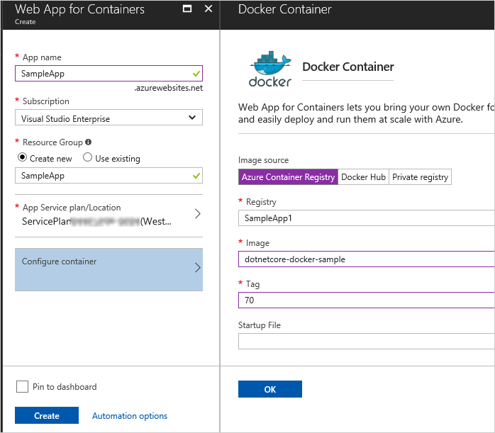

## Create an Azure web app to host a container

1. Sign into your Azure Account at [https://portal.azure.com](https://portal.azure.com).

1. In the Azure Portal, choose **Create a resource**, **New**, **Web + Mobile**, then choose **Web App for Containers**.    

1. Enter a name for your new web app, and select or create a new Resource Group.
   Then choose **Configure container** and select **Azure Container Registry**.
   Use the drop-down lists to select the registry you created earlier, and the
   Docker image and tag that was generated by the build definition.

   

   The **Docker** tasks you used in the build definition when you created the
   build artifacts push the Docker image back into your Azure Container Registry.
   The web app you created here will host an instance of that image and expose it as a website.

1. Wait until the new web app has been created. Then you can create a release definition as shown in the next section.

**Why use a separate release definition instead of the automatic deployment feature available in Web App for Containers?**

You can configure Web App for Containers to automatically configure deployment as part of the
CI/CD process so that the web app is automatically updated when a new image is pushed to the container
registry (this feature uses a [webhook](https://docs.microsoft.com/en-us/azure/container-registry/container-registry-webhook)).
However, by using a separate release definition in VSTS or TFS you gain extra flexibility and traceability. You can:

* Specify an appropriate tag that is used to select the deployment target for multi-environment deployments.
* Use separate container registries for different environments.
* Use parameterized start-up commands to, for example, set the values of variables based on the target environment.
* Avoid using the same tag for all the deployments. The default CD process for Web App for Containers
  uses the same tag for every deployment. While this may be appropriate for a tag such as **latest**,
  you can achieve end-to-end traceability from code to deployment by using a build-specific tag for each deployment.
  For example, the Docker build tasks let you tag your images with the **Build.ID** for each deployment. 
