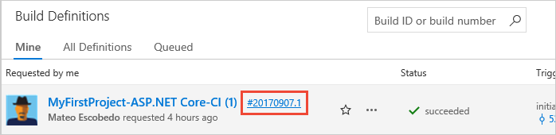
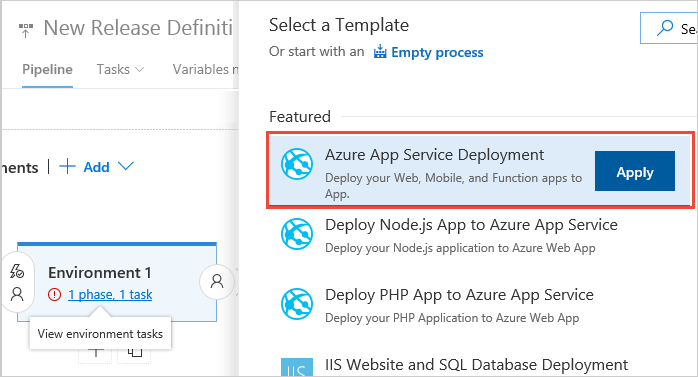

## Create a release definition

1. In the **Build &amp; Release** hub, open the build summary for your build.

   

1. In the build summary page, choose the **Release** icon to start a new release definition.

   

   If you have previously created a release definition that uses these build artifacts, you will
   be prompted to create a new release instead. In that case, go to the **Releases** tab page and
   start a new release definition from there by choosing the **+** icon.

1. Select the **Azure App Service Deployment** template and choose **Apply**.

   

1. Open the **Tasks** tab and select the **Environment 1** item.
   Configure the linked properties as follows:

   - **Azure Subscription**: Select a connection from the list under **Available Azure Service Connections** or create a more restricted permissions connection to your Azure subscription.
     If you are using VSTS and if you see an **Authorize** button next to the input, click on it to authorize VSTS to connect to your Azure subscription. If you are using TFS or if you do not see
     the desired Azure subscription in the list of subscriptions, see [Azure Resource Manager service endpoint](../../library/service-endpoints.md#sep-azure-rm) to manually set up the connection.

     

   - **App type**: Select **Linux App**.  

   - **App service name**: Select the web app you created earlier from your subscription.

   When you select the Docker-enabled app type, the task recognizes that it is a
   containerized app, and changes the property settings to show the following:

   - **Image Source**: Leave this set to **Container Registry**.

   - **Registry or Namespace**: Enter the path to your Azure Container Registry. Typically this is _your-registry-name_**.azurecr.io**

   - **Repository**: Enter the name of your repository, which is typically of the format `<account name>/<code-repo-name>` or just the repository name.

   > You can find these values in the Azure portal in the **Overview** and **Repositories** tabs for your container registry.

1. Save the release definition.

## Create a release to deploy your app

You're now ready to create a release, which means to start the process of running the release definition with the artifacts produced by a specific build. This will result in deploying the build:

1. Choose **+ Release** and select **Create Release**.

1. In the **Create new release** panel, check that the artifact version you want to use is selected and choose **Create**.

1. Choose the release link in the information bar message. For example: "Release **Release-1** has been created".

1. Open the **Logs** tab to watch the release console output.

1. After the release is complete, navigate to your site running in Azure using the Web App URL `http://{web_app_name}.azurewebsites.net`, and verify its contents.
