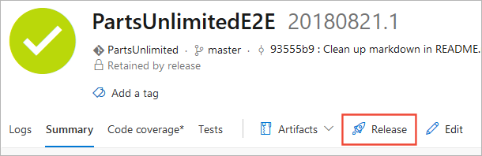
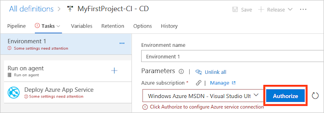

<h2 id="cd">Define your CD release process</h2>

Your CD release process picks up the artifacts published by your CI build and then deploys them to your Azure web site.

1. Do one of the following to start creating a release definition:

   * If you've just completed a CI build (see above), choose the link (for example, _Build 20170815.1_)
     to open the build summary. Then choose **Release** to start a new release definition that's automatically linked to the build definition.

     

   * Open the **Releases** tab of the **Build &amp; Release** hub, open the **+** drop-down
     in the list of release definitions, and choose **Create release definition**.

     

1. The easiest way to create a release definition is to use a template. If you are deploying a Node app, select the **Deploy Node.js App to Azure App Service** template. 
   Otherwise, select the **Azure App Service Deployment** template. Then choose **Apply**.

   > The only difference between these templates is that Node template configures the task to generate a **web.config** file containing a parameter that starts the **iisnode** service.

1. If you created your new release definition from a build summary, check that the build definition and artifact
   is shown in the **Artifacts** section on the **Pipeline** tab. If you created a new release definition from
   the **Releases** tab, choose the **+ Add** link and select your build artifact.

   

1. Choose the **Continuous deployment** icon in the **Artifacts** section, check that the
   continuous deployment trigger is enabled, and add a filter to include the **master** branch.

   

   > Continuous deployment is not enabled by default when you create a new release definition from the **Releases** tab.

1. Open the **Tasks** tab and, with **Environment 1** selected, configure the task property variables as follows:

   * **Azure Subscription:** Select a connection from the list under **Available Azure Service Connections** or create a more restricted permissions connection to your Azure subscription.
     If you are using VSTS and if you see an **Authorize** button next to the input, click on it to authorize VSTS to connect to your Azure subscription. If you are using TFS or if you do not see
     the desired Azure subscription in the list of subscriptions, see [Azure Resource Manager service endpoint](../../library/connect-to-azure.md) to manually set up the connection.

     

   * **App Service Name**: Select the name of the web app from your subscription.

   [!INCLUDE [edit-template-vars-in-environment](edit-template-vars-in-environment.md)]

1. Save the release definition.

<h2 id="deploy">Create a release to deploy your app</h2>

You're now ready to create a release, which means to start the process of running the release definition with the artifacts produced by a specific build. This will result in deploying the build:

1. Choose **+ Release** and select **Create Release**.

1. In the **Create new release** panel, check that the artifact version you want to use is selected and choose **Create**.

1. Choose the release link in the information bar message. For example: "Release **Release-1** has been created".

1. Open the **Logs** tab to watch the release console output.

1. After the release is complete, navigate to your site running in Azure using the Web App URL `http://{web_app_name}.azurewebsites.net`, and verify its contents.
