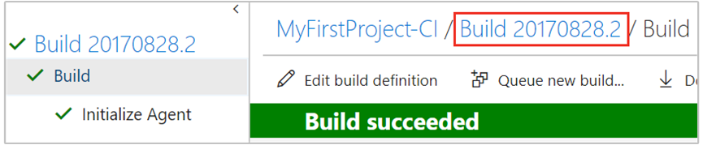

1. Once the build completes, select the build number to view a summary of the build.

   

2. Notice the various sections in the build summary - the source version of the commit in build details section, list of all associated changes, links to work items associated with commits, and test results.
   When the build is automatically triggered by a push to your Git repository, these sections are populated with all the relevant information.
