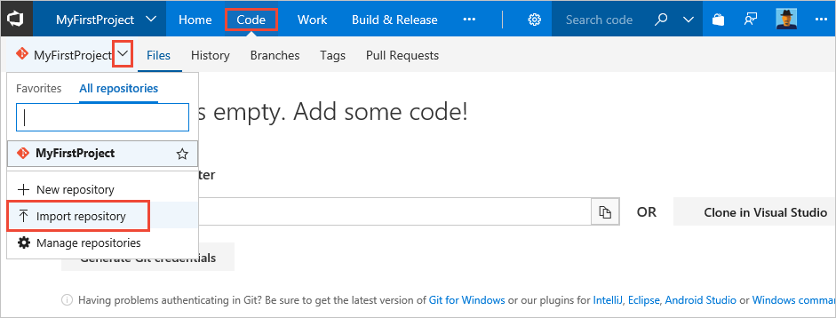

Azure Repos is a full-featured Git server for hosting your team's source code. You'll import code for a sample ASP.NET Core app into Azure Repos Git repository. This is the app that you'll configure CI/CD for.

[//]: # (> [!NOTE])
[//]: # (> If you already have an ASP.NET Core application checked into your Azure Repos Git repository, you can use that for this quickstart, so long as your app does not depend on a database.)

1. In Azure Repos, on the **Code** page for your project, select the option to **Import repository**.

   

2. In the **Import a Git repository** dialog box, paste the following URL into the **Clone URL** text box.

   ```
   https://github.com/MicrosoftDocs/pipelines-dotnet-core
   ```

3. Click **Import** to copy the sample code into your Git repo.
