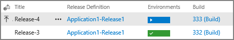

<h2 id="check-in">Commit a change and see it automatically go live</h2>

Now you get to see the magic of a release pipeline at work! You'll make a change in Visual Studio, commit it or check it in to the source repository, and then let the build and release pipelines take care of the rest.

1. On your deployed web site, click **About** at the top, and examine the page. We'll change the "Use this area..." text to something different.

1. In Visual Studio, switch to Solution Explorer, expand **src > {project name} > Views > Home** and open _About.cshtml_.

1. Change the text within the &lt;p&gt; tag, for example, to _Hello continuous integration and continuous deployment!_

1. Save the file, push/check-in the changes to the project:
    * If you're using Git in Visual Studio, click the changes icon on the status bar:

        

        Then enter a commit message, click **Commit All**, click the **Sync** link, then click **Outgoing Commits > Push**. This will push the changes to a repository in Azure Repos.

    * If you're using Team Foundation version control (TFVC), switch to the Team Explorer pane, then to Pending Changes where you should see About.cshtml listed. Enter a comment and click **Check In**.

1. Once the push/check-in is complete, switch to Azure Pipelines in your browser.
1. Navigate to **Builds** and click on your build pipeline. You should see a build in progress:

    

1. When the build has completed, navigate to **Releases** and you should see that a release has started for that build:

    

1. When the release has completed, browse to your web site, refresh the page, and see that the change has been deployed.
