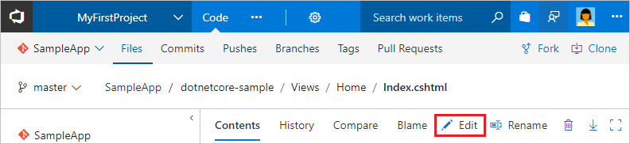
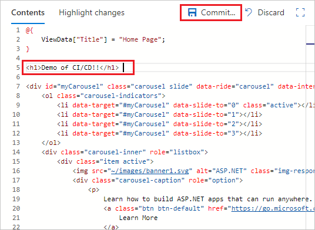

## Edit the code and see it deployed

Now that you have a completely automated CI/CD pipeline, any changes that you make to the app are automatically built and deployed by Azure Pipelines. To try this, make a change to the app and commit that change to the Git repository.

1. Both Azure Repos and GitHub feature a full code editor within the web browser. Using the browser, navigate to **Views/Homes/Index.cshtml** file in your repository.

   # [Azure Repos or TFS repo](#tab/vsts)

   In the Azure Repos **Code** hub, edit the **Views/Home/Index.cshtml** file.

   

   # [GitHub repo](#tab/github)

   Open your GitHub repository in the browser and edit **Views/Home/Index.cshtml** file.

   ---

2. Make a simple change above the slide carousel `div` tag:

   ```html
   <h1>Demo of CI/CD!!</h1>
   ```

3. **Commit** your changes to trigger a CI build. When the build completes, it triggers an automatic deployment.

<!--
 
-->
