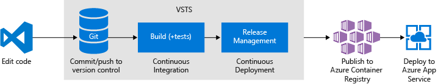
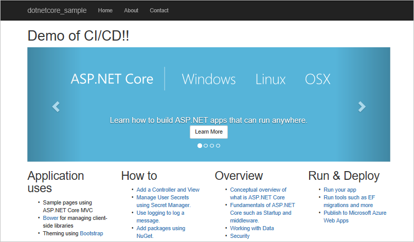
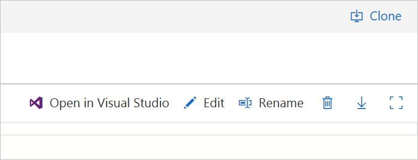
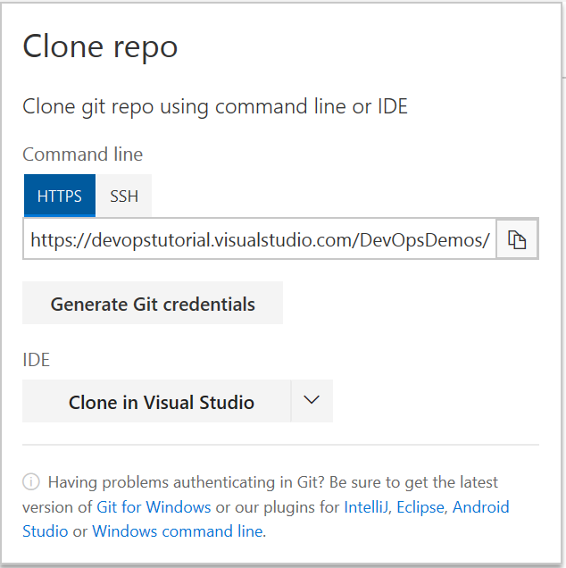
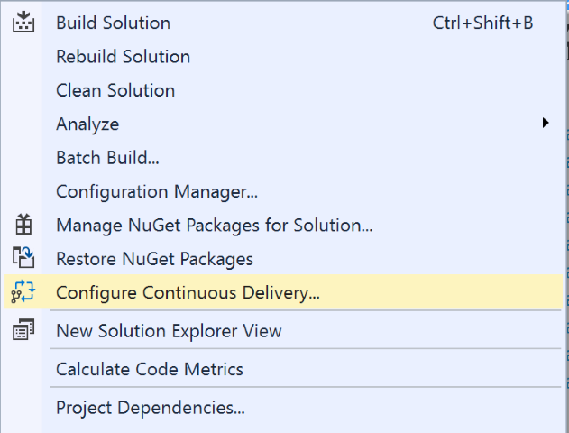
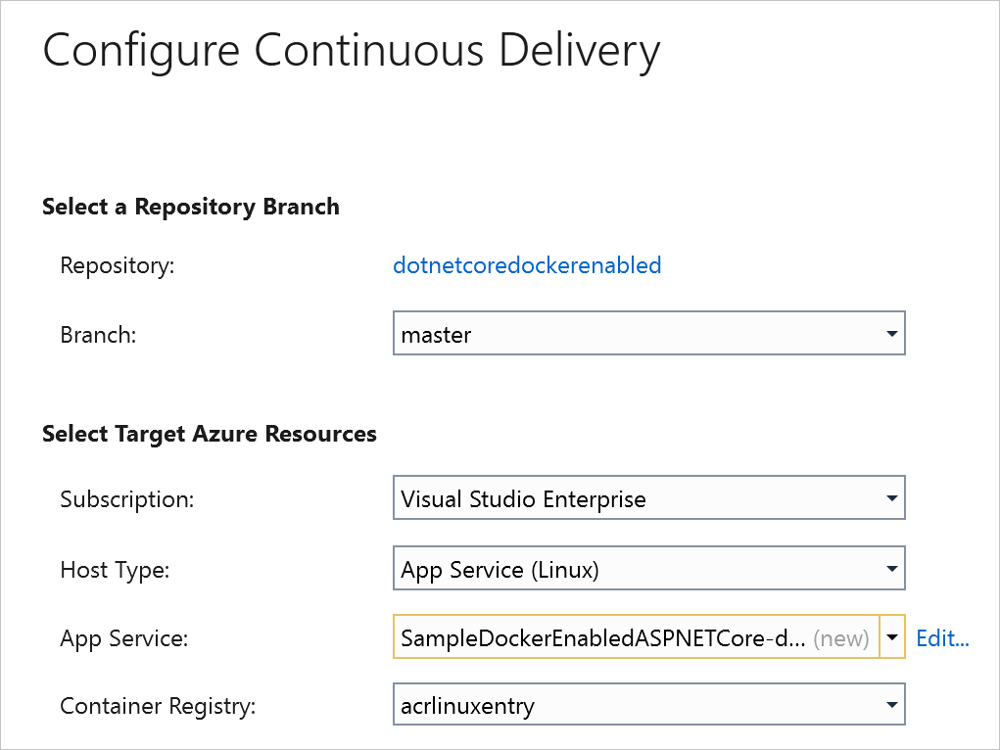
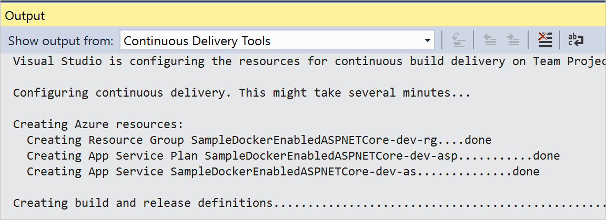

# Deploy your ASP.NET Core app as a container

**Azure Pipelines**

Azure Pipelines provides a highly customizable continuous integration (CI) and continuous deployment (CD) pipeline for your ASP.NET Core apps. This quickstart shows how to set up CI and CD to deploy an ASP.NET Core application to Linux App Service using Docker and [Azure Container Registry](/azure/container-registry/).

With your CI/CD processes in place, you'll push a change into your team's git repo and the results will automatically show up on your site.

## Prerequisites

[!INCLUDE [include](../../../_shared/ci-cd-prerequisites-vsts.md)]
* [Visual Studio 2017](https://visualstudio.microsoft.com/downloads/)    
* [Continuous Delivery Tools for Visual Studio](https://marketplace.visualstudio.com/items?itemName=VSIDEDevOpsMSFT.ContinuousDeliveryToolsforVisualStudio)

[!INCLUDE [create-azure-container-registry](../../../apps/_shared/create-azure-container-registry.md)]

[!INCLUDE [import-code-aspnet-core](../../../apps/_shared/import-code-aspnet-core-docker.md)]

##  Clone the solution
Use the following steps to clone the sample solution and open it in Visual Studio 2017.  This allows you to work with the solution in a local development environment.  In upcoming steps, you use Visual Studio 2017 to configure continuous integration and continuous delivery for the web app.

1.  Ensure the import of the code completes successfully.  In the top right-hand corner of your browser Select **clone**.  Select **Clone in Visual Studio**.  

        
        
2.  Visual Studio 2017 will launch and prompt for credentials.
3.  After authenticating, choose a directory and Select **clone** to finish cloning the code to your local environment.

## Install Continuous Delivery (CD) Tools for Visual Studio 2017    
Continuous Delivery (CD) Tools for Visual Studio 2017 helps automate the creation of Azure Pipelines to Azure release pipelines.  Optionally, you can extend the generated pipeline to further enhance your CI/CD workflows.

1.  In Visual Studio 2017 Select **Tools then Select Extensions and Updates**.
2.  In the dialogue, Select **Online** and search for **Continuous Delivery Tools for Visual Studio**.
3.  Select **Download**, and once it finishes **close** Visual Studio to finish the install process.
4.  **Restart** Visual Studio and **open** your solution.
5.  In solution explorer **Right Select** your solution and verify you see a **Configure Continuous Delivery** icon.

        

##  Configure and execute Continuous Delivery (CD) for your app    
Visual Studio 2017 can automate the creation of a CI/CD pipeline.  The CD tooling quickly creates various services in Azure and Azure Pipelines.  This automation allows you to enable CI/CD to Azure for your apps by creating full build and release pipelines in Azure Pipelines.

1.  In Visual Studio, **right Select** your solution and Select **Configure Continuous Delivery**.

    
2.  Choose App Service (Linux) as your **Host Type**.
3.  Choose the **Container Registry** you created earlier.
4.  Accept the default App Service name or Select **edit** to choose a new name.
5.  Select **ok**, and monitor the output window for results.  
6.  **Azure resources** including the App Service will be created.  **Azure Pipelines resources** such as a build pipeline, and a release pipeline will be created in the same project that contains your source code.  You can monitor the configuration progress in the **Output** window in Visual Studio.    

    
7.  A **build** and **release** will then execute.  **Navigate** to the organization and monitor the builds and releases until they complete.  This may take several minutes.
8.  When the deployment finishes, verify that your changes are live in your web browser: **http://**_your-app-name_**.azurewebsites.net**.
9.  Make changes to the web app code and push them to Azure Pipelines.  A new build and release will execute and deploy the changes.

You're now ready to collaborate with a team on an ASP.NET Core app with a CI/CD pipeline that automatically deploys your latest work to your Azure App Service.

## Next Steps    
You've just put your own CI/CD processes in place. You can modify these build and release pipelines to meet the needs of your team. To learn more see this tutorial:

* [Customize CD pipeline](../../../release/define-multistage-release-process.md)
