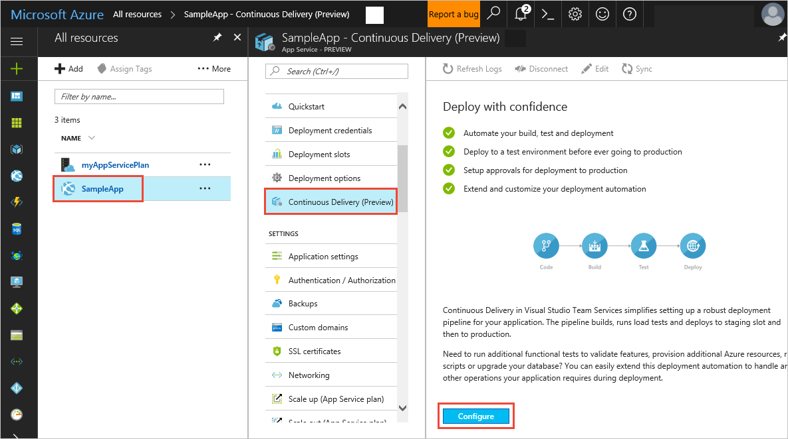
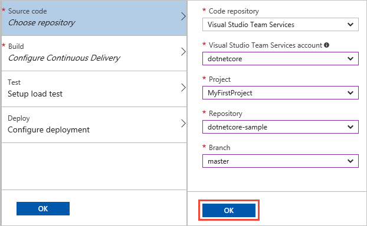
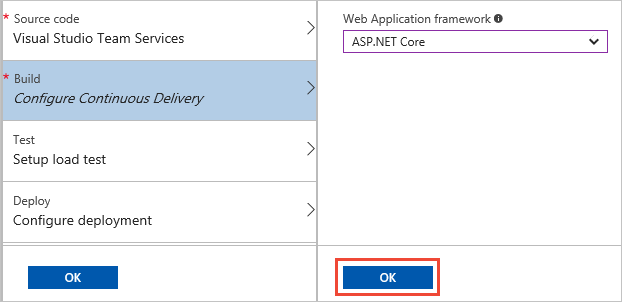
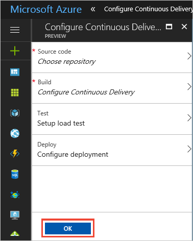

# Build and deploy to an Azure Web App

**VSTS**

Visual Studio Team Services (VSTS) provides a highly customizable continuous integration (CI) and continuous deployment (CD) pipeline to automatically deliver your ASP.NET Core web app to Azure App Services. In this quickstart you will use the Azure portal to configure an entire CI/CD pipeline, and then see it build and deploy your app.

For example, you can continuously deliver your app to Azure.


After you commit and push a code change, it is automatically built and then deployed. The results will automatically show up on your site.

<!--

-->

[How do I deploy an Azure Function project?](https://blogs.msdn.microsoft.com/appserviceteam/2017/06/01/deploying-visual-studio-2017-function-projects-with-vsts/)

>[!VIDEO https://channel9.msdn.com/Shows/Docs/Build-and-deploy-to-an-Azure-Web-App/player]

## Prerequisites

[!INCLUDE [include](../../../_shared/ci-cd-prerequisites-vsts.md)]
* An Azure subscription. You can get one free through [Visual Studio Dev Essentials](https://www.visualstudio.com/dev-essentials/).

## Get the sample code

To configure a CI build process for your app, the source code needs to be in a version control system. You can use VSTS as your version control system, since VSTS provides a full-featured Git server. Alternatively, you can use GitHub.

For a simple way to follow this quickstart, get the following sample app code and put it into your own version control repository:

```
https://github.com/adventworks/dotnetcore-sample
```

# [VSTS or TFS repo](#tab/vsts)

[!INCLUDE [include](../../_shared/get-sample-code-vsts-tfs-2017-update-2.md)]

# [GitHub repo](#tab/github)

[!INCLUDE [include](../../_shared/get-sample-code-github.md)]

---

<a name="create-webapp-portal"></a>

[!INCLUDE [create-azure-web-app-portal](_shared/create-azure-web-app-portal.md)]

## Configure continuous delivery

1. In the Azure portal, open your web app's blade. Choose **Continuous Delivery** and then choose **Configure**.

   

1. Select **Choose repository** and select **Visual Studio Team Services** for the code repository. Select the project, repository, and branch into which your imported the sample code. When you're done, choose **OK**.

   

   If your code is stored in a different repository service, such as GitHub or a private external Git service, you will be required to
   provide credentials or obtain authorization. For GitHub, choose the **Authorize** button that appears. A new window opens where you
   can log into GitHub and/or authorize access. For an external repository, you are prompted for a username and password.
   
   > For information about connecting VSTS or TFS to a Git repository, see [Service endpoints for Build and Release](../../../library/service-endpoints.md).

1. Select **Configure Continuous Delivery** and choose **ASP.NET Core**. When you're done, choose **OK**.

   

1. Skip the other two steps - **Test** and **Deploy** - and choose **OK** to complete the configuration of continuous delivery. You'll see how to use the test and deployment options in other tutorials.

   

1. When you choose **OK**, Azure Continuous Delivery configures and kicks off a build and deployment in VSTS.
   When the build completes, the deployment is automatically initiated.
   After a while, the deployment is completed. Choose **Refresh Logs** to see this in the **Activity Log**.

   

1. Open a new browser window and navigate to your new website at **http://**_your-app-name_**.azurewebsites.net**.

[!INCLUDE [change-aspnet-core-code](_shared/change-aspnet-core-code.md)]

It takes several minutes for the build and deployment to execute.
Wait until the deployment is done, then verify that the changes are live in your web browser: **http://**_your-app-name_**.azurewebsites.net**.

You're now ready to collaborate with a team on an ASP.NET Core app with a CI/CD process that automatically deploys your latest work to your web site.

## Next steps

When you configured your CI/CD process in this quickstart, a build and release definition were automatically created in your VSTS project. You can modify these build and release definitions to meet the needs of your team. To learn more see one of these tutorials:

* [Customize CD process](../../../release/define-multistage-release-process.md)

[//]: # (TODO MAYBE [!INCLUDE [include](_shared/quickstart-next-steps.md)
