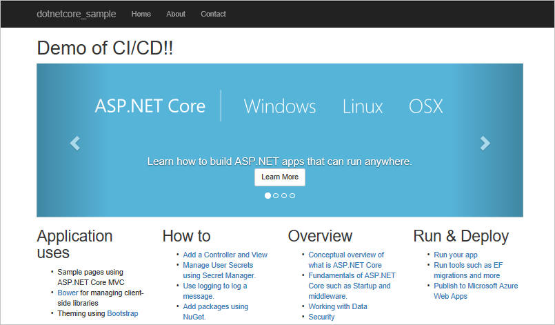

# Deploy your ASP.NET Core app to a Windows virtual machine

**Azure Pipelines**

Azure Pipelines provides a highly customizable continuous integration (CI) and continuous deployment (CD) pipeline to automatically deploy your ASP.NET Core web app to a Windows virtual machine (VM) in Azure.

You'll use the Azure Pipelines portal to set up CI/CD. Your CI pipeline runs the .NET Core commands to restore packages, build and test the app, and finally publish artifacts. Your CD pipeline automatically picks up these artifacts and deploys them to your stage. Finally, you'll test it all out by pushing a small code change into your team's git repo. Your CI/CD processes will automatically deploy the change.

Your code changes automatically appear on your site:

## Prerequisites

[!INCLUDE [include](../../../_shared/ci-cd-prerequisites-vsts.md)]
* Have a Windows virtual machine that has a default web site running in IIS. See [Create a Windows virtual machine with the Azure CLI](/azure/virtual-machines/windows/quick-create-cli) for instructions to create a virtual machine in Azure, to install IIS, and to obtain its `publicIpAddress`.

## Prepare the Windows VM

[!INCLUDE [prepare-aspnetcore-windows-vm](../../../apps/_shared/prepare-aspnetcore-windows-vm.md)]

[!INCLUDE [create-deployment-group](../../../apps/_shared/create-deployment-group.md)]

## Import code for a sample app into Azure Repos

[!INCLUDE [import-code-aspnet-core-vsts](../../../apps/aspnet/_shared/import-code-aspnet-core-vsts.md)]

[//]: # (TODO: we want factoring of include like above so we can reuse stock fragments that appear in many many places)

## Set up continuous integration

[!INCLUDE [ci-quickstart-intro](../../../_shared/ci-quickstart-intro.md)]

[//]: # (TODO: Restore use of includes when we get support for using them in a list.)

[//]: # (TODO: [!INCLUDE [create-aspnet-core-build-team-services](../../../apps/_shared/create-aspnet-core-build-team-services.md])

1. On the **Files** tab of the **Code** hub, click **Set up build**.

 

 You are taken to Azure Pipelines and asked to **Choose a template**.

1. In the right panel, click **ASP.NET Core**, and then click **Apply**.

 

 You now see all the tasks that were automatically added to the build pipeline by the template. These are the tasks that will automatically run every time you push code changes.

1. For the **Agent pool**, select _Hosted VS2017_. This is how you can use our pool of agents that have the software you need to build your app.

1. Click the **Triggers** tab in the build pipeline. Enable the **Continuous Integration** trigger. This will ensure that the build pipeline is automatically triggered every time you commit a change to your repository.

1. Click **Save & queue** to kick off your first build. On the **Save build pipeline and queue** dialog box, click **Save & queue**.

A new build is started. You'll see a link to the new build on the top of the page. Click the link to watch the new build as it happens. Wait for the build to complete and succeed before proceeding to the next section.

[//]: # (TODO)

[//]: # (TODO: Restore use of includes when we get support for using them in a list.)

## Set up continuous deployment

Continuous deployment (CD) is a lean practice that your team can use to keep production fresh. Here you'll set up a short automatic path from the availability of new code in version control to deployment. Specifically, you'll define a CD pipeline that picks up the artifacts from your CI build and deploys you app to the IIS web server hosted in your Windows VM.

1. Once the build succeeds, click the **Release** action on the build summary page.

 

1. In the **Create release pipeline** wizard, select **IIS Website Deployment** template, and then click **Apply**.

 

1. Click the **Tasks** tab, and then click the **IIS Deployment** job. For the **Deployment Group**, click the deployment group you created earlier, such as *myIIS*.

 

1. Click **Save**. On the Save dialog box, click **OK**.

1. To test the release pipeline, click **Release** and then **Create Release**.

 

1. On the Create new release dialog box, click **Queue**.

 Notice that a new release was created. Click the link to navigate to the release.

 

1. Click the **Logs** tab to watch the live logs from the deployment as it happens. Wait for the release to be deployed to the Azure Web App.

1. Once deployment has completed, open your web browser and test your web app: `http://<publicIpAddress>`

[!INCLUDE [include](_shared/change-aspnet-core-code.md)]

When the deployment is done, verify that your changes are live in your web browser: `
http://<publicIpAddress>`

You're ready to collaborate with a team on an ASP.NET Core app with a CI/CD pipeline that automatically deploys your latest work to your web site.

## Next steps

You've just put your own CI/CD processes in place. You can modify these build and release pipelines to meet the needs of your team. To learn more see one of these tutorials:

* [Customize CD pipeline](../../../release/define-multistage-release-process.md)

[//]: # (TODO MAYBE [!INCLUDE [include](_shared/quickstart-next-steps.md)
