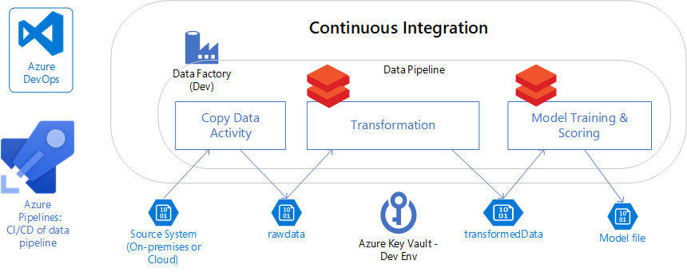

# Why data pipelines?

You can use data pipelines to:
* Ingest data from various data sources
* Process and transform the data 
* Save the processed data to a staging location for others to consume

Data pipelines in the enterprise can evolve into more complicated scenarios with multiple source systems and supporting various downstream applications.

Data pipelines provide:
* Consistency: Data pipelines transform data into a consistent format for users to consume
* Error reduction: Automated data pipelines eliminate human errors when manipulating data
* Efficiency: Data professionals save time spent on data processing transformation. Saving time allows then to focus on their core job function - getting the insight out of the data and helping business makes better decisions

## What is CI/CD?
Continuous integration and continuous delivery (CI/CD) is a software development approach where all developers work together on a shared repository of code – and as changes are made, there are automated build process for detecting code issues.  The outcome is a faster development life cycle and a lower error rate.   

## What is a CICD/ data pipeline and why does it matter for data science?
The building of machine learning models is similar to traditional software development in the sense that the data scientist needs to write code to train and score machine learning models. 

Unlike traditional software development where the product is based on code, data science machine learning models are based on both the code (algorithm, hyper parameters) and the data used to train the model.  That’s why most data scientists will tell you that they spend 80% of the time doing data preparation, cleaning and feature engineering.  

To complicate the matter even further – to ensure the quality of the machine learning models, techniques such as A/B testing are used. With A/B testing, there could be multiple machine learning models being used concurrently.  There is usually one control model and one or more treatment models for comparison – so that the model performance can be compared and maintained.  Having multiple models adds another layer of complexity for the CI/CD of machine learning models.

Having a CI/CD data pipeline is crucial for the data science team to deliver the machine learning models to the business in a timely and quality manner. 

## Next steps
> [!div class="nextstepaction"]
> [Build a data pipeline with Azure](build-data-pipeline.md)
