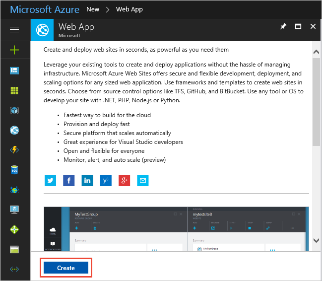
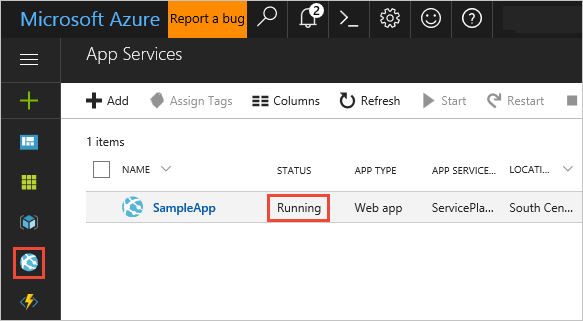

## Create an Azure Web App using the portal

> [!NOTE]
> If you already have a web app that you want to use, you can skip this and move to the next section.  

1. Sign into the [Microsoft Azure portal](https://portal.azure.com).

1. Choose the **+** icon in the left navigation bar, then choose **Web App**.
 
   

   >If you don't see **Web App** in the list, use the search box to find it.

1. If you see the introduction page, choose **Create**.

   

1. Enter a name for the new web app. You'll see a green checkmark when the name is unique.
   Then choose **Create**.  

   

1. Choose the **App Services** icon in the left navigation bar.
   After a few minutes, you'll see the new web app appear in the list.
   Ensure that it is running.

   

You're now ready to start using your new web app.

