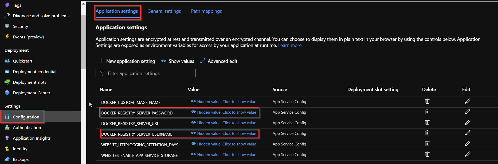

# Deploy a custom container to Azure App Service with Azure Pipelines

[!INCLUDE [version-lt-eq-azure-devops](../../../includes/version-lt-eq-azure-devops.md)]

Using Azure Pipelines, you can build, test, and automatically deploy your web app to an Azure App Service Web App container on Linux. In this article, you'll learn how to use YAML or Classic pipelines to:

> [!div class="checklist"]
>
> - Build and publish a Docker image to Azure Container Registry.
> - Create an Azure Web App.
> - Deploy a container to Azure App Service.
> - Deploy to deployment slots.

## Prerequisites

| **Product** | **Requirements**   |
|---|---|
| **Azure DevOps** | - An Azure DevOps organization and project. [Create one for free](../../get-started/pipelines-sign-up.md). <br>   - **Permissions:**<br>      &nbsp;&nbsp;&nbsp;&nbsp;- To grant access to all pipelines in the project: You must be a member of the [Project Administrators group](../../../organizations/security/change-project-level-permissions.md).<br>      &nbsp;&nbsp;&nbsp;&nbsp;- To create service connections: You must have the *Administrator* or *Creator* role for [service connections](../../library/add-resource-protection.md).<br>   - An ability to run pipelines on Microsoft-hosted agents. You can either purchase a [parallel job](../../licensing/concurrent-jobs.md) or you can request a free tier.  |
| **GitHub** | - A [GitHub](https://github.com) account.|
| **Azure** | - An Azure Container Registry. [Create an Azure container registry](/azure/container-registry/container-registry-get-started-portal#create-a-container-registry) if you don't have one already.|

## Get the code

Fork the following sample app at GitHub.

#### [Java](#tab/java)

```
https://github.com/spring-guides/gs-spring-boot-docker.git
```
#### [JavaScript](#tab/javascript)

```
https://github.com/MicrosoftDocs/pipelines-javascript-docker
```
#### [Python](#tab/python)

```
https://github.com/Microsoft/python-sample-vscode-flask-tutorial
```
#### [.NET Core](#tab/dotnet-core)

```
https://github.com/MicrosoftDocs/pipelines-dotnet-core-docker
```
* * *

## Build and publish a Docker image to Azure Container Registry

To complete this section successfully, you must have an [Azure Container Registry](#prerequisites). Refer to the prerequisites section for details. 
 
1. Sign in to your Azure DevOps organization and navigate to your project.

1. Select **Pipelines**, and then **New Pipeline**.

1. Select **GitHub** when prompted for the location of your source code, and then select your repository.

1. Select the **Docker: build and push an image to Azure Container Registry** pipeline template.

    :::image type="content" source="media/docker-template.png" alt-text="Screenshot of selecting the Docker pipeline template.":::

1. Select your Azure subscription, and then select **Continue**.

1. Select your **Container registry** from the drop-down menu, and then select **Validate and configure**.

    :::image type="content" source="media/validate-and-configure.png" alt-text="Screenshot of the Validate and Configure Docker screen.":::

1. Review the pipeline YAML template, then select **Save and run** to build and publish the Docker image to Azure Container Registry. 

    ```YAML
    trigger:
    - main
    
    resources:
    - repo: self
    
    variables:
        # Container registry service connection established during pipeline creation
        dockerRegistryServiceConnection: '{{ containerRegistryConnection.Id }}'
        imageRepository: 'javascriptdocker'
        containerRegistry: 'sampleappcontainerregistry.azurecr.io'
        dockerfilePath: '$(Build.SourcesDirectory)/app/Dockerfile'
        tag: '$(Build.BuildId)'
    
        # Agent VM image name
        vmImageName: 'ubuntu-latest'
    
    stages:
    - stage: Build
        displayName: Build and push stage
        jobs:
        - job: Build
        displayName: Build
        pool:
            vmImage: $(vmImageName)
        steps:
        - task: Docker@2
            displayName: Build and push an image to container registry
            inputs:
            command: buildAndPush
            repository: $(imageRepository)
            dockerfile: $(dockerfilePath)
            containerRegistry: $(dockerRegistryServiceConnection)
            tags: |
                $(tag)
    ```
1. To view the published Docker image after the pipeline run is complete, go to the container registry in Azure portal, then select **Repositories**.

    :::image type="content" source="media/docker-image-in-azure-portal.png" alt-text="Screenshot of the Docker image published to Azure Container Registry.":::

1. To deploy the image from the container registry, enable the admin user account. Go to the container registry in Azure portal, and select **Access keys**. Then, select the toggle button to **Enable Admin user**.

## Create a Web App

1. Go to [Azure portal](https://portal.azure.com).

1. Select **Create a resource** > **Containers**, then choose **Web App for Containers**.

    :::image type="content" source="media/create-web-app-container.png" alt-text="Screenshot of creating a web app for containers resource.":::

1. Enter a name for your new web app and create a new resource group. Select **Linux** for the **Operating System**.

    :::image type="content" source="media/configure-web-app.png" alt-text="Screenshot of configuring the web app.":::

1. In the **Pricing plans** section, select the **F1 Free plan**.

1. Select **Review and create**. Review your configuration and select **Create** when you're done.

## Deploy to Web App for Containers

# [YAML](#tab/yaml/)

In this YAML, you build and push a Docker image to a container registry and then deploy it to Azure Web App for Containers. In the Build stage, you build and push a Docker image to an Azure Container Registry with the [Docker@2 task](/azure/devops/pipelines/tasks/reference/docker-v2). The [AzureWebAppContainer@1 task](/azure/devops/pipelines/tasks/reference/azure-web-app-container-v1) deploys the image to Web App for Containers.

```yaml

trigger:
- main

resources:
- repo: self

variables: 
  ## Add this under variables section in the pipeline
  azureSubscription: <Name of the Azure subscription>
  appName: <Name of the Web App>
  containerRegistry: <Name of the Azure container registry>
  dockerRegistryServiceConnection: '4fa4efbc-59af-4c0b-8637-1d5bf7f268fc'
  imageRepository: <Name of image repository>
  dockerfilePath: '$(Build.SourcesDirectory)/Dockerfile'
  tag: '$(Build.BuildId)'

  vmImageName: 'ubuntu-latest'

stages:
- stage: Build
  displayName: Build and push stage
  jobs:
  - job: Build
    displayName: Build
    pool:
      vmImage: $(vmImageName)
    steps:
    - task: Docker@2
      displayName: Build and push an image to container registry
      inputs:
        command: buildAndPush
        repository: $(imageRepository)
        dockerfile: $(dockerfilePath)
        containerRegistry: $(dockerRegistryServiceConnection)
        tags: |
          $(tag)


    ## Add the below snippet at the end of your pipeline
    - task: AzureWebAppContainer@1
      displayName: 'Azure Web App on Container Deploy'
      inputs:
        azureSubscription: $(azureSubscription)
        appName: $(appName)
        containers: $(containerRegistry)/$(imageRepository):$(tag)
```

# [Classic](#tab/classic/)

1. From within your project, select **Pipelines**, and then select **Release**.

1. Select **New pipeline** to create a new release pipeline.

1. Select the **Azure App Service deployment** template

    :::image type="content" source="media/app-service-template.png" alt-text="Screenshot of Azure App Service template.":::

1. Select **Tasks**, then **Unlink all** in **stage 1** to unlink all the pipeline parameters. 

    :::image type="content" source="media/unlink-parameters.png" alt-text="Screenshot of unlink pipeline parameters.":::

1. Select the **Deploy Azure App Service** task, and fill out the required fields. Select **Save** when you're done.

    :::image type="content" source="media/deploy-task.png" alt-text="Screenshot of deploy Azure App Service task.":::

1. Select **Create release**, and then choose **Stage 1** from the dropdown menu. Select **Create** when you're done.

    :::image type="content" source="media/create-release.png" alt-text="Screenshot of create a release pipeline.":::

1. Hover over **Stage 1** in your pipeline, and then select **Deploy** to queue and start the deployment.

    :::image type="content" source="media/deploy-docker-image.png" alt-text="Screenshot of queue and deploy Docker image.":::

1. Your pipeline logs should look similar to this screenshot. 

    :::image type="content" source="media/pipeline-logs.png" lightbox="media/pipeline-logs.png" alt-text="Screenshot of pipeline logs.":::

1. Navigate to your newly deployed web app to verify your deployment.

    :::image type="content" source="media/deployed-web-app.png" alt-text="Screenshot of web app deployed. Hello World message.":::
---

## Deploy to a deployment slot

# [YAML](#tab/yaml/)

Configure the Azure Web App container to have multiple slots. Slots let you safely deploy your app and test it before making it available to your customers. Learn more in [Create staging environments](/azure/app-service/deploy-staging-slots).

The following YAML snippet shows how to deploy to a staging slot, and then swap to a production slot:

```yaml
- task: AzureWebAppContainer@1
  inputs:
    azureSubscription: '<Azure service connection>'
    appName: '<Name of the web app>'
    containers: $(containerRegistry)/$(imageRepository):$(tag)
    deployToSlotOrASE: true
    resourceGroupName: '<Name of the resource group>'
    slotName: staging

- task: AzureAppServiceManage@0
  inputs:
    azureSubscription: '<Azure service connection>'
    WebAppName: '<name of web app>'
    ResourceGroupName: '<name of resource group>'
    SourceSlot: staging
    SwapWithProduction: true
```

# [Classic](#tab/classic/)

You can configure the Azure Web App for container to have multiple slots. Slots allow you to safely deploy your app and test it before making it available to your customers.
Use the **Deploy to Slot** option in the **Azure Web App Container** task to specify the slot to deploy to. Swap the slots by using the **Azure App Service Manage** task.

***

## FAQ

### Q: How can I find my Docker registry credentials?

A: Go to [Azure portal](https://portal.azure.com), and select your Web App for Containers. Select **Configuration** > **Application settings**, and then select to show the value.

[  ](azure/media/configure-app-service-security.png#lightbox)

## Related articles

- [Deploy to Azure](../../overview-azure.md)
- [Use ARM templates](./azure/deploy-arm-template.md)
- [Define and target environments](../../process/environments.md)
