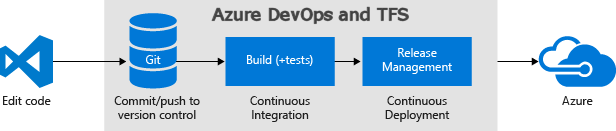

# Deploy to an Azure Web App for Containers

**Azure Pipelines**

We'll show you how to set up continuous deployment of your Docker-enabled app to an Azure Web App using
Azure Pipelines.

For example, you can continuously deliver your app to a Windows VM hosted in Azure.



After you commit and push a code change, it is automatically built and then deployed. The results will automatically show up on your site.

## Example

If you want some sample code that works with this guidance, import (into Azure DevOps) or fork (into GitHub) this repo:

```
https://github.com/Microsoft/devops-project-samples/tree/master/dotnet/aspnetcore/container/Application

```
## Define your CI build pipeline

You'll need a continuous integration (CI) build pipeline that publishes a Docker container image.
To set up a CI build pipeline, see:

* [Build and push a Docker image](../../languages/docker.md).

## Prerequisites

You'll need an Azure subscription. You can get one free through [Visual Studio Dev Essentials](https://visualstudio.microsoft.com/dev-essentials/).

[!INCLUDE [create-azure-webapp-to-host-container](../_shared/create-azure-webapp-to-host-container.md)]

[!INCLUDE [create-release-azure-webapp-container](../_shared/create-release-azure-webapp-container.md)]

## Next steps

* [Set up multi-stage release](../../release/define-multistage-release-process.md)
