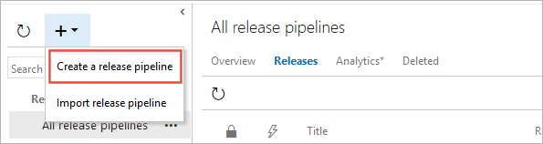
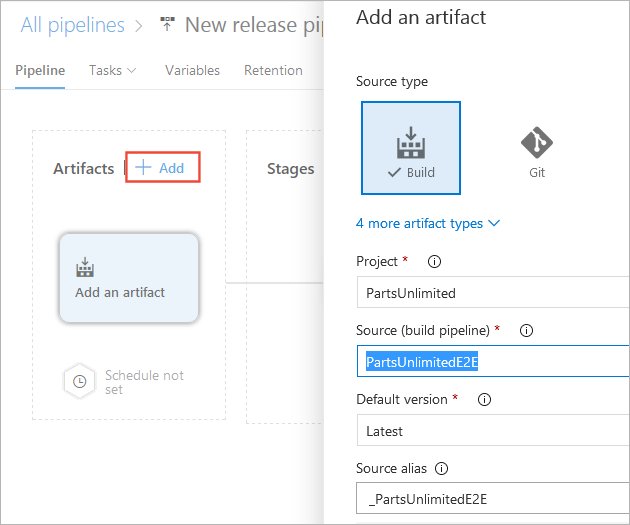
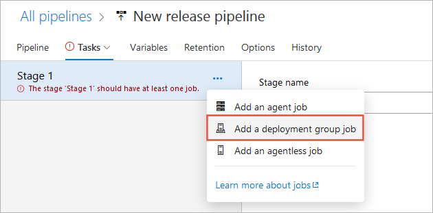
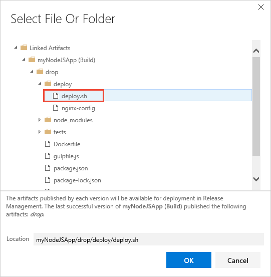

# Deploy a web app to an NGINX web server running on a Linux Virtual Machine (CLassic)

[!INCLUDE [version-lt-eq-azure-devops](../../../includes/version-lt-eq-azure-devops.md)]

> [!NOTE]
> If you want to deploy your application to a Linux virtual machine using YAML pipelines, see [Deploy to a Linux virtual machine](../../ecosystems/deploy-linux-vm.md).

Learn how to use classic Azure Pipelines to build and deploy your web app to a NGINX web server running on a Linux virtual machine.

## Prerequisites

- An Azure DevOps Organization. [Create one for free](../../../organizations/accounts/create-organization.md).
- An Azure account with an active subscription. [Create an Azure account](https://azure.microsoft.com/free/?WT.mc_id=A261C142F) for free if you don't have one already.
- A GitHub account. [Create one for free](https://github.com).

## Linux VM Prerequisites

#### [Java](#tab/java)

- Use Ubuntu 16.04 or higher.
- For Java Spring Boot and Spring Cloud apps, create a Linux VM in Azure using this [template](https://azuremarketplace.microsoft.com/marketplace/apps/azul.azul-zulu13-ubuntu-2004), which provides a fully supported OpenJDK-based runtime.
- For Java servlets on Tomcat server, create a Linux VM using this [template](https://azuremarketplace.microsoft.com/marketplace/apps/azul.azul-zulu13-ubuntu-2004) and then [set up Tomcat](https://www.digitalocean.com/community/tutorials/how-to-install-apache-tomcat-8-on-ubuntu-16-04#step-5-create-a-systemd-service-file) 9.x as a service.
- For Java EE apps, use one of the following templates to create a [Linux VM, Java and WebSphere 9.x](https://azuremarketplace.microsoft.com/marketplace/apps/midvision.websphere-application-server-nde-90), a [Linux VM, Java and WebLogic](https://azuremarketplace.microsoft.com/marketplace/apps/oracle.20191009-arm-oraclelinux-wls-admin), or a [Linux VM and Java 13.x](https://azuremarketplace.microsoft.com/marketplace/apps/azul.azul-zulu13-ubuntu-2004) and WildFly/JBoss 14.

#### [JavaScript](#tab/javascript)

- If you don't have a Linux VM with an Nginx web server, follow the steps in this [Quickstart](/azure/virtual-machines/linux/quick-create-cli) to create one in Azure.

- - -

## Get the code

#### [Java](#tab/java)

[!INCLUDE [include](../../ecosystems/includes/get-code-before-sample-repo-option-to-use-own-code.md)]

```
https://github.com/spring-guides/gs-spring-boot-docker.git
```

#### [JavaScript](#tab/javascript)

[!INCLUDE [include](../../ecosystems/includes/get-code-before-sample-repo-option-to-use-own-code.md)]

```
https://github.com/MicrosoftDocs/pipelines-javascript-docker
```

- - -

[!INCLUDE [create-linux-deployment-group](../includes/create-linux-deployment-group.md)]

## Define your CD release pipeline

Your CD release pipeline picks up the artifacts published by your CI build and then deploys them to your nginx servers.

1. Do one of the following to start creating a release pipeline:

   * If you've completed a CI build, in the build's **Summary** tab under **Deployments**,
     choose **Create release** followed by **Yes**. This starts a new release pipeline that's automatically linked to the build pipeline.

     

   * Open the **Releases** tab of **Azure Pipelines**, open the **+** drop down
     in the list of release pipelines, and choose **Create release pipeline**.

     

1. Choose **Start with an Empty job**.

1. If you created your new release pipeline from a build summary, check that the build pipeline and artifact
   is shown in the **Artifacts** section on the **Pipeline** tab. If you created a new release pipeline from
   the **Releases** tab, choose the **+ Add** link and select your build artifact.

   

1. Choose the **Continuous deployment** icon in the **Artifacts** section, check that the
   continuous deployment trigger is enabled, and add a filter that includes the **main** branch.

   

   > Continuous deployment is not enabled by default when you create a new release pipeline from the **Releases** tab.

1. Open the **Tasks** tab, select the **Agent job**, and choose **Remove** to remove this job.

   

1. Choose **...** next to the **Stage 1** deployment pipeline and select **Add deployment group job**.

   

1. For the **Deployment Group**, select the deployment group you created earlier such as **myNginx**.

   

    The tasks you add to this job will run on each of the machines in the deployment group you specified.

1. Choose **+** next to the **Deployment group job** and, in the task catalog, search for and add a
   **Bash** task.

   

1. In the properties of the **Bash** task, use the **Browse** button for the **Script Path** to select
   the path to the **deploy.sh** script in the build artifact. For example, when you use the **nodejs-sample**
   repository to build your app, the location of the script is  
   `$(System.DefaultWorkingDirectory)/nodejs-sample/drop/deploy/deploy.sh`.
   
   
   
   See a [sample deploy.sh file](https://github.com/azure-devops/fabrikam-node/blob/master/deployscript.sh) for a Node.js web app.   

1. Save the release pipeline.

   

## Create a release to deploy your app

You're now ready to create a release, which means to start the process of running the release pipeline
with the artifacts produced by a specific build. This will result in deploying the build.

[!INCLUDE [simple-create-release](../includes/simple-create-release.md)]

## Next steps

* [Dynamically create and remove a deployment group](howto-webdeploy-iis-deploygroups.md#depgroup)
* [Apply stage-specific configurations](howto-webdeploy-iis-deploygroups.md#envirconfig)
* [Perform a safe rolling deployment](howto-webdeploy-iis-deploygroups.md#rolling)
* [Deploy a database with your app](howto-webdeploy-iis-deploygroups.md#database)
