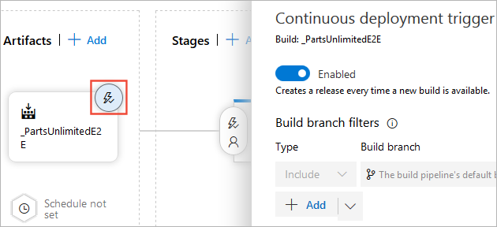
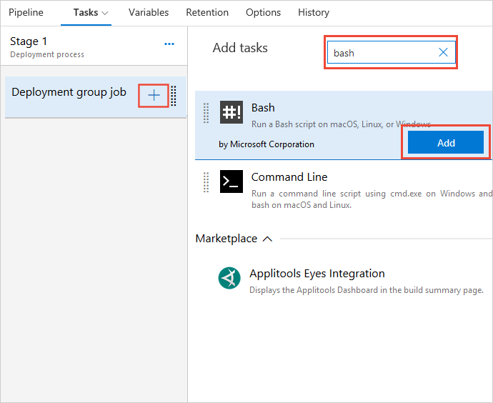

# Deploy to a Linux Virtual Machine

[!INCLUDE [version-tfs-2018](../../_shared/version-tfs-2018.md)]

We'll show you how to set up continuous deployment of your app to an nginx web server running on Ubuntu using
Azure Pipelines or Team Foundation Server (TFS) 2018. You can use the steps in this
quickstart for any app as long as your continuous integration pipeline publishes a web deployment package.

After you commit and push a code change, it is automatically built and then deployed. The results will
automatically show up on your site.

## Define your CI build pipeline

You'll need a continuous integration (CI) build pipeline that publishes your web application, as well as
a deployment script that can be run locally on the Ubuntu server. To set up a CI build pipeline, see:

* [Build your Node.js app with gulp](../../languages/javascript.md)

> Make sure you follow the additional steps in that topic for creating a build to deploy to Linux.

## Prerequisites

You'll need a Linux VM with Nginx web server to deploy the app. The deployment scripts used in the sample repositories
have been tested on Ubuntu 16.04, and we recommend you use the same version of Linux VM for this quickstart.
If you don't already have a Linux VM with Nginx, create one now in Azure using the steps in
[this example](/azure/virtual-machines/linux/quick-create-cli).

[!INCLUDE [create-linux-deployment-group](../_shared/create-linux-deployment-group.md)]

## Define your CD release pipeline

Your CD release pipeline picks up the artifacts published by your CI build and then deploys them to your nginx servers.

1. Do one of the following to start creating a release pipeline:

   * If you've just completed a CI build then, in the build's **Summary** tab under **Deployments**,
     choose **Create release** followed by **Yes**. This starts a new release pipeline that's automatically linked to the build pipeline.

     

   * Open the **Releases** tab of **Azure Pipelines**, open the **+** drop-down
     in the list of release pipelines, and choose **Create release pipeline**.

     

1. Choose **Start with an Empty job**.

1. If you created your new release pipeline from a build summary, check that the build pipeline and artifact
   is shown in the **Artifacts** section on the **Pipeline** tab. If you created a new release pipeline from
   the **Releases** tab, choose the **+ Add** link and select your build artifact.

   

1. Choose the **Continuous deployment** icon in the **Artifacts** section, check that the
   continuous deployment trigger is enabled, and add a filter that includes the **master** branch.

   

   > Continuous deployment is not enabled by default when you create a new release pipeline from the **Releases** tab.

1. Open the **Tasks** tab, select the **Agent job**, and choose **Remove** to remove this job.

   

1. Choose **...** next to the **Stage 1** deployment pipeline and select **Add deployment group job**.

   

1. For the **Deployment Group**, select the deployment group you created earlier such as **myNginx**.

   

    The tasks you add to this job will run on each of the machines in the deployment group you specified.

1. Choose **+** next to the **Deployment group job** and, in the task catalog, search for and add a
   **Bash** task.

   

1. In the properties of the **Bash** task, use the **Browse** button for the **Script Path** to select
   the path to the **deploy.sh** script in the build artifact. For example, when you use the **nodejs-sample**
   repository to build your app, the location of the script is  
   `$(System.DefaultWorkingDirectory)/nodejs-sample/drop/deploy/deploy.sh`

   

1. Save the release pipeline.

   

## Create a release to deploy your app

You're now ready to create a release, which means to start the process of running the release pipeline
with the artifacts produced by a specific build. This will result in deploying the build.

[!INCLUDE [simple-create-release](../_shared/simple-create-release.md)]

## Next steps

* [Dynamically create and remove a deployment group](howto-webdeploy-iis-deploygroups.md#depgroup)
* [Apply stage-specific configurations](howto-webdeploy-iis-deploygroups.md#envirconfig)
* [Perform a safe rolling deployment](howto-webdeploy-iis-deploygroups.md#rolling)
* [Deploy a database with your app](howto-webdeploy-iis-deploygroups.md#database)
