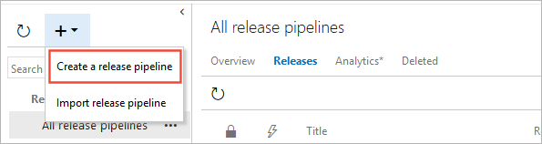
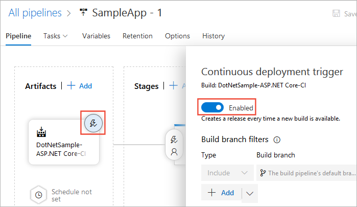

# Deploy to a Windows Virtual Machine

**VSTS | TFS 2018**

We'll show you how to set up continuous deployment of your ASP.NET or Node app to an IIS web server running on Windows using
Visual Studio Team Services (VSTS). You can use the steps in this quickstart as long as your continuous integration process publishes a web deployment package.

After you commit and push a code change, it is automatically built and then deployed. The results will automatically show up on your site.

## Define your CI build process

You'll need a continuous integration (CI) build process that publishes your web deployment package. To set up a CI build process, see:

* [Build your ASP.NET 4 app](../aspnet/build-aspnet-4.md)

* [Build your ASP.NET Core app](../../languages/dotnet-core.md)

* [Build your Node app with Gulp](../nodejs/build-gulp.md)

## Prerequisites

### IIS configuration

The configuration varies depending on the type of app you are deploying.

#### ASP.NET app

[!INCLUDE [prepare-aspnet-windows-vm](../_shared/prepare-aspnet-windows-vm.md)]

#### ASP.NET Core app

[!INCLUDE [prepare-aspnetcore-windows-vm](../_shared/prepare-aspnetcore-windows-vm.md)]

#### Node app

Follow the instructions in [this topic](https://github.com/tjanczuk/iisnode) to install and configure IISnode on IIS servers.

[!INCLUDE [create-deployment-group](../_shared/create-deployment-group.md)]

## Define your CD release process

Your CD release process picks up the artifacts published by your CI build and then deploys them to your IIS servers.

1. Do one of the following:

   * If you've just completed a CI build then, in the build's **Summary** tab under **Deployments**,
     choose **Create release** followed by **Yes**. This starts a new release definition that's automatically linked to the build definition.

     

   * Open the **Releases** tab of the **Build &amp; Release** hub, open the **+** drop-down
     in the list of release definitions, and choose **Create release definition**.

     

1. Select the **IIS Website Deployment** template and choose **Apply**.

1. If you created your new release definition from a build summary, check that the build definition
   and artifact is shown in the **Artifacts** section on the **Pipeline** tab. If you created a new
   release definition from the **Releases** tab, choose the **+ Add** link and select your build artifact.

   

1. Choose the **Continuous deployment** icon in the **Artifacts** section, check that the continuous deployment trigger is enabled,
   and add a filter to include the **master** branch.

   

1. Open the **Tasks** tab and select the **IIS Deployment** phase. For the **Deployment Group**, select the deployment group you created earlier (such as *myIIS*).

   

1. Save the release definition.

## Create a release to deploy your app

You're now ready to create a release, which means to start the process of running the release definition with the artifacts produced by a specific build. This will result in deploying the build:

[!INCLUDE [simple-create-release](../_shared/simple-create-release.md)]

## Next steps

* [Dynamically create and remove a deployment group](howto-webdeploy-iis-deploygroups.md#depgroup)
* [Apply environment-specific configurations](howto-webdeploy-iis-deploygroups.md#envirconfig)
* [Perform a safe rolling deployment](howto-webdeploy-iis-deploygroups.md#rolling)
* [Deploy a database with your app](howto-webdeploy-iis-deploygroups.md#database)
