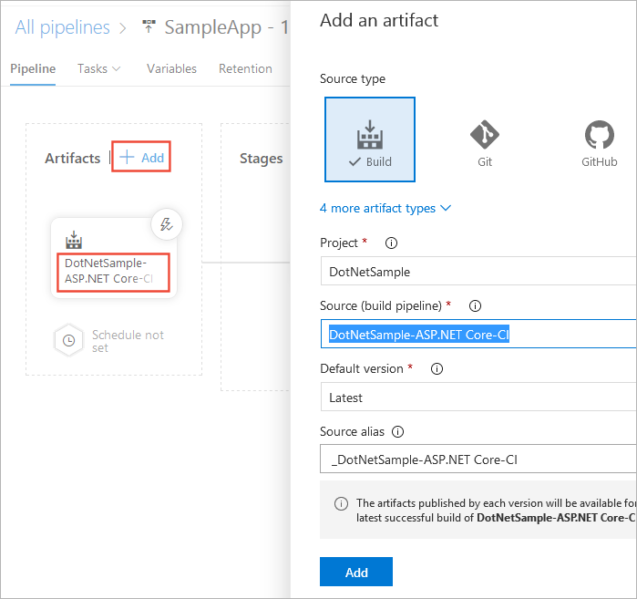

# Deploy your Web Deploy package to IIS servers using WinRM

[!INCLUDE [version-tfs-2015-rtm](../../_shared/version-tfs-2015-rtm.md)]

::: moniker range="<= tfs-2018"
[!INCLUDE [temp](../../_shared/concept-rename-note.md)]
::: moniker-end

> A simpler way to deploy web applications to IIS servers is by using [deployment groups](deploy-webdeploy-iis-deploygroups.md) instead of WinRM. However, deployment groups are not available in version of TFS earlier than TFS 2018.

Continuous deployment means starting an automated deployment pipeline whenever a new successful build is available.
Here we'll show you how to set up continuous deployment of your ASP.NET or Node.js app to one or more IIS servers using Azure Pipelines.
A task running on the [Build and Release agent](../../agents/agents.md) opens a WinRM connection to each IIS server to run Powershell scripts remotely in order to deploy the Web Deploy package.

## Get set up

### Begin with a CI build

Before you begin, you'll need a CI build that publishes your Web Deploy package. To set up CI for your specific type of app, see:

* [Build your ASP.NET 4 app](../aspnet/build-aspnet-4.md)

* [Build your ASP.NET Core app](../../languages/dotnet-core.md)

* [Build your Node.js app with gulp](../../languages/javascript.md)

### WinRM configuration

Windows Remote Management (WinRM) requires target servers to be:

* Domain-joined or workgroup-joined
* Able to communicate using the HTTP or HTTPS protocol
* Addressed by using a fully-qualified domain name (FQDN) or an IP address

This table shows the supported scenarios for WinRM.

| Joined to a | Protocol | Addressing mode |
| --------- | -------- | --------------- |
| Workgroup | HTTPS | FQDN |
| Workgroup | HTTPS | IP address |
| Domain | HTTPS | IP address |
| Domain | HTTPS | FQDN |
| Domain | HTTP | FQDN |

Ensure that your IIS servers are set up in one of these configurations.
For example, do not use WinRM over HTTP to communicate with a Workgroup machine.
Similarly, do not use an IP address to access the target server(s) when you use HTTP.
Instead, in both scenarios, use HTTPS.

> If you need to deploy to a server that is not in the same workgroup or domain, add it to trusted hosts in your [WinRM configuration](https://msdn.microsoft.com/library/aa384372.aspx).

Follow these steps to configure each target server.

1. Enable File and Printer Sharing. You can do this by executing the
   following command in a Command window with Administrative permissions:

   `netsh advfirewall firewall set rule group="File and Printer Sharing" new enable=yes`

1. Check your PowerShell version. You need PowerShell version
   4.0 or above installed on every target machine. To display the current
   PowerShell version, execute the following command in the PowerShell console:

   `$PSVersionTable.PSVersion`

1. Check your .NET Framework version. You need version 4.5
   or higher installed on every target machine. See
   [How to: Determine Which .NET Framework Versions Are Installed](https://msdn.microsoft.com/library/hh925568(v=vs.110).aspx).

1. Download from GitHub [this PowerShell script](https://github.com/Microsoft/vsts-rm-extensions/blob/master/TaskModules/powershell/WinRM/WinRM-Http-Https/ConfigureWinRM.ps1)
   for Windows 10 and Windows Server 2016, or
   [this PowerShell script](https://github.com/Microsoft/vsts-rm-extensions/blob/master/TaskModules/powershell/WinRM/WinRM-Http-Https-With-Makecert/ConfigureWinRM.ps1)
   for previous versions of Windows. Copy them to every target machine. You will use them to configure WinRM in the following steps.
   
1. Decide if you want to use HTTP or HTTPS to communicate
   with the target machine(s).

   * If you choose HTTP, execute the following in a Command
     window with Administrative permissions:

     `ConfigureWinRM.ps1 {FQDN} http`

     > This command creates an HTTP WinRM listener and
     opens port 5985 inbound for WinRM over HTTP.

   * If you choose HTTPS, you can use either a FQDN or an IP
     address to access the target machine(s). To use a FQDN to access the target machine(s),
     execute the following in the PowerShell console with Administrative permissions:  

     `ConfigureWinRM.ps1 {FQDN} https`

     To use an IP address to access the target machine(s),
     execute the following in the PowerShell console with Administrative permissions:  

     `ConfigureWinRM.ps1 {ipaddress} https`

     > These commands create a test certificate by using
     **MakeCert.exe**, use the certificate to create
     an HTTPS WinRM listener, and open port
     5986 inbound for WinRM over HTTPS. The script also
     increases the WinRM **MaxEnvelopeSizekb** setting.
     By default on Windows Server this is 500 KB,
     which can result in a "Request size exceeded the
     configured MaxEnvelopeSize quota" error.

### IIS configuration

If you are deploying an ASP.NET app, make sure that you have ASP.NET 4.5 or ASP.NET 4.6 installed on each of your IIS target servers. For more information, see [this topic](https://www.asp.net/web-forms/overview/deployment/visual-studio-web-deployment/deploying-to-iis).

If you are deploying an ASP.NET Core application to IIS target servers, follow the additional instructions in [this topic](/aspnet/core/publishing/iis) to install .NET Core Windows Server Hosting Bundle.

If you are deploying a Node.js application to IIS target servers, follow the instructions in [this topic](https://github.com/tjanczuk/iisnode) to install and configure IISnode on IIS servers.

In this example, we will deploy to the Default Web Site on each of the servers. If you need to deploy to another website, make sure you configure this as well.

### IIS WinRM extension

Install the [IIS Web App Deployment Using WinRM](https://marketplace.visualstudio.com/items?itemName=ms-vscs-rm.iiswebapp)
extension from Visual Studio Marketplace in Azure Pipelines or TFS.

## Define and test your CD release pipeline

Continuous deployment (CD) means starting an automated release pipeline whenever a new successful build is available. Your CD release pipeline picks up the artifacts published by your CI build and then deploys them to your IIS servers.

1. Do one of the following:

   * If you've just completed a CI build (see above) then, in the build's
     **Summary** tab under **Deployments**, choose **Create release** followed by **Yes**.
     This starts a new release pipeline that's automatically linked to the build pipeline.

   * Open the **Releases** tab of **Azure Pipelines**, open the **+** drop-down
     in the list of release pipelines, and choose **Create release pipeline**.

1. Choose **Start with an empty pipeline**.

1. If you created your new release pipeline from a build summary, check that the build pipeline
   and artifact is shown in the **Artifacts** section on the **Pipeline** tab. If you created a new
   release pipeline from the **Releases** tab, choose the **+ Add** link and select your build artifact.

   

1. Choose the **Continuous deployment** icon in the **Artifacts** section, check that the continuous deployment trigger is enabled,
   and add a filter to include the **master** branch.

   

1. On the **Variables** tab of the stage in release pipeline, configure a variable named **WebServers** with the list of IIS servers as its value; for example `machine1,machine2,machine3`.

1. Configure the following tasks in the stage:
  
    [Deploy: Windows Machine File Copy](../../tasks/deploy/windows-machine-file-copy.md) - Copy the Web Deploy package to the IIS servers.
   
   - **Source**: Select the Web deploy package (zip file) from the artifact source.
   
   - **Machines**: `$(WebServers)`
   
   - **Admin Login**: Enter the administrator credentials for the target servers. For workgroup-joined computers, use the format `.\username`. For domain-joined computers, use the format `domain\username`.
   
   - **Password**: Enter the administrator password for the target servers.
   
   - **Destination Folder**: Specify a folder on the target server where the files should be copied to.

   
    [Deploy: WinRM - IIS Web App Deployment](https://github.com/Microsoft/vsts-rm-extensions/blob/master/Extensions/IISWebAppDeploy/Src/Tasks/IISWebAppDeploy/README_IISAppDeploy.md) - Deploy the package.
   
   - **Machines**: `$(WebServers)`
   
   - **Admin Login**: Enter the administrator credentials for target servers. For workgroup-joined computers, use the format `.\username`. For domain-joined computers, use the format `domain\username`.
   
   - **Password**: Enter the administrator password for target servers.
   
   - **Protocol**: Select `HTTP` or `HTTPS` (depending on how you configured the target machine earlier). Note that if the target machine is workgroup-joined, you must choose `HTTPS`. You can use HTTP only if the target machine is domain-joined and configured to use a FQDN.
   
   - **Web Deploy Package**: Fully qualified path of the zip file you copied to the target server in the previous task.
   
   - **Website Name**: `Default Web Site` (or the name of the website if you configured a different one earlier).

1. Edit the name of the release pipeline, click **Save**, and click **OK**. Note that the default stage is named Stage1, which you can edit by clicking directly on the name.

You're now ready to create a release, which means to run the release pipeline with the artifacts produced by a specific build. This will result in deploying the build to IIS servers:

[!INCLUDE [simple-create-release](../_shared/simple-create-release.md)]

## Q & A

<!-- BEGINSECTION class="md-qanda" -->

::: moniker range="<= tfs-2018"
[!INCLUDE [temp](../../_shared/qa-versions.md)]
::: moniker-end

<!-- ENDSECTION -->

[!INCLUDE [rm-help-support-shared](../../_shared/rm-help-support-shared.md)]
