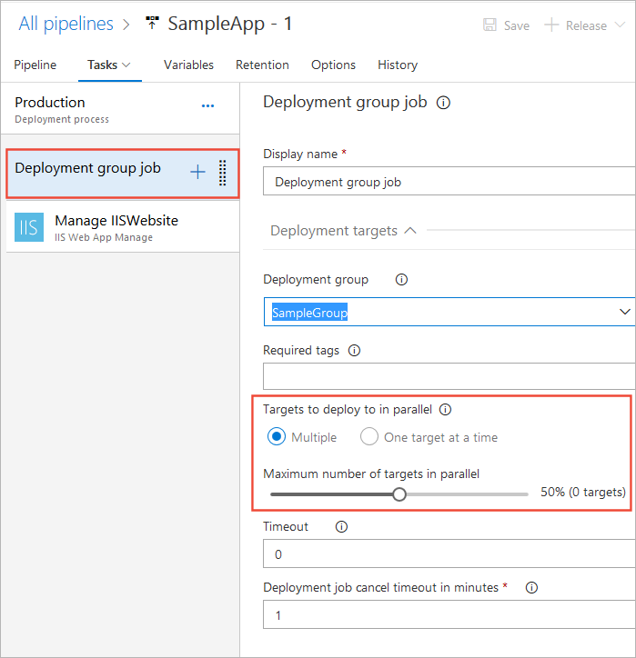

# How To: Extend your deployments to IIS Deployment Groups

[!INCLUDE [version-tfs-2018](../../_shared/version-tfs-2018.md)]

You can quickly and easily deploy your ASP.NET or Node.js app to an IIS Deployment Group using
Azure Pipelines or Team Foundation Server (TFS),
as demonstrated in [this example](deploy-webdeploy-iis-deploygroups.md).
In addition, you can extend your deployment in a range of ways
depending on your scenario and requirements. This topic shows you how to:

* [Dynamically create and remove a deployment group](#depgroup)
* [Apply stage-specific configurations](#envirconfig)
* [Perform a safe rolling deployment](#rolling)
* [Deploy a database with your app](#database)

## Prerequisites

You should have worked through the example [CD to an IIS Deployment Group](deploy-webdeploy-iis-deploygroups.md) before you attempt any of these steps.
This ensures that you have the release pipeline, build artifacts, and websites required.

## Dynamically create and remove a deployment group

You can create and remove deployment groups dynamically if you prefer by using
the [Azure Resource Group Deployment task](https://aka.ms/argtaskreadme)
to install the agent on the machines in a deployment group using ARM templates.
See [Provision deployment group agents](../../release/deployment-groups/howto-provision-deployment-group-agents.md).  

## Apply stage-specific configurations

If you deploy releases to multiple stages, you can substitute configuration settings in **Web.config** and other configuration files of your website using these steps:

1. Define stage-specific configuration settings in the **Variables** tab of a stage in a release pipeline; for example,
   `<connectionStringKeyName> = <value>`.

1. In the **IIS Web App Deploy** task, select the checkbox for **XML variable substitution** under **File Transforms and Variable Substitution Options**.

   > If you prefer to manage stage configuration settings in
   your own database or Azure KeyVault, add a task to the stage to read and emit those values using
   `##vso[task.setvariable variable=connectionString;issecret=true]<value>`.

   > At present, you cannot apply a different configuration to individual IIS servers.

## Perform a safe rolling deployment

If your deployment group consists of many IIS target servers, you can deploy to a subset of servers at a time.
This ensures that your application is available to your customers at all times.
Simply select the **Deployment group job** and use the slider to configure the **Maximum number of targets in parallel**.

## Deploy a database with your app

To deploy a database with your app:

1. Add both the IIS target servers and database servers to your deployment group.
   Tag all the IIS servers as `web` and all database servers as `database`.

1. Add two machine group jobs to stages in the release pipeline, and a task in each job as follows:

   **First [Run on deployment group job](../../process/phases.md)** for configuration of web servers.
   
   - **Deployment group**: Select the deployment group you created in the [previous example](deploy-webdeploy-iis-deploygroups.md).
   
   - **Required tags**: `web`

   
   Then add an **IIS Web App Deploy** task to this job.
   
   **Second [Run on deployment group job](../../process/phases.md)** for configuration of database servers.
   
   - **Deployment group**: Select the deployment group you created in the [previous example](deploy-webdeploy-iis-deploygroups.md).
   
   - **Required tags**: `database`

   
   Then add a **SQL Server Database Deploy** task to this job.
