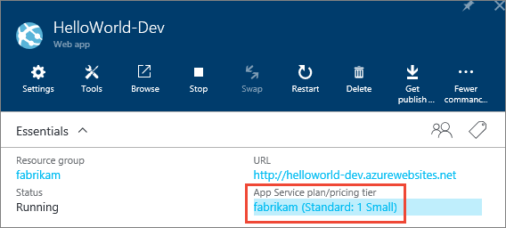
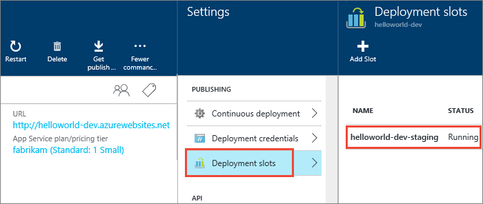

# How To: Extend your deployments to Azure App Services

You can quickly and easily deploy your ASP.NET or Node app to an Azure App Services website using
Visual Studio Team Services (VSTS) or Microsoft Team Foundation Server (TFS) 2017.2,
as demonstrated in [this example](deploy-webdeploy-webapps.md). In addition, you can extend your deployment in a range of ways
depending on your scenario and requirements. This topic shows you how to:

* [Deploy to a staging slot and then swap to production](#swapslots)
* [Deploy multiple apps in the same release](#multipleapps)
* [Apply environment-specific configurations](#configenvir)
* [Deploy to a Government cloud or Azure Stack instead of a public cloud](#govtcloud)

## Prerequisites

You should have worked through the example [CD to Azure App Services](deploy-webdeploy-webapps.md) before you attempt any of these steps.
This ensures that you have the release definition, build artifacts, and website required.

## Deploy to a staging slot and then swap to production

If you want to deploy to a staging slot in an Azure App Services website, and then swap the staging and production slots, perform these steps.

1. Ensure that your Azure App Services plan is a standard or
   premium level. This is required to configure deployment slots.

   

1. Configure a **Staging** slot in the Azure App Services website.

   

   You do not need to configure a **Production** slot because it is implicitly present in all Azure App Services websites.

   >For more information on configuring deployment slots, see
   [Set up staging environments for web apps in Azure App Service](https://azure.microsoft.com/documentation/articles/web-sites-staged-publishing)
   on the Azure website.

1. Configure the tasks in the environment of the release definition as follows:

    [Deploy: Azure App Service Deploy](../../tasks/deploy/azure-rm-web-app-deployment.md) - Deploy the app to Azure App Services.
   
   - **Azure Subscription**: Select a connection from the list under **Available Azure Service Connections** or create a more restricted permissions
     connection to your Azure subscription. For more details, see [Azure Resource Manager service endpoint](../../library/service-endpoints.md#sep-azure-rm).
   
   - **App Service name**: Select your App Service.
   
   - **Deploy to slot**: `Checked`.
   
   - **Slot**: `Staging`

   
    [Deploy: Azure App Service Manage](../../tasks/deploy/azure-app-service-manage.md) - Swap slots.
   
   - **Azure Subscription**: Select a connection from the list under **Available Azure Service Connections** or create a more restricted permissions
     connection to your Azure subscription. For more details, see [Azure Resource Manager service endpoint](../../library/service-endpoints.md#sep-azure-rm).
   
   - **Action**: `Swap slots`
   
   - **App Service name**: Select your App Service.
   
   - **Resource group**: Select the resource group to which your App Service belongs.
   
   - **Source slot**: `Staging` 

   
You might also consider [Configuring Auto Swap](https://docs.microsoft.com/en-us/azure/app-service-web/web-sites-staged-publishing#Auto-Swap)
for your Azure App Services web app to automatically swap the app into production after successful deployment.

[!INCLUDE [edit-template-vars-in-environment](../_shared/edit-template-vars-in-environment.md)]

## Deploy multiple apps in the same release

If your CI build process builds multiple apps, you can deploy them in the same release.
To do this, configure a separate instance of the **Azure App Service Deploy** task for each app. In each instance of the task:

* Specify a unique value for **App Service Name**

* Specify the **Web Deploy Package** with a reference to a specific app. For example, replace the default value with a more specific value such as `$(build.stagingDirectory)\**\WebApplication1.zip`

## Apply environment-specific configurations

If you deploy releases to multiple environments, you can substitute configuration settings in **Web.config** and other configuration files of your website using these steps:

1. Define environment-specific configuration settings in the **Variables** tab of an environment in a release definition; for example,
   `connectionString = <value>`.

1. In the **Azure App Service Deploy** task, select the check box for **XML variable substitution** under **File Transforms and Variable Substitution Options**.
   This option is present only in version **3.\*** and above of the task.
   
> If you prefer to manage environment configuration settings in your own database or Azure keyvault, add a task to the environment to read and emit those values using `##vso[task.setvariable variable=connectionString;issecret=true]<value>`
   
For more details, see [Managing Configuration & App Settings for Multiple Environments in Your CD Pipeline](https://blogs.msdn.microsoft.com/visualstudioalm/2017/04/05/managing-configuration-app-settings-for-multiple-environments-in-your-cd-pipeline/).   

## Deploy to a Government cloud or Azure Stack

Do this by creating a suitable service endpoint in VSTS ot TFS:

* [Azure Government Cloud deployment](../../library/government-cloud.md)
* [Azure Stack deployment](../../library/azure-stack.md)
