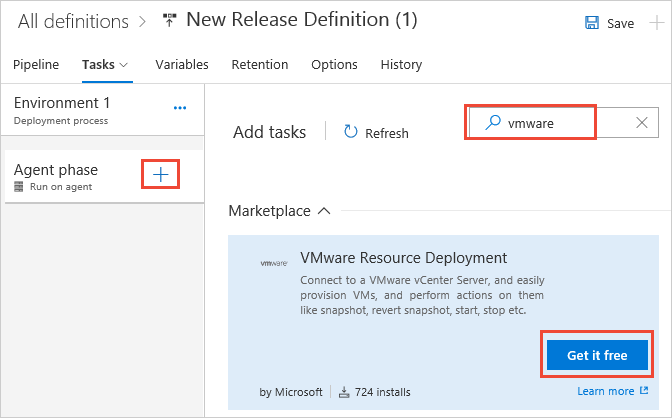

# Provision and manage virtual machines in VMware

[!INCLUDE [version-rm-dev14](../../_shared/version-rm-dev14.md)]

This example shows how you can integrate **VMware 
vCenter Server** with Release Management in Visual 
Studio Team Services (VSTS) or Team Foundation Server (TFS). 
You can provision and manage virtual machines in vCenter 
and then deploy your apps to them.

## Prepare

You will need a minimum of two machines - a **target server** 
or virtual machine to deploy to, and an **agent machine** that 
drives the deployment. You may have multiple target 
servers depending on how many nodes you want to 
deploy to. However, you only need one agent 
machine to drive the deployment.

1. The extension uses the VMware vSphere Management 
SDK to call VMware API functions that access vSphere
web services. To install and configure the SDK on 
the agent machine:

   * Download and install the latest 
     version of the Java Runtime Environment from 
     [this location](http://aka.ms/downloadjre).

   * Go to [this location](http://aka.ms/vspheresdk)
     and sign in with your existing credentials or register
     with the website. Then download the **vSphere 6.0 
     Management SDK**.

   * Create a directory for the vSphere Management SDK
     such as **C:\vSphereSDK**. Do not include spaces in 
     the directory names to avoid issues with some of the
     batch and script files included in the SDK.

   * Unpack the vSphere Management SDK into the 
     new folder you just created.

   * Add the full path and name of the precompiled 
     VMware Java SDK file **vim25.jar** to the machine's 
     CLASSPATH environment variable. If you used the path and name
     **C:\vSphereSDK** for the SDK files, as shown above, the full
     path will be:  
     `C:\vSphereSDK\SDK\vsphere-ws\java\JAXWS\lib\vim25.jar`

1. Install an agent on the **agent machine**:

   * [Deploy an agent on Windows](../../agents/v2-windows.md)
   * [Deploy an agent on macOS](../../agents/v2-osx.md)
   * [Deploy an agent on Linux](../../agents/v2-linux.md)

1. Install the VMware extension 
   from Visual Studio Marketplace into your server or account.

   * If you are using **VSTS**, 
     install the extension from [this location](https://marketplace.visualstudio.com/items?itemName=ms-vscs-rm.vmwareapp)
     in Visual Studio Marketplace. 
   * If you are using **Team Foundation Server**, download 
     the extension from [this location](https://marketplace.visualstudio.com/items?itemName=ms-vscs-rm.vmwareapp)
     in Visual Studio Marketplace, upload it to your 
     Team Foundation Server, and install it.

1. Follow these steps to create a vCenter Server Service 
   endpoint in your project:

   * Open your VSTS or TFS project in 
     your web browser. Choose the **Settings** icon in the menu bar and select **Services**.

   * In the **Services** tab, choose **New Service Endpoint**, and select **VMware vCenter Server**.

   * In the **Add new VMware vCenter Server Connection** 
     dialog, enter the values required to connect to the 
     vCenter Server:

     - **Connection Name**: Enter a user-friendly name 
       for the service endpoint such as **Fabrikam vCenter**.
     - **vCenter Server URL**: Enter the URL of the 
       vCenter server, in the form `https://machine.domain.com/`.
       Note that only **HTTPS** connections are supported.
     - **Username** and **Password**: Enter the credentials
       required to connect to the vCenter Server. 
       Username formats such as **username**, **domain\\username**,
       **machine-name\\username**, and **.\\username** are supported.
       UPN formats such as **username@domain.com** and built-in system 
       accounts such as **NT Authority\\System** are not supported.

1. Choose **OK** to save the settings and create the connection.

## Deploy

1. Open the **Releases** tab of the **Build &amp; Release** hub and choose the
   "**+**" icon to create a new release definition.

1. Choose **Start with an Empty process**.

1. Open the **Tasks** tab and choose the **+** icon for the **Agent phase**.
   Add a **VMware Resource Deployment** task to the environment. You may need
   to install the task extension from Marketplace.

   

1. To configure the **VMware Resource Deployment** task
   to take snapshot of virtual machines, or to revert or delete them, use these settings:

    [VMWare Resource Deployment](https://marketplace.visualstudio.com/items?itemName=ms-vscs-rm.vmwareapp) - Connect to a VMware vCenter Server, easily provision VMs, and perform actions on them.
   
   - **VMware Service Connection**: Select the VMware vCenter Server connection you created earlier.
   
   - **Action**: Select one of the actions: **Take Snapshot of Virtual Machines**, **Revert Snapshot of Virtual Machines**, or **Delete Snapshot of Virtual Machines**. 
   
   - **Virtual Machine Names**: Enter the names of one or more virtual machines. Separate multiple names with a comma; for example, `VM1,VM2,VM3`
   
   - **Datacenter**: Enter the name of the datacenter where the virtual machines will be created.
   
   - **Snapshot Name**: Enter the name of the snapshot. This snapshot must exist if you use the revert or delete action.
   
   - **Host Name**: Depending on the option you selected for the compute resource type, enter the name of the host, cluster, or resource pool.
   
   - **Datastore**: Enter the name of the datastore that will hold the virtual machines' configuration and disk files.
   
   - **Description**: Optional. Enter a description for the **Take Snapshot of Virtual Machines** action, such as `$(Build.DefinitionName).$(Build.BuildNumber)`. This can be used to track the execution of the build or release that created the snapshot.
   
   - **Skip Certificate Authority Check**: If the vCenter Server's certificate is self-signed, select this option to skip the validation of the certificate by a trusted certificate authority.

   >To verify if a self-signed certificate is installed 
   on the vCenter Server, open the VMware vSphere Web 
   Client in your browser and check for a certificate
   error page. The vSphere Web Client URL will be 
   of the form `https://machine.domain/vsphere-client/`. 
   Good practice guidance for vCenter Server certificates 
   can be found in the [VMWare Knowledge Base](http://aka.ms/vcentercertificate)
   (article 2057223).

1. To configure the **VMware Resource Deployment** task
   to provision a new virtual machine from a template, use these settings:

    [VMWare Resource Deployment](https://marketplace.visualstudio.com/items?itemName=ms-vscs-rm.vmwareapp) - Connect to a VMware vCenter Server, easily provision VMs, and perform actions on them.
   
   - **VMware Service Connection**: Select the VMware vCenter Server connection you created earlier.
   
   - **Action**: `Deploy Virtual Machines using Template`
   
   - **Template**: The name of the template that will be used to create the virtual machines. The template must exist in the location you enter for the **Datacenter** parameter.
   
   - **Virtual Machine Names**: Enter the names of one or more virtual machines. Separate multiple names with a comma; for example, `VM1,VM2,VM3`
   
   - **Datacenter**: Enter the name of the datacenter where the virtual machines will be created.
   
   - **Compute Resource Type**: Select the type of hosting for the virtual machines: `VMware ESXi Host`, `Cluster`, or `Resource Pool`
   
   - **Host Name**: Depending on the option you selected for the compute resource type, enter the name of the host, cluster, or resource pool.
   
   - **Datastore**: Enter the name of the datastore that will hold the virtual machines' configuration and disk files.
   
   - **Description**: Optional. Enter a description to identify the deployment.
   
   - **Skip Certificate Authority Check**: If the vCenter Server's certificate is self-signed, select this option to skip the validation of the certificate by a trusted certificate authority. See the note for the previous step to check for the presence of a self-signed certificate.

1. You can now add other tasks to the environment, 
   such as **PowerShell on Target Machines**, and then 
   deploy to the newly provisioned machines.

   > In the future we plan for the **VMware Resource 
   Deployment** task to provide an output variable that you
   set in the task and then use as input to subsequent
   tasks. Until then, if you want to run additional tasks, 
   you'll need to specify the fully-qualified domain 
   names of the virtual machines that are provisioned 
   in VMware.

1. Type a name for the new release definition and save it.

1. Create a new release from the release definition and deploy it to the environment.

## Q&A

<!-- BEGINSECTION class="md-qanda" -->

::: moniker range="< vsts"
[!INCLUDE [temp](../../_shared/qa-versions.md)]
::: moniker-end

<!-- ENDSECTION -->

[!INCLUDE [rm-help-support-shared](../../_shared/rm-help-support-shared.md)]
