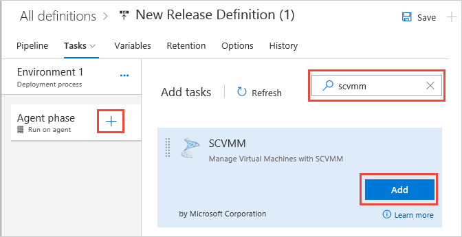

# Configure and manage VMs with System Center Virtual Machine Manager (SCVMM)

[!INCLUDE [version-rm-dev14](../../../_shared/version-rm-dev14.md)]

This example shows how you can integrate **System 
Center Virtual Machine Manager** (SCVMM) with Release Management in 
VSTS or Team Foundation Server.

## Prepare

You need SCVMM. If you want to create an isolated virtual network using SCVMM, see [this topic](../../../targets/create-virtual-network.md.

1. Install the **Virtual Machine Manager** (VMM) console by
   following [these instructions](https://docs.microsoft.com/system-center/vmm/install-console).
   Supported version: [System Center 2012 R2 Virtual Machine Manager](https://technet.microsoft.com/library/hh546785.aspx).

1. Install an agent on the **agent machine**:

   * [Deploy an agent on Windows](../../../agents/v2-windows.md)
   * [Deploy an agent on macOS](../../../agents/v2-osx.md)
   * [Deploy an agent on Linux](../../../agents/v2-linux.md)

1. Install the **System Center Virtual Machine Manager (SCVMM)** extension
   from Visual Studio Marketplace into your server or account:

   * If you are using **VSTS**,
     install the extension from [this location](https://marketplace.visualstudio.com/items?itemName=ms-vscs-rm.scvmmapp)
     in Visual Studio Marketplace.
   * If you are using **Team Foundation Server**, download
     the extension from [this location](https://marketplace.visualstudio.com/items?itemName=ms-vscs-rm.scvmmapp)
     in Visual Studio Marketplace, upload it to your
     Team Foundation Server, and install it.

1. Create an SCVMM service endpoint in your project:

   * Open your VSTS or TFS project in 
     your web browser. Choose the **Settings** icon in the menu bar and select **Services**.

   * In the **Services** tab, choose **New Service Endpoint**, and select **SCVMM**.

   * In the **Add new SCVMM Connection** 
     dialog, enter the values required to connect to the 
     SCVMM Server:

     - **Connection Name**: Enter a user-friendly name 
       for the service endpoint such as **MySCVMMServer**.
     - **SCVMM Server Name**: Enter the fully qualified domain 
       name and port number of the SCVMM server, in the form **machine.domain.com:port**.
     - **Username** and **Password**: Enter the credentials
       required to connect to the vCenter Server. Username formats such as **username**, **domain\username**,
       **machine-name\\username**, and **.\\username** are supported.
       UPN formats such as **username@domain.com** and built-in system 
       accounts such as **NT Authority\\System** are not supported.

1. Choose **OK** to save the settings and create the connection.

## Deploy

1. Open the **Releases** tab of the **Build &amp; Release** hub and choose the
   "**+**" icon to create a new release definition.

1. Choose **Start with an Empty process**.

1. Open the **Tasks** tab and choose the **+** icon for the **Agent phase**.
   Add an **SCVMM** task to the environment.

   

1. You can select the action from the list of actions available in the task.
   See [SCVMM task actions](../../../targets/manage-vms-using-scvmm.md for details.
  
1. You can now add other tasks to the environment, 
   such as **PowerShell on Target Machines** and then 
   deploy to the newly provisioned machines.

   > In the future, we plan for the **SCVMM** task 
   to provide an output variable that you
   set in the task and then use as input to subsequent
   tasks. Until then, if you want to run additional tasks, 
   you must specify the fully-qualified domain 
   names of the virtual machines that are provisioned 
   in SCVMM.

1. Type a name for the new release definition and save it.

1. Create a new release from the release definition
   and deploy it to the environment.

## See also

* [Create a virtual network isolated environment for build-deploy-test scenarios](../../../targets/create-virtual-network.md
* [Task actions for managing VMs using SCVMM](../../../targets/manage-vms-using-scvmm.md

## Q&A

<!-- BEGINSECTION class="md-qanda" -->

::: moniker range="< vsts"
[!INCLUDE [temp](../../../_shared/qa-versions.md)]
::: moniker-end

<!-- ENDSECTION -->

[!INCLUDE [rm-help-support-shared](../../../_shared/rm-help-support-shared.md)]
