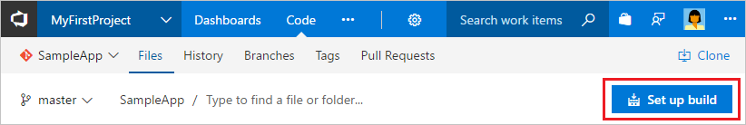

# Build your Go app

**VSTS | TFS 2018 | TFS 2017.2**

Visual Studio Team Services (VSTS) and Team Foundation Server (TFS) provide a highly customizable continuous integration (CI) process to automatically build your Go application whenever your team pushes or checks in code. In this quickstart you learn how to define your CI process for a Go application.

## Prerequisites

[!INCLUDE [include](../../_shared/ci-cd-prerequisites-vsts.md)]

* While the simplest way to try this quickstart is to use a VSTS account, you can also use a TFS server instead of a VSTS account. Make sure that you have [configured a build agent](../../agents/agents.md) for your project, and that you have Go installed on the agent machine.

## Get sample app code

[!INCLUDE [include](../_shared/get-sample-code-intro.md)]

```
https://github.com/adventworks/go-sample
```

# [VSTS or TFS repo](#tab/vsts)

[!INCLUDE [include](../_shared/get-sample-code-vsts-tfs-2017-update-2.md)]

# [GitHub repo](#tab/github)

[!INCLUDE [include](../_shared/get-sample-code-github.md)]

---

## Set up continuous integration

[!INCLUDE [include](../../_shared/ci-quickstart-intro.md)]

[//]: # (TODO: Restore use of includes when we get support for using them in a list.)

1. Create a new build definition.

# [VSTS or TFS repo](#tab/vsts)

Navigate to the **Files** tab of the **Code** hub, and then click **Set up build**.



You are taken to the **Build and Release** hub and asked to **Select a template** for the new build definition.

::: moniker range="> tfs-2018"

  ### VSTS

1. In the right panel, search for `Go`, select **Go (Preview)**, and then click **Apply**.

 You now see all the tasks that were automatically added to the build definition by the template. These are the tasks that will automatically run every time you push code changes.

1. For the **Agent queue**:

 * **VSTS:** Select _Hosted Linux_, _Hosted macOS_, or _Hosted VS2017_. This will use a Microsoft-hosted agent with Go installed.

 * **TFS:** Select a queue that includes an agent with Go installed.

1. Click **Get sources** and observe that the new build definition is automatically linked to your repository.

::: moniker-end

::: moniker range="<=tfs-2018"

  ### TFS 2018 and 2017.2

1. In the right panel, select **Empty**, and then click **Apply**. This template allows starting from scratch and adding your own build tasks.

1. For the **Agent queue**, select a queue that includes an agent with Go installed.

1. Click **Get sources** and observe that the new build definition is automatically linked to your repository.

1. Click the **+** icon on **Phase 1** of the build.

1. Search for the **Command Line** task and click **Add** to add it to your build.

1. Click the **Command Line** task and set its field values as follows:

      Field        | Value
      ------------ | -----
      Display name | `Build Go application`
      Tool         | `go`
      Arguments    | `build hello.go`

::: moniker-end

# [GitHub repo](#tab/github)

Navigate to the **Builds** tab of the **Build and Release** hub in VSTS or TFS, and then click **+ New**. You are asked to **Select a template** for the new build definition.

::: moniker range="> tfs-2018"

  ### VSTS

1. In the right panel, search for `Go`, select **Go (Preview)**, and then click **Apply**.

 You now see all the tasks that were automatically added to the build definition by the template. These are the tasks that will automatically run every time you push code changes.

1. For the **Agent queue**:

 * **VSTS:** Select _Hosted Linux_, _Hosted macOS_, or _Hosted VS2017_. This will use a Microsoft-hosted agent with Go installed.

 * **TFS:** Select a queue that includes an agent with Go installed.

1. Click **Get sources** and select your version control repository. You'll need to authorize access to it.

::: moniker-end

::: moniker range="<=tfs-2018"

  ### TFS 2018 and 2017.2

1. In the right panel, select **Empty**, and then click **Apply**. This template allows starting from scratch and adding your own build tasks.

1. For the **Agent queue**, select a queue that includes an agent with Go installed.

1. Click **Get sources** and select your version control repository. You'll need to authorize access to it.

1. Click the **+** icon on **Phase 1** of the build.

1. Search for the **Command Line** task and click **Add** to add it to your build.

1. Click the **Command Line** task and set its field values as follows:

      Field        | Value
      ------------ | -----
      Display name | `Build Go application`
      Tool         | `go`
      Arguments    | `build hello.go`

::: moniker-end
---

  ### Finish

1. Click the **Triggers** tab in the build definition. Enable the **Continuous integration** trigger. This will ensure that the build process is automatically triggered every time changes are pushed to your repository.

1. Click **Save & queue** to kick off your first build. On the **Save build definition and queue** dialog box, click **Save & queue**.

1. A new build is started. You'll see a link to the new build on the top of the page. Click the link to watch the new build as it happens.

[//]: # (TODO:> [!TIP])
[//]: # (TODO:> To learn more about GitHub CI builds, see [Define CI build process for your Git repo](#)

## View the build summary

[!INCLUDE [include](../_shared/view-build-summary.md)]

::: moniker range="<=tfs-2018"

## Publish your build output

Add the [Copy Files](../../tasks/utility/copy-files.md) and [Publish Build Artifacts](../../tasks/utility/publish-build-artifacts.md) tasks to your build to save its compiled output as a build artifact.

::: moniker-end

## Next steps

[!INCLUDE [include](../_shared/ci-web-app-next-steps.md)]
