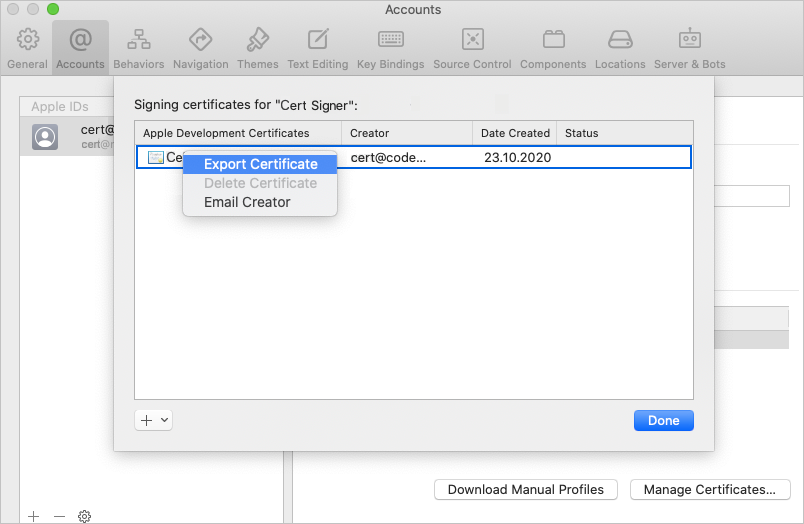

# Sign a mobile app

[!INCLUDE [version-lt-eq-azure-devops](../../../includes/version-lt-eq-azure-devops.md)]

To sign and provision a mobile app for Android or Apple operating systems, you need to manage signing certificates and Apple [provisioning profiles](https://developer.apple.com/library/ios/documentation/IDEs/Conceptual/AppStoreDistributionTutorial/Introduction/Introduction.html#//apple_ref/doc/uid/TP40013839). This article describes how to securely manage certificates and profiles for signing and provisioning your app in Azure Pipelines.

> [!NOTE]  
> You need at least one agent to run a build or release. You can use a Microsoft-hosted Linux, macOS, or Windows build agent, or set up your own agent. For more information, see [Build and release agents](../../agents/agents.md).

<a name="android"></a>
## Sign your Android app

Follow these steps to sign your Android app while keeping your signing certificate secure.

### Upload the keystore file

1. Obtain a keystore file that contains your signing certificate. The [Android documentation](https://developer.android.com/studio/publish/app-signing.html#generate-key) describes the process of generating a keystore file and its corresponding key.

1. In Azure Pipelines, go to **Libraries** > **Secure files**. Select **+ Secure file** and upload your keystore file to the [secure files library](../../library/secure-files.md). During upload, your keystore is encrypted and securely stored.

### Add the signing task to the pipeline

# [YAML](#tab/yaml)

Add the [AndroidSigning@3](/azure/devops/pipelines/tasks/reference/android-signing-v3) task to your YAML pipeline after the step that builds your app. In the `AndroidSigning@3` task:

- `<apkFiles>` is required and is the path and names of the APK files to be signed. The default is `**/*.apk`.
- `<apksign>` must be `true`, which is the default.
- `<keystore-file>` is the name of your uploaded keystore file in the secure files library.
- `<apksignerKeystorePassword>` is the password to the unencrypted keystore file.
- `<apksignerKeystoreAlias>` is the key alias for the signing certificate.
- `<apksignerKeyPassword>` is the password for the key associated with the specified alias.

You can set and use variables in the YAML, or you can set the variables using the **Variables** tab in the Azure Pipelines UI and refer to them in the YAML.

```yaml
variables:
  keystore-password: <keystore file password>
  key-alias: <key alias for the signing certificater>
  key-password: <password for the key associated with the alias>

steps:
- task: AndroidSigning@3
  displayName: 'Signing and aligning APK file(s) **/*.apk'
  inputs:
    apkFiles: '**/*.apk'
    apksign: true
    apksignerKeystoreFile: <keystore-filename.keystore>
    apksignerKeystorePassword: $(keystore-password)
    apksignerKeystoreAlias: $(key-alias)
    apksignerKeyPassword: $(key-password)
```

# [Classic](#tab/classic)

1. Create your build pipeline from the Android or Xamarin.Android build template. Or if you already have a build pipeline, make sure the [Android signing](/azure/devops/pipelines/tasks/reference/android-signing-v3) task is present after the task that builds your app.

1. In the Android signing task, select the **Sign the APK** checkbox under **Signing Options**.

1. Select the settings icon next to the **Keystore file** field, and select the uploaded keystore file from the **Keystore file** dropdown.

1. Select the **Variables** tab for the pipeline and add the following variables:

   |Name|Value|
   |--------|-----|
   |**keystore-password**|Password to the unencrypted keystore file. Be sure to select the **lock** icon to secure your password and obscure it in logs.|
   |**key-alias**|The key alias for the signing certificate you generated.|
   |**key-password**|The password for the key associated with the specified alias. Be sure to select the **lock** icon.|

1. On the **Tasks** tab, select the Android signing task and reference the names of your newly created variables in the **Signing Options** as `$(keystore-password)`, `$(key-alias)`, and `$(key-password)`.
---

Any build agent can now securely sign your app without any certificate management on the build machine itself.

<a name="apple"></a>
## Sign your Apple iOS, macOS, tvOS, or watchOS app

To sign and provision your app, your Xcode or Xamarin.iOS build needs access to your P12 signing certificate and one or more provisioning profiles. The following steps explain how to obtain these files.

### Get your P12 signing certificate

1. Export your development or distribution signing certificate to a *.p12* file by using either Xcode or the Keychain Access app on macOS.

   - To export using Xcode:

     1. Go to **Xcode** > **Preferences** > **Accounts**.
     1. In the left column, select your Apple ID.
     1. On the right side, select your personal or team account and select **Manage Certificates**.
     1. Ctrl+Select the certificate you want to export and select **Export certificate** from the menu.

        

     1. In the dialog box, enter the certificate name, location to save the file, and a password to secure the certificate.

   - Or, use the procedure described in [iOS Signing](https://github.com/phonegap/phonegap-docs/blob/master/docs/4-phonegap-build/3-signing/2-ios.html.md) to follow a similar process using the **Keychain Access** app on macOS or generate a signing certificate on Windows.

1. Upload your P12 file to the Azure Pipelines [secure files library](../../library/secure-files.md). During upload, your certificate is encrypted and securely stored.

1. In your pipeline, go to the **Variables** tab and add a variable named **P12password** with your certificate password as the value. Be sure to select the **lock** icon to secure your password and obscure it in logs.

### Get your provisioning profile

If your app doesn't use automatic signing, you can download your app provisioning profile from the Apple Developer portal. For more information, see [Edit, download, or delete provisioning profiles](https://developer.apple.com/help/account/manage-profiles/edit-download-or-delete-profiles/).

You can also use Xcode to access provisioning profiles that are installed on your Mac. In Xcode, go to **Xcode** > **Preferences** > **Accounts**. Select your Apple ID and your team and then select **Download Manual Profiles**.

In Azure Pipelines, upload your provisioning profile to the [secure files library](../../library/secure-files.md). During upload, your file is encrypted and securely stored.

### Add the signing and provisioning tasks to the pipeline

To sign and provision your app, you can either install the certificate and profile during each build, or [preinstall the files on a macOS build agent](#preinstall-the-certificate-and-profile-on-a-macos-build-agent).

#### Install the certificate and profile during each build

Install the certificate and profile during each build when you don't have enduring access to the build agent, for example when you use [hosted macOS agents](../../agents/hosted.md). The P12 certificate and provisioning profile are installed at the beginning of the build and removed when the build completes.

# [YAML](#tab/yaml)

- Add the [InstallAppleCertificate@2](/azure/devops/pipelines/tasks/reference/install-apple-certificate-v2) task to your YAML pipeline before the Xcode or Xamarin.iOS task. In the code, replace `<secure-file.p12>` with the name of your uploaded *.p12* file. Use the variable for the secure `P12password`.

  ```yaml
  - task: InstallAppleCertificate@2
      inputs:
        certSecureFile: '<secure-file.p12>'
        certPwd: '$(P12password)'
  ```

  >[!NOTE]
  >In the `InstallAppleCertificate@2` task, the `deleteCert` parameter defaults to `true`, which removes the certificate after build.

- Add the [InstallAppleProvisioningProfile@1](/azure/devops/pipelines/tasks/reference/install-apple-provisioning-profile-v1) task to your YAML before the Xcode or Xamarin.iOS task. Replace `<secure-file.mobileprovision>` with the name of your provisioning profile file.

  ```yaml
  - task: InstallAppleProvisioningProfile@1
      inputs:
        provProfileSecureFile: '<secure-file.mobileprovision>'
  ```

  >[!NOTE]
  >In the `InstallAppleProvisioningProfile@1` task, the `removeProfile` parameter defaults to `true`, which removes the profile after build.

# [Classic](#tab/classic)

- Add the [Install Apple Certificate](/azure/devops/pipelines/tasks/reference/install-apple-certificate-v2) task to your build before the Xcode or Xamarin.iOS task.

  In the **Install Apple Certificate** task settings:
  
  - Next to the **Certificate (P12)** field, select your uploaded certificate from the **Certificate (P12)** dropdown.
  - In the **Certificate (P12) password** field, reference the *$(P12password)* variable.

- Add the [Install Apple Provisioning Profile](/azure/devops/pipelines/tasks/reference/install-apple-provisioning-profile-v1) task to your build before the Xcode or Xamarin.iOS task.

  In the **Install Apple Provisioning Profile** task settings:
  
  - For the **Provisioning profile location** option, choose **Secure Files**, and select your uploaded file in the **Provisioning profile** dropdown.
  - Select the checkbox labeled **Remove profile after build** to ensure that the provisioning profile isn't left on the agent machine.

---

Any build agent can now securely sign your app without any certificate or profile management on the build machine itself.

#### Preinstall the certificate and profile on a macOS build agent

Instead of installing the signing certificate and provisioning profiles during the build, you can preinstall them on a macOS build agent. The files are then available for continued use by builds. Use this method only when you trust the people and processes that have access to the macOS keychain on the agent machine.

**Preinstall the P12 certificate**

1. To install the P12 certificate in the default keychain, run the following command from a macOS Terminal window on the build agent. Replace `<certificate.p12>` with the path and name of your P12 file. Replace `<password>` with your P12 file's encryption password.

   ```
   sudo security import <certificate.p12> -P <password>
   ```

1. Add a new variable to your pipeline named **KEYCHAIN_PWD**. Set the value as the password to the default keychain, which is normally the password for the user that starts the agent. Be sure to select the **lock** icon to secure this password.

**Preinstall the provisioning profile**

1. Find the full name of your signing identity by opening a macOS Terminal window and entering `security find-identity -v -p codesigning`. You see a list of signing identities in the form `iPhone Developer/Distribution: Developer Name (ID)`. If an identity is invalid, you see something like `(CSSMERR_TP_CERT_REVOKED)` after the identity.

1. To install the provisioning profile on the agent machine, run the following command from a macOS Terminal window. Replace `<profile>` with the path to your provisioning profile file, and replace `<UUID>` with the provisioning profile UUID, which is the provisioning profile filename without the `.mobileprovision` extension.

   ```
   sudo cp <profile> ~/Library/MobileDevice/Provisioning Profiles/<UUID>.mobileprovision
   ```

**Add signing and provisioning tasks that use the default keychain**

# [YAML](#tab/yaml)

- Add the [InstallAppleCertificate@2](/azure/devops/pipelines/tasks/reference/install-apple-certificate-v2) task to your YAML pipeline before the Xcode or Xamarin.iOS task. In the code, set the following values:

  - `certSecureFile`: The name of your uploaded *.p12* file.
  - `certPwd`: The variable for the secure `P12password`.
  - `signingIdentity`: The full name of your signing identity.
  - `keychain`: `default`, to allow access to the default keychain.
  - `keychainPassword`: The `KEYCHAIN_PWD` variable.
  - `deleteCert`: `false`, to retain the certificate between builds.

  ```yaml
  - task: InstallAppleCertificate@2
    inputs:
      certSecureFile: '<secure-file.p12>'
      certPwd: '$(P12password)'
      signingIdentity: <full-signing-identity>
      keychain: default
      keychainPassword: `$(KEYCHAIN_PWD)
      deleteCert: false
  ```

- Add the [InstallAppleProvisioningProfile@1](/azure/devops/pipelines/tasks/reference/install-apple-provisioning-profile-v1) task. In the code:

  - Set `provProfileSecureFile` to the name of your provisioning profile file.
  - Set `removeProfile` to `false` so the profile is retained between builds.

  ```yaml
  - task: InstallAppleProvisioningProfile@1
      inputs:
        provProfileSecureFile: '<secure-file.mobileprovision>'
        removeProfile: false
  ```

# [Classic](#tab/classic)

- Add the [Install Apple Certificate](/azure/devops/pipelines/tasks/reference/install-apple-certificate-v2) task to your build before the Xcode or Xamarin.iOS task. In the **Install Apple Certificate** task settings:

  - Next to the **Certificate (P12)** field, select your uploaded certificate from the **Certificate (P12)** dropdown.
  - In the **Certificate (P12) password** field, reference the *$(P12password)* variable.
  - Under **Advanced**, set **Keychain** to **Default Keychain**.
    - Set **Keychain password** to the keychain password variable.
    - Deselect the **Delete certificate from keychain** checkbox to keep the certificate on the agent machine after the build.

- Add the [Install Apple Provisioning Profile](/azure/devops/pipelines/tasks/reference/install-apple-provisioning-profile-v1) task to your build before the Xcode or Xamarin.iOS task. In the **Install Apple Provisioning Profile** task settings:

  - For the **Provisioning profile location** option, choose **Secure Files**, and select your uploaded file in the **Provisioning profile** dropdown.
  - Deselect the **Remove profile after build** checkbox to keep the provisioning profile on the agent machine after the build.

---

The macOS build agent can now securely sign and provision your app for all builds without further certificate or profile management.

### Reference the secure files in the Xcode or Xamarin.iOS build task

To use the secure certificate and profile in your pipelines, configure the following settings in your Xcode or Xamarin.iOS build tasks.

The secure files references in the build tasks use variables for the `signingIdentity` and the `provisioningProfileUuid`. These variables are automatically set by the **Install Apple Certificate** and **Install Apple Provisioning Profile** tasks for the certificate and provisioning profile you selected.

# [YAML](#tab/yaml)

For Xcode:

```yaml
- task: Xcode@5
  inputs:
    signingOption: 'manual'
    signingIdentity: '$(APPLE_CERTIFICATE_SIGNING_IDENTITY)'
    provisioningProfileUuid: '$(APPLE_PROV_PROFILE_UUID)'
```

For Xamarin.iOS:

```yaml
- task: XamariniOS@2
    inputs:
      solutionFile: '**/*.iOS.csproj'
      signingIdentity: '$(APPLE_CERTIFICATE_SIGNING_IDENTITY)'
      signingProvisioningProfileID: '$(APPLE_PROV_PROFILE_UUID)'
```

# [Classic](#tab/classic)

For the **Xcode** task settings:

- For the **Signing style** option, choose **Manual signing**.
- In the **Signing identity** field, enter `$(APPLE_CERTIFICATE_SIGNING_IDENTITY)`. 
- In the **Provisioning profile UUID** field, enter `$(APPLE_PROV_PROFILE_UUID)`.

For the **Xamarin.iOS** task settings:

- For the **Override using** option, choose **Identifiers**.
- In the **Signing identity** field, enter `$(APPLE_CERTIFICATE_SIGNING_IDENTITY)`.
- In the **Provisioning profile UUID** field, enter `$(APPLE_PROV_PROFILE_UUID)`.

---

The pipeline build agent now securely signs and provisions your app without further certificate or profile management on the build machine itself.

## Related content

For more information about:

- Pipelines for Android apps, see [Build, test, and deploy Android apps](../../ecosystems/android.md).
- Pipelines for iOS apps, see [Build, test, and deploy Xcode apps](../../ecosystems/xcode.md).
- Agents, see [Azure Pipelines agents](../../agents/agents.md).
- Agent pools and queues, see [Create and manage agent pools](../../agents/pools-queues.md).
- Variables in pipelines, see [Define variables](../../process/variables.md).
- Pipeline troubleshooting, see [Troubleshoot pipeline runs](../../troubleshooting/troubleshooting.md).
