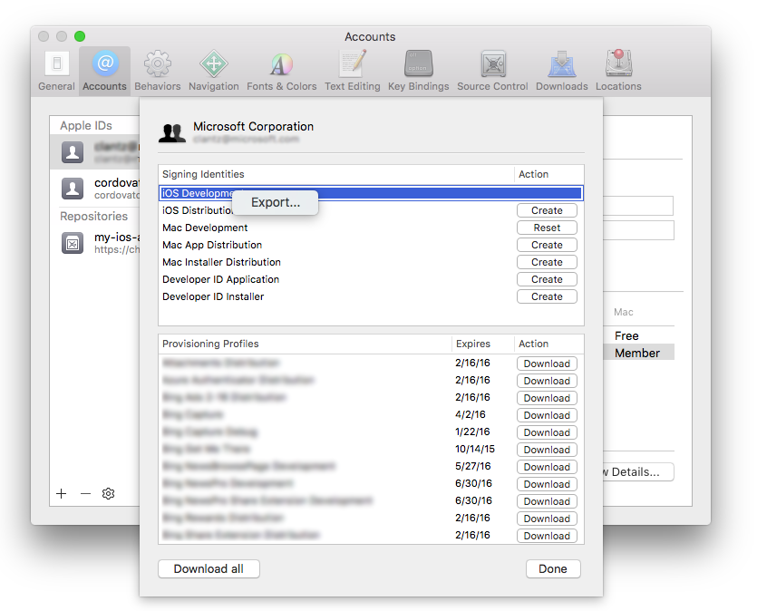
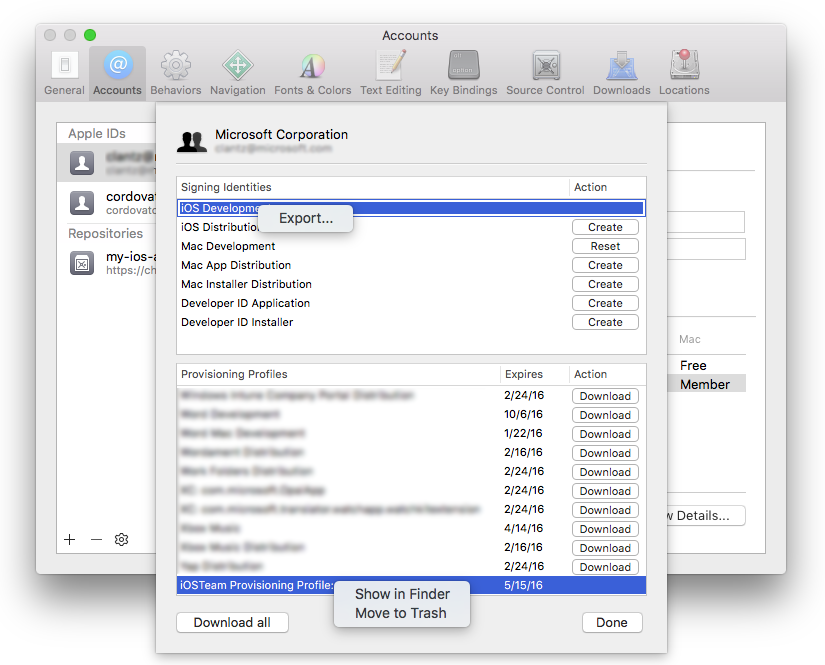

# Sign your mobile app

**Azure Pipelines | TFS 2018 | [TFS 2017.2](secure-certs.md)**

::: moniker range="<= tfs-2018"
[!INCLUDE [temp](../../_shared/concept-rename-note.md)]
::: moniker-end

When developing an app for Android or Apple operating systems, you will eventually need to manage signing certificates, and in the case of Apple apps, [provisioning profiles](https://developer.apple.com/library/ios/documentation/IDEs/Conceptual/AppStoreDistributionTutorial/Introduction/Introduction.html#//apple_ref/doc/uid/TP40013839). This article describes how to securely manage them for signing and provisioning your app.

> **Tip**: Use a Microsoft-hosted Linux, macOS, or Windows build agent, or set up your own agent. See [Build and release agents](../../agents/agents.md).

This article covers:
- [Sign your Android app](#android)
- [Sign your Apple iOS, macOS, tvOS, or watchOS app](#apple)

<a name="android"></a>

## Sign your Android app

Follow these steps to sign your Android app while keeping your signing certificate secure:

1. First, obtain a keystore file that contains your signing certificate. The [Android documentation](https://developer.android.com/studio/publish/app-signing.html#generate-key) describes the process of generating a keystore file and its corresponding key.

1. Create your build pipeline from the Android or Xamarin.Android build template. Or, if you already have a build pipeline, add the [Android Signing](../../tasks/build/android-signing.md) task after the task that builds your APK.

1. Find the Android Signing task's **Sign the APK** checkbox and enable it.

1. Next to the **Keystore file** field, click the settings icon and upload your keystore file to the [Secure Files library](../../library/secure-files.md). During upload, your keystore will be encrypted and securely stored.

1. Once your keystore has been uploaded to the Secure Files library, select it in the **Keystore file** dropdown.

1. Go to the **Variables** tab and add the following variables. In their **Value** column, enter your **Keystore password**, **Key alias**, and **Key password**.

   - **keystore-password**: Password to the unencrypted keystore file. _Be sure to click the **lock** icon._ This will secure your password and obscure it in logs.
   - **key-alias**: The key alias for the signing certificate you generated.
   - **key-password**: The password for the key associated with the specified alias. _Again, be sure to click the **lock** icon._

      

1. Go back to the **Tasks** tab and reference the names of your newly-created variables in the signing options.

      

Save your build pipeline, and you are all set! Any build agent will now be able to securely sign your app without any certificate management on the build machine itself.

<a name="apple"></a>

## Sign your Apple iOS, macOS, tvOS, or watchOS app

For your Xcode or Xamarin.iOS build to sign and provision your app, it needs access to your P12 signing certificate and one or more provisioning profiles. The following sections explain how to obtain these files.

### Obtain your P12 signing certificate

After creating your development or distribution signing certificate, export it to a `.p12` file using either Xcode or the Keychain Access app on macOS.

1. To export using Xcode 8 or lower, go to **Xcode** &gt; **Preferences...** &gt; **Accounts** and select your Apple Developer account.
1. Click **View Details...**, right-click on the signing identity you wish to export, and click **Export...**.
1. Enter a filename and password. Take note of the password as you will need it later.

    

1. Alternatively, follow a similar process using the **Keychain Access** app on macOS or generate a signing certificate on Windows. Use the procedure [described in this article](http://docs.phonegap.com/phonegap-build/signing/ios/) if you prefer this method.

### Obtain your provisioning profile

You can download your app provisioning profile from the Apple Developer portal, unless your app uses automatic signing. You can also use Xcode to access those that are installed on your Mac.
1. Using Xcode 8 or lower, go to **Xcode** &gt; **Preferences...** &gt; **Accounts** and select your Apple Developer account.
1. Right-click the provisioning profile you want to use and select **Show in Finder**.
1. Copy the highlighted file from Finder to another location and give it a descriptive filename.

    

### Configure your build

There are two recommended ways for your build to access signing certificates and provisioning profiles for signing and provisioning your app:

1. Installing them during the build
1. Preinstalling them on a macOS build agent

Choose either of the tabs below for details.

# [Install them during the build](#tab/apple-install-during-build)

Use this method when you do not have enduring access to the build agent, such as the [hosted macOS agents](../../agents/hosted.md). The P12 certificate and provisioning profile are installed at the beginning of the build and removed when the build completes.

#### Install the P12 certificate during your build

1. Add the [Install Apple Certificate](../../tasks/utility/install-apple-certificate.md) task to your build before the Xcode or Xamarin.iOS task.
1. Next to the **Certificate (P12)** field, click the settings icon and upload your P12 file to the [Secure Files library](../../library/secure-files.md). During upload, your certificate will be encrypted and securely stored.
1. Once your certificate has been uploaded to the Secure Files library, select it in the **Certificate (P12)** dropdown.
1. Go to the **Variables** tab and add a variable named `P12password`. Set its value to the password of your certificate. _Be sure to click the **lock** icon._ This will secure your password and obscure it in logs.
1. Go back to the **Tasks** tab. In the **Install Apple Certificate** task's settings, reference your newly-created variable in the **Certificate (P12) password** field as: `$(P12password)`

#### Install the provisioning profile during your build

1. Add the [Install Apple Provisioning Profile](../../tasks/utility/install-apple-provisioning-profile.md) task to your build before the Xcode or Xamarin.iOS task.
1. For the **Provisioning profile location** option, choose **Secure Files** (in YAML, `secureFiles`).
1. Next to the **Provisioning profile** field, click the settings icon and upload your provisioning profile file to the [Secure Files library](../../library/secure-files.md). During upload, your certificate will be encrypted and securely stored.
1. Once your certificate has been uploaded to the Secure Files library, select it in the **Provisioning profile** dropdown.
1. Enable the checkbox labeled **Remove profile after build**. This will ensure that the provisioning profile is not left on the agent machine.

#### Reference the files in your Xcode task

1. Select the **Xcode** task.
1. For the **Signing style** option, choose **Manual signing**.
1. In the **Signing identity** field, enter `$(APPLE_CERTIFICATE_SIGNING_IDENTITY)`. This variable is automatically set by the **Install Apple Certificate** task for the certificate you selected.
1. In the **Provisioning profile UUID** field, enter `$(APPLE_PROV_PROFILE_UUID)`. This variable is automatically set by the **Install Apple Provisioning Profile** task for the provisioning profile you selected.

#### Reference the files in your Xamarin.iOS task

1. Select the **Xamarin.iOS** task.
1. For the **Override using** option, choose **Identifiers**.
1. In the **Signing identity** field, enter `$(APPLE_CERTIFICATE_SIGNING_IDENTITY)`. This variable is automatically set by the **Install Apple Certificate** task for the certificate you selected.
1. In the **Provisioning profile UUID** field, enter `$(APPLE_PROV_PROFILE_UUID)`. This variable is automatically set by the **Install Apple Provisioning Profile** task for the provisioning profile you selected.

Save your build pipeline, and you are all set! The build agent will now be able to securely sign and provision your app.

# [Preinstall them on a macOS build agent](#tab/apple-preinstall)

Use this method only when you trust the people and processes that have access to the macOS keychain on the agent machine where these files will be installed. They will be available for continued use by builds.

#### Install the P12 certificate
Run the following command from a macOS Terminal window of the build agent machine to install the P12 certificate in the default keychain. Replace `<certificate.p12>` with the path to your P12 file. Replace `<password>` with your P12 file's encryption password.

```
sudo security import <certificate.p12> -P <password>
```

#### Install the provisioning profile

Follow these steps:

1. Find the full name of your signing identity by opening the Terminal app and typing the following:

    ```
    security find-identity -v -p codesigning
    ```

    You will see a list of signing identities in the form `iPhone Developer/Distribution: Developer Name (ID)`. If the identity is invalid, you will see something like `(CSSMERR_TP_CERT_REVOKED)` after the identity.

    Take note of the identity you want to use including the ID.

1. Find the UUID for the provisioning profile you want to use by following these steps:

    1. Open Xcode and go to **Xcode** &gt; **Preferences...** &gt; **Accounts** and select your Apple Developer account.
    1. Click **View Details...**, right-click the provisioning profile you want, and select **Show in Finder**.
      
    1. The name of the file that is highlighted in Finder is the UUID of your provisioning profile.

1. Run the following command from a macOS Terminal window of the build agent machine to install the provisioning profile. Replace `<profile>` with the path to your provisioning profile file. Replace `<UUID>` with the UUID of the provisioning profile, obtained above.

```
sudo cp <profile> ~/Library/MobileDevice/Provisioning\ Profiles/<UUID>.mobileprovision
```

#### Reference the files in your Xcode task

1. Select the **Xcode** task.
1. For the **Signing style** option, choose **Manual signing**.
1. In the **Signing identity** field, enter the full signing identity you found using the security command above.
1. In the **Provisioning profile UUID** field, enter the UUID of the provisioning profile from the filename above.

#### Reference the files in your Xamarin.iOS task

1. Select the **Xamarin.iOS** task.
1. For the **Override using** option, choose **Identifiers**.
1. In the **Signing identity** field, enter the full signing identity you found using the security command above.
1. In the **Provisioning profile UUID** field, enter the UUID of the provisioning profile from the filename above.

#### Authorize the agent to access the keychain
1. If you are using the Xamarin.iOS task and running the build agent as a launchd service, you will need to set up the build to unlock the default keychain.

    1. Go to the **Variables** tab and add a new variable named `KEYCHAIN_PWD`. Set its value to the password to the default keychain. This is normally the password for the user that is starting the agent. _Be sure to click the "lock" icon to secure this password._
    1. For the Xamarin.iOS task, under the **Signing & Provisioning** section, enable the **Unlock default keychain** checkbox and set the **Default keychain password** field to: `$(KEYCHAIN_PWD)`

Save your build pipeline, and you are all set! The build agent will now be able to securely sign and provision your app.

---

## Q & A

<!-- BEGINSECTION class="md-qanda" -->

[!INCLUDE [temp](../../_shared/qa-agents.md)]

::: moniker range="< azure-devops"
[!INCLUDE [temp](../../_shared/qa-versions.md)]
::: moniker-end

<!-- ENDSECTION -->
