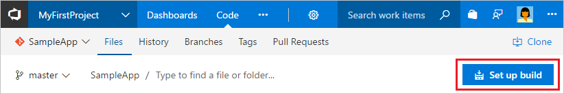

# Build your .NET desktop app for Windows

**Azure Pipelines | TFS 2018 | TFS 2017.2**

::: moniker range="<= tfs-2018"
[!INCLUDE [temp](../../_shared/concept-rename-note.md)]
::: moniker-end

Azure Pipelines and Team Foundation Server (TFS) provide a highly customizable continuous integration (CI) pipeline to automatically build your .NET desktop app whenever your team pushes or checks in code. In this quickstart you learn how to define your CI pipeline.

## Prerequisites

[!INCLUDE [include](../../_shared/ci-cd-prerequisites-vsts.md)]

* While the simplest way to try this quickstart is to use an Azure DevOps organization, you can also use a TFS server instead of an Azure DevOps organization. Make sure that you have [configured a build agent](../../agents/v2-windows.md) for your project, and that you have a version of Visual Studio matching your development machine installed on the agent machine.

## Get sample app code

[!INCLUDE [include](../_shared/get-sample-code-intro.md)]

```
https://github.com/adventworks/net-sample
```

# [Azure Repos or TFS repo](#tab/vsts)

[!INCLUDE [include](../_shared/get-sample-code-vsts-tfs-2017-update-2.md)]

# [GitHub repo](#tab/github)

::: moniker range="azure-devops"

[!INCLUDE [include](../_shared/get-sample-code-github.md)]

::: moniker-end

::: moniker range="< azure-devops"

**TFS**: Does not apply.

::: moniker-end

---

This quickstart works for apps targeting the .NET Framework 4 or newer. The sample app is a Visual Studio solution that has two projects: A .NET Class Library project targeting .NET Framework 4.5 and a Unit Test project.

## Set up continuous integration

[!INCLUDE [include](../../_shared/ci-quickstart-intro.md)]

[//]: # (TODO: Restore use of includes when we get support for using them in a list.)

1. Create a new build pipeline.

 # [Azure Repos or TFS repo](#tab/vsts)

 Navigate to the **Files** tab of the **Code** hub, and then click **Set up build**.

 

 You are taken to **Azure Pipelines** and asked to **Select a template** for the new build pipeline.

 # [GitHub repo](#tab/github)

 Navigate to the **Builds** tab in Azure Pipelines or TFS, and then click **+ New**. You are asked to **Select a template** for the new build pipeline.

 ---

1. In the right panel, select **.NET Desktop**, and then click **Apply**.

 You now see all the tasks that were automatically added to the build pipeline by the template. These are the tasks that will automatically run every time you push code changes.

1. For the **Agent pool**:

 * **Azure Pipelines:** Select _Hosted VS2017_. This is how you can use our pool of agents that have the software you need to build your app.

 * **TFS:** Select a pool that includes a [Windows build agent](../../agents/v2-windows.md).

1. Click **Get sources** and then:

 # [Azure Repos or TFS repo](#tab/vsts)

 Observe that the new build pipeline is automatically linked to your repository.

 # [GitHub repo](#tab/github)

 Select your version control repository. You'll need to authorize access to your repo.

 ---

1. Click the **Triggers** tab in the build pipeline. Enable the **Continuous Integration** trigger. This will ensure that the build pipeline is automatically triggered every time you commit a change to your repository.

1. Click **Save & queue** to kick off your first build. On the **Save build pipeline and queue** dialog box, click **Save & queue**.

1. A new build is started. You'll see a link to the new build on the top of the page. Click the link to watch the new build as it happens.

 [//]: # (TODO:> [!TIP])
 [//]: # (TODO:> To learn more about GitHub CI builds, see [Define CI build pipeline for your Git repo](#)

## View the build summary

[!INCLUDE [include](../_shared/view-build-summary.md)]

## Next steps

[!INCLUDE [include](../_shared/ci-web-app-next-steps.md)]
