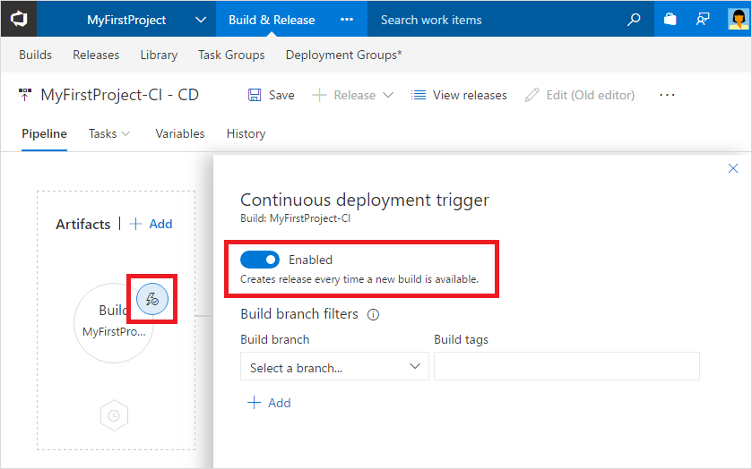

Select the artifact trigger and make sure the **Continuous deployment trigger** is enabled.

Click **Save**. In the Save dialog box, click **OK**.

To test the release pipeline, click **Release** and then **Create Release**.

On the Create new release dialog box, click **Queue**.

You will notice a new release being created. Select the link to navigate to the release.

You can watch the live logs for the deployment as it happens. Wait for the release to be deployed to the Azure Web App.
