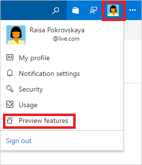
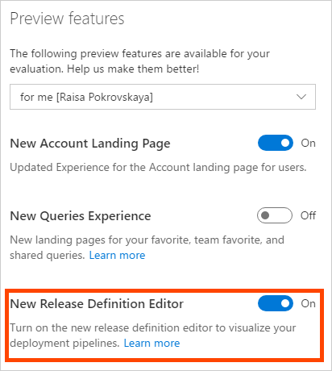

## Get ready to go

Before you begin, make sure that you are:

* A co-administrator of the Azure subscription. If you don't have an Azure subscription, you can get one free through [Visual Studio Dev Essentials](https://visualstudio.microsoft.com/dev-essentials/).

* An administrator in Azure DevOps. If you don't yet have an organization, you can [create one for free](https://go.microsoft.com/fwlink/?LinkId=307137).

* Using the **New Release pipeline Editor** that is currently in preview.

 

 
