# Use Azure to automatically generate a CI/CD pipeline to deploy an ASP.NET app

[!INCLUDE [version-tfs-2015-rtm](../../../_shared/version-tfs-2015-rtm.md)]

This tutorial shows how to configure a continuous delivery (CD) workflow for
[Azure App Service](https://azure.microsoft.com/documentation/articles/app-service-changes-existing-services/)
by using Azure Pipelines. CD is a great option for projects that require multiple and frequent
contributions to be integrated.

CD in Azure Pipelines simplifies setting up a robust
deployment pipeline for your app to publish the most recent updates
to Azure App Service. The pipeline can be configured to build,
runs tests, and deploy to a staging slot and then to production.

## Code

You must store your app's source code in a 
[Azure Repos Git](../../../../repos/git/gitquickstart.md), 
[GitHub](https://help.github.com/articles/create-a-repo),
or any other Git repository to use Azure Continuous Delivery.
Team Foundation Version Control (TFVC) repositories are not supported at present.

Carry out the following steps to create a simple 
.NET MVC app to deploy.

1. Create a new **ASP.NET Web Application** project in
   Visual Studio, targeting .NET Framework 4.5.

1. Choose the **MVC** project type and leave the other
   settings at their defaults.

1. Wait until the sample application has been created, then save the solution.

1. Commit the solution to your chosen repository.

>For more information about publishing your project, see 
[Get Started with Git and Azure Repos](../../../../repos/git/gitquickstart.md)
or [Create a repo (GitHub)](https://help.github.com/articles/create-a-repo).

## Configure

1. In the [Azure portal](https://portal.azure.com/), select your
   web app. If you haven't yet created a web app, do this now by choosing
   the "**+**" icon, selecting **Web App** from the **Web + Mobile** category,
   and providing a name and a resource group.
   
   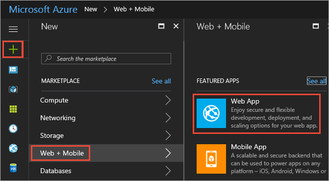

1. In your app's menu blade, choose **Continuous Delivery (Preview)** and then choose **Configure**.

   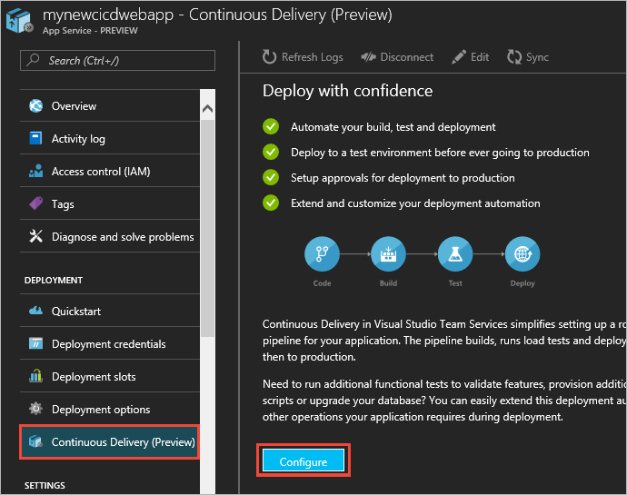

1. Select **Choose repository** and select the type of repository where you stored your app's source code.
   You have a choice of **Azure Pipelines**, **GitHub** or **External Git**
   (a Git type repository not hosted in Azure Pipelines or GitHub).

   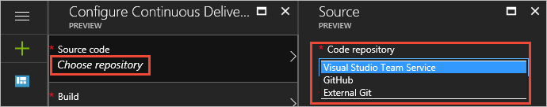
 
1. Select the project, repository, and branch to deploy from. When you're done, choose **OK**.

   
 
   If you chose to use GitHub, complete the authorization steps.
   If you chose to use an external Git repository, enter the repository name, branch, and (if required) your credentials.
 
   >If you encounter a service endpoint error while configuring Continuous Delivery, see
   [Troubleshoot Azure Resource Manager service endpoints](../../../release/azure-rm-endpoint.md).
 
1. Select **Configure Continuous Delivery** and choose the web application framework
   you used to develop your app. This choice influences the way that Azure Continuous Delivery builds
   and packages the app for deployment. At present, ASP.NET, ASP.NET Core, PHP, Python, and Node.js
   are supported. When you're done, choose **OK**.

   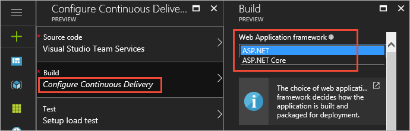
 
1. Select **Set up load test** and decide if you want to run a load test on your app
   before deploying the latest changes to production. The default is **NO**.
   If you want to set up a load test (25 virtual users concurrently accessing
   the app for 60 seconds), choose **YES** then specify whether to use an existing 
   Azure App Service instance, or create a new one in a new App Service plan.
   When you're done, choose **OK**.
 
   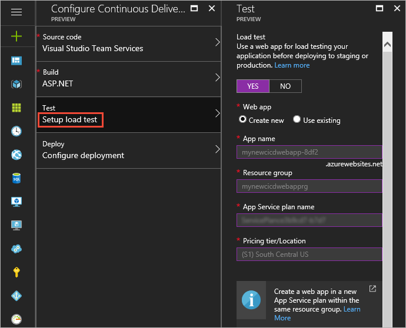

   >The new Azure App Service instance is created at the lowest
   pricing tier possible. For example, if your current App Service
   is in the S2 Standard pricing tier, the new App Service
   Plan for the load test will use the S1 Standard pricing tier.
   [Pricing details](https://azure.microsoft.com/documentation/articles/azure-web-sites-web-hosting-plans-in-depth-overview/).

1. Select **Configure deployment** and decide if you want to deploy your latest changes
   first to staging, and then promote to production. The default is **NO**.
   If you want to set this up, choose **YES** then specify whether you want to
   use an existing Azure App Service slot, or create a new one. When you're done, choose **OK**.

   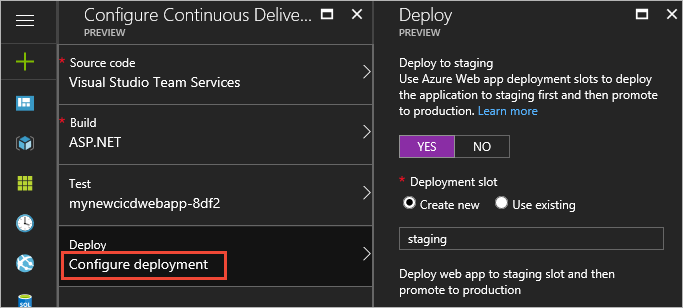

   See [this topic](https://azure.microsoft.com/documentation/articles/web-sites-staged-publishing/)
   for information about Azure App Service staging environments.

## Build and deploy

1. Choose **OK** to create and execute the Continuous Delivery workflow.

   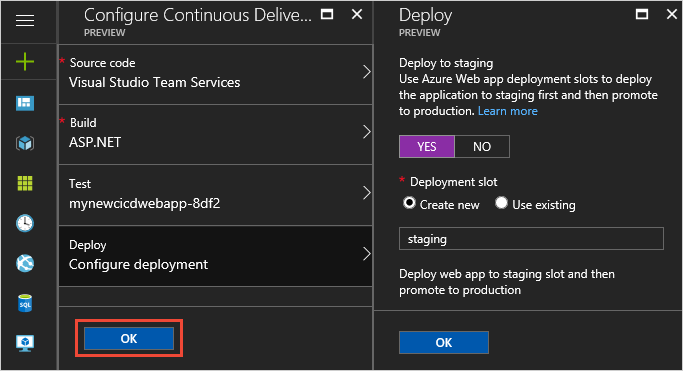

   The following sequence of events occurs:
 
   - Azure Continuous Delivery creates a build and a release pipeline in the Azure Pipelines subscription
     you specified, together with a service endpoint to connect to Azure.
 
   - If you chose to create a new Azure App Service instance for load tests, and/or a new slot for
     staging, these are created in your Azure subscription.
 
   - After setup has completed successfully, a build is triggered that builds and packages the
     application for deployment.
 
   - After the build has completed successfully, a new release is created and the deployment triggered.
 
   - If you chose to include a load test, the latest changes are first deployed to the Azure App Service
     you selected, and then the load test is executed after the deployment succeeds.
 
   - If you chose to use a staging slot, the latest changes are deployed to the staging slot and then a 
     slot swap is performed to complete the continuous delivery workflow.

1. After all these actions have completed, the Azure portal shows the results in the **Activity Log**.

   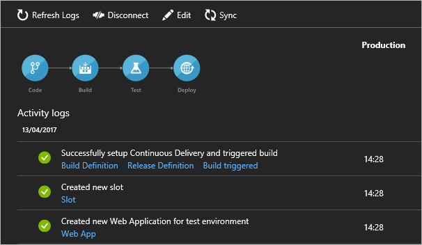

1. In the "Successfully set up Continuous Delivery..." item, choose the **Build pipeline**
   link to open the project containing your app in Azure Pipelines, and see the summary for the build pipeline.
   Choose **Edit** to see the tasks that have been added and configured.

   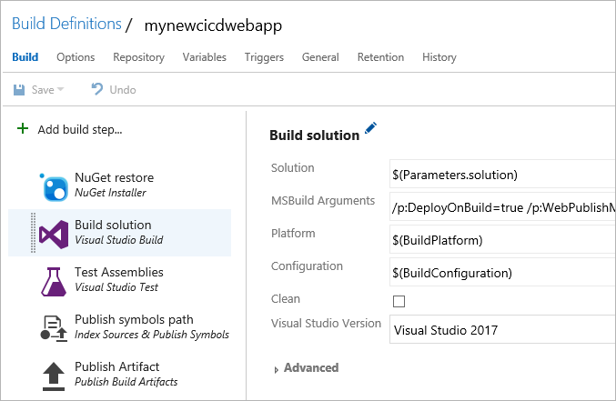

   Different tasks are added to the build pipeline depending on the app framework you selected.
   For example, a **Visual Studio Build** task is added for ASP.NET apps, while a 
   **.NET Core** task is used for  ASP.NET Core apps.

1. In the "Successfully set up Continuous Delivery..." item, choose the **Release pipeline**
   link to open the project containing your app in Azure Pipelines, and see the list of releases for this pipeline.
   Choose **Edit** to see the tasks that have been added and configured.

   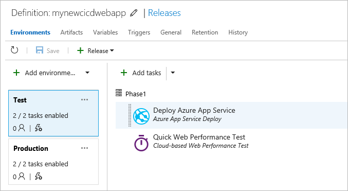

   The release pipeline that is created depends on whether you chose to include a load test
   and/or a staging deployment. If you chose either or both, your release pipeline will have
   two environments named **Test** and **Production**. As shown above, the **Test** environment
   has two tasks: **Azure App Service Deploy** deploys the app to the Azure App Service you
   selected for load testing, and **Cloud-based Web Performance** task execute the load test.

   The **Production** environment, shown below, has an **Azure App Service Deploy** task.
   If you chose to use a staging deployment, the latest changes are deployed to the staging 
   slot and then an **Azure App Service Manage** task performs a slot swap between staging
   and production slots.

   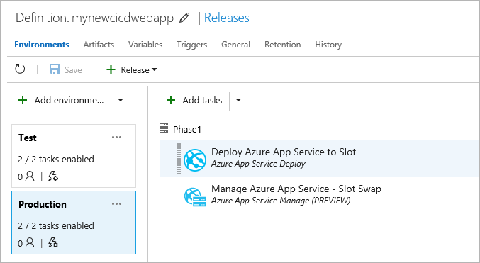

   If you opted out of both load test and a staging deployment, your release pipeline
   will have a single environment with just one **Azure App Service Deploy** task 
   to deploy the latest changes to your Azure App Service.

   There are also links in other items in the **Activity Log** that open commits, 
   builds, build reports, releases, deployment slots, and the deployed app itself,
   in relevant windows or apps.  

1. Verify that continuous deployment is occurring from the repository containing your
   app by pushing a change to the repository. Your app should update to reflect the
   changes shortly after the push to the repository completes.

   You can stop a deployment to your Azure App Service by choosing **Disconnect** at the top of
   the **Continuous Deployment** blade. This deletes the Azure Continuous Delivery
   configuration in the Azure portal and turns off the build triggers in Azure Pipelines
   for this configuration.

   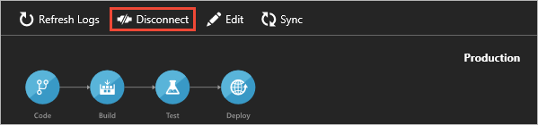

   >To ensure the build and release history is preserved, the build and release definitions
   are not deleted from Azure Pipelines when you disconnect.

## Next steps

You can easily add another Azure App Service to the pipeline to validate
your changes before they reach production. This validation can be by 
running load or functional tests at each step. Further customization
can be through provisioning additional Azure resources, running custom
scripts, or upgrading a database. In addition, you can extend this
deployment automation to handle any other operations your app needs
to execute during deployment. You can even choose to deploy automatically,
or set up manual approval for any deployment to production.

## Notes

The Azure Continuous Delivery feature is a preview version. You
may encounter the following known issues:

* If you do not have relevant permission to create build and release definitions 
  in Azure Pipelines, the Continuous Delivery configuration will fail
  with an appropriate error message. See 
  [Manage users and access in Azure Pipelines](../../../../organizations/accounts/add-organization-users.md).
  
* Continuous Delivery supports only applications developed by using
  [ASP.NET](https://www.asp.net/) and [ASP.NET Core](https://www.microsoft.com/net/core#windows).
  
* If you encounter the error "Failed to create an Azure service connection"
  while deploying to Azure App Service, see
  [Troubleshoot Azure Resource Manager service endpoints](../../../release/azure-rm-endpoint.md).
  
* There is a known issue where users are able to see their Azure Pipelines information within the [Azure classic portal](https://manage.windowsazure.com/),
  but not in the [Azure dashboard](https://portal.azure.com/). You may see a
  "No accounts found" message in this situation. To resolve this, you can
  configure Azure Pipelines to be backed by an Azure Active Directory (Azure AD) instance. For information on how to do this, see
  [Azure Pipelines - Access with Azure Active Directory](../../../../organizations/accounts/access-with-azure-ad.md).

## Q&A

<!-- BEGINSECTION class="md-qanda" -->

<h3 id="new_solution">How do I create an ASP.NET 4 web app?</h3>

1. In Visual Studio, [connect to your project](../../../../organizations/projects/connect-to-projects.md#visual-studio).

1. On the Team Explorer home page (Keyboard: Ctrl + 0, H), under **Solutions**, click **New**.

1. Select the **Web** category under **Visual C#**.

1. Select **ASP.NET Web Application** and click **OK**.

1. Select **MVC** from the template list.

1. Click **Change Authentication**, select **No Authentication**, and click **OK**.

1. Optionally, set **Add unit tests** to create a unit test project for the application. Unit tests can be run automatically with every build as part of a release pipeline.

1. Clear **Host in the cloud** and click **OK**.

1. [Commit and push (Git)](../../../../repos/git/share-your-code-in-git-vs.md) or [check in (TFVC)](../../../../repos/tfvc/share-your-code-in-tfvc-vs.md) your code.

::: moniker range="< azure-devops"
[!INCLUDE [qa-versions](../../../_shared/qa-versions.md)]
::: moniker-end

<!-- ENDSECTION -->

[!INCLUDE [rm-help-support-shared](../../../_shared/rm-help-support-shared.md)]
