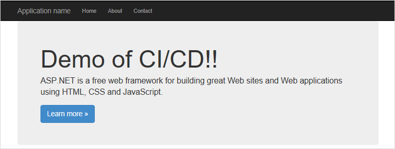
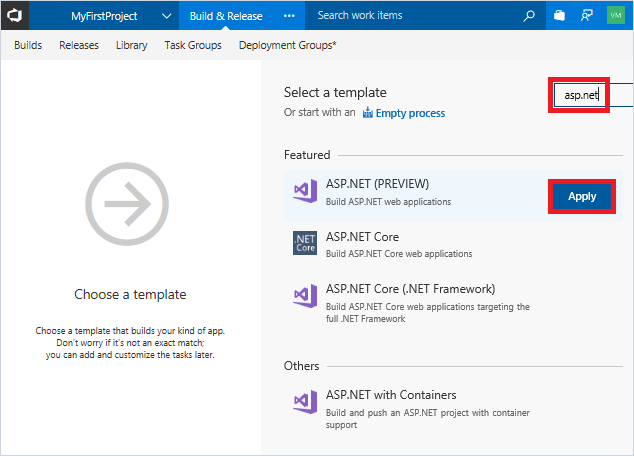
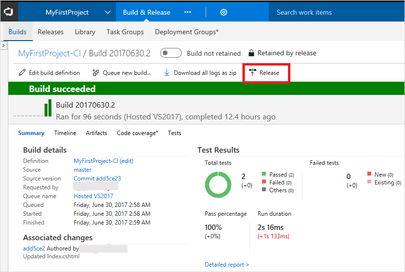
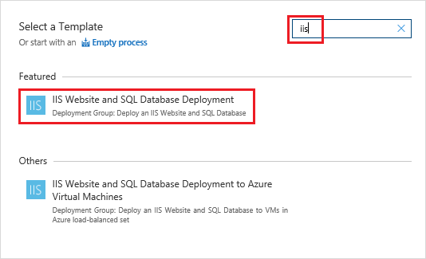
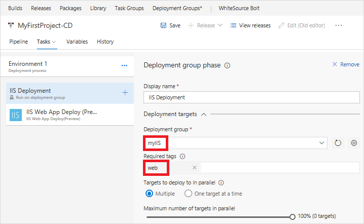
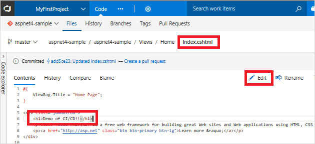

# Implement a CI/CD pipeline to build and deploy your ASP.NET app to Azure

[!INCLUDE [version-tfs-2015-rtm](../../../_shared/version-tfs-2015-rtm.md)]

Azure Pipelines provides a highly customizable continuous integration (CI) and deployment (CD) automation system for your
ASP.NET apps.
This quickstart shows how to set up CI and CD to deploy
an ASP.NET app
to a Windows virtual machine in Azure.
You create the virtual machine using Azure Powershell, and then you set up CI/CD in Azure Pipelines. In the CI pipeline, you build the app using MSBuild and run tests using VSTest.



[!INCLUDE [temp](../_shared/vsts-and-azure-setup.md)]

On your dev machine, you need Azure PowerShell module version 4.0 or newer. See [Install and configure Azure PowerShell](/powershell/azure/install-azurerm-ps?view=azurermps-4.2.0).

[!INCLUDE [temp](../_shared/create-azure-windows-vm.md)]

[!INCLUDE [temp](../_shared/create-deployment-group.md)]

[!INCLUDE [temp](../_shared/import-code-1.md)]

```bash
https://github.com/adventworks/aspnet4-sample
```

[!INCLUDE [temp](../_shared/import-code-2.md)]

[!INCLUDE [temp](../_shared/set-up-ci-1.md)]

In the right panel, select **ASP.NET**, and then click **Apply**.



[!INCLUDE [temp](../_shared/set-up-ci-2.md)]

[!INCLUDE [temp](../_shared/set-up-ci-3.md)]

[!INCLUDE [temp](../_shared/set-up-cd-1.md)]



In the dialog that prompts to **Create release pipeline**, select **Yes**.

In the **Create release pipeline** wizard, select the **IIS Website and SQL Database deployment** template, and click **Apply**.



Click **Tasks**, and then select the **SQL Deployment** phase. Click 'X' to delete this phase. We won't be deploying a database in this quickstart.

Select **IIS Deployment** phase. For the **Deployment Group**, select the deployment group you created earlier, such as *myIIS*. In the **Machine tags** box, select **Add** and choose the *Web* tag.

Select the **IIS Web App Manage** task; click 'X' to delete this task. We will not create a new website for this quickstart. Instead, we will deploy to the **default web site**.

Select the **IIS Web App Deploy** task to configure your IIS instance settings as follows. For **Website Name**, enter *default web site*. Leave all the other default settings.



[!INCLUDE [temp](../_shared//set-up-cd-3.md)]

## Update to redeploy the code

Navigate to the **Code** hub in the Azure Repos portal. Navigate to **Views/Home/Index.cshtml** file. Make the following simple change to that file by selecting the edit action.



Add the following line of text as indicated in the image above:
```html
<h1>Demo of CI/CD!!</h1>
```

Commit your changes in Git. This change triggers a CI build, and when the build completes, it triggers an automatic deployment to Azure Web App.

## Browse to the app

Once deployment has completed, open the browser and test your web app.

```bash
http://<publicIpAddress>
```

**Congratulations!** You've deployed changes to your application using CI/CD.

[!INCLUDE [temp](../_shared/clean-up-resources.md)]
