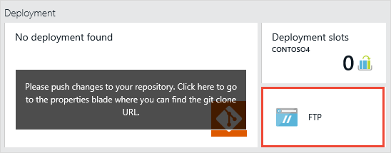
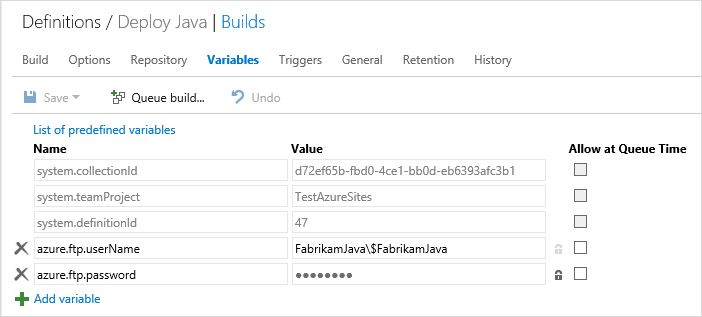

# Build and Deploy your Java app to an Azure Web App

**[Azure Pipelines](quick-to-azure.md) | TFS 2017 RTM**

In just a few steps you can build and deploy your Java app to Azure. This works from both the Azure Pipelines service and your on-premises Team Foundation Server.

## Upload your code

Upload your code to Azure Pipelines or your on-premises Team Foundation Server. Either push your code to Git or check in your code to TFVC.

[!INCLUDE [temp](_shared/java-web-app-sample-link.md)]

## Enable Java, Apache Tomcat, and FTP for your Azure Web App

0. Sign in to the [Azure portal](https://portal.azure.com/).

0. Edit or [create a Java web app](https://azure.microsoft.com/documentation/articles/web-sites-java-apps/get-started/) and enable Apache Tomcat.

0. Click the deployment credentials part (outlined in red below). Create a user name and password. Click Save. If you previously enabled publishing for a web app, you don't need to do this step.

 

## Create the pipeline

<ol>
[!INCLUDE [include](../../../_shared/begin-create-build-definition.md)]

<li>Click Empty to start with an empty pipeline.</li>
</ol>

### Define variables to store Azure FTP authentication data

On the Variables tab, store the data needed to copy files to Azure via FTP. Copy this data from the [Azure portal](https://portal.azure.com/). There is nothing special about the variable names we suggest below, so you can make them whatever you prefer.

| Name | Notes |
|---|---|---|
| azure.ftp.userName | Take this value from your Azure Web App essentials. For example if the name of your Azure Web App is FabrikamJava, then the value would be : ```FabrikamJava\YourUserName``` |
| azure.ftp.password | Take this value from your Azure subscription deployment settings. In your build pipeline variables, make sure to click secret to avoid exposing this password value. [I don't want to use my Azure subscription FTP credentials. Can I use credentials scoped to my Azure Web App?](#azure_site_ftp) |



### Add build tasks

On the Build tab, add these tasks:

<table>
   <tr>

      <td> **Build: Maven**</td>
      <td>
<p>Build the app.</p>
<ul>
          <li>Maven POM file: Browse and select your pom.xml file. For example, ```helloworld/pom.xml```.</li>
</ul>
      </td>
</tr>

        <tr>
            <td> **Utility: cURL Upload Files**</td>
            <td>
<p>Copy the .war file to Azure.</p>
<ul>
<li> Files: ```helloworld/target/hello.war```</li>
 <li> Username: ```$(azure.ftp.userName)```</li>
 <li> Password: ```$(azure.ftp.password)```</li>
 <li> URL: Take this value from your Azure Web App essentials page on the [Azure portal](https://portal.azure.com/). For example, ```ftp://waws-prod-sn1-011.ftp.azurewebsites.windows.net```</li>
 <li> Optional Arguments: ```-Q "+CWD site/wwwroot/webapps"```</li>
</ul>
</td>
        </tr>
        <tr>
            <td> **Build: Publish Build Artifacts**</td>
            <td>
<p>(Optional) Drop some of the build outputs, such as the .war file as we do in the example below.</p>
<ul>
 <li> Copy Root: ```helloworld/target```</li>
 <li> Contents: ```hello.war```</li>
 <li> Artifact name: ```drop```</li>
 <li> Artifact Type: ```Server```</li>
</ul>
</td>
        </tr>
</table>

[!INCLUDE [temp](../_shared/definition-finish-and-test.md)]

After a successful build, check your site: ```http://{web_app_name}.azurewebsites.net/{war_file_name}```

## Q & A

<!-- BEGINSECTION class="md-qanda" -->

[!INCLUDE [temp](_shared/java-web-app-sample-qa.md)]


<a name="azure_site_ftp"></a>
### I don't want to use my Azure subscription FTP credentials. Can I use credentials scoped to my Azure Web App?

A: Yes.

0. Sign in to the [Azure portal](https://portal.azure.com/).

0. Open your web app and download the publish profile.

0. Open your .PublishSettings file and copy some of the data from the ```publishMethod="FTP"``` section into your build variables.

| Name | Value from .PublishSettings file attribute| Notes |
|---|---|---|
| azure.ftp.userName | userName   |  For example, ```YourAppName\$YourAppName```  |
| azure.ftp.password | userPWD| In your build pipeline variables, make sure to click secret to avoid exposing this password value. |


### How do I continually deliver my app and manage my releases?

[Learn about Azure Pipelines](../../../release/index.md)


[!INCLUDE [temp](../../../_shared/qa-definition-common-all-platforms.md)]

[!INCLUDE [temp](../../../_shared/qa-agents.md)]

::: moniker range="< azure-devops"
[!INCLUDE [temp](../../../_shared/qa-versions.md)]
::: moniker-end

<!-- ENDSECTION -->
