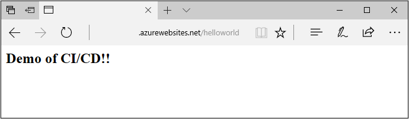
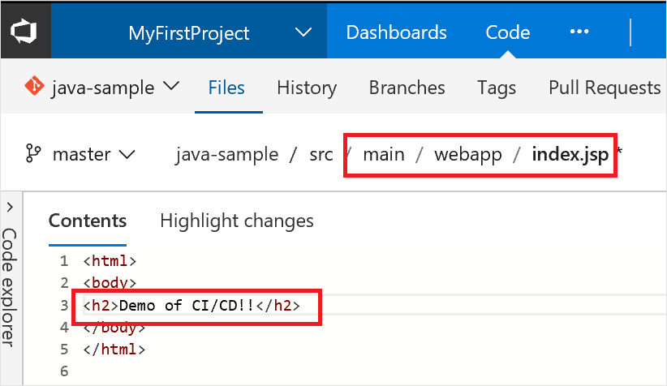

# Implement a CI/CD pipeline to build and deploy your Java app to Azure

**Azure Pipelines**

Azure Pipelines provides a highly customizable continuous integration (CI) and deployment (CD) automation system for your 
Java apps.
This quickstart shows how to set up CI and CD to deploy
a Java app.
to an Azure Web App.
You create the web app using the Azure CLI, then set up CI/CD in Azure Pipelines.
In the CI pipeline, you build the Java app and run JUnit tests using Maven. In the CD pipeline, you deploy the build to an Azure Web App.



[!INCLUDE [temp](../_shared/vsts-and-azure-setup.md)]

[!INCLUDE [temp](../_shared/create-azure-web-app.md)]

Set up the Java runtime configuration that your app needs with the `az appservice web config update` command. The following command configures the web app to run on a recent Java 8 JDK and Apache Tomcat 8.0

```azurecli-interactive
az webapp config set --name <app_name> --resource-group myResourceGroup --java-version 1.8 --java-container Tomcat --java-container-version 8.0
```

[!INCLUDE [temp](../_shared/import-code-1.md)]

```bash
https://github.com/Adventworks/java-sample
```

[!INCLUDE [temp](../_shared/import-code-2.md)]

[!INCLUDE [temp](../_shared/set-up-ci-1.md)]

In the right panel, search for `java`, select **Maven**, and then click **Apply**.

[!INCLUDE [temp](../_shared/set-up-ci-2.md)]

[!INCLUDE [temp](../_shared/set-up-cd-1.md)]

[!INCLUDE [temp](../_shared/set-up-cd-2.md)]

[!INCLUDE [temp](../_shared/set-up-cd-3.md)]

## Update to redeploy the code

Navigate to the **Code** hub in the Azure DevOps portal. Navigate to **src/main/webapp/index.jsp** file. Make the following simple change to that file by selecting the edit action.



Change the following line of text:
```html
<h2>Hello World!</h2>
```

to the following:
```html
<h2>Demo of CI/CD!!</h2>
```

Commit your changes in Git. This change triggers a CI build, and when the build completes, it triggers an automatic deployment to Azure Web App.

[!INCLUDE [temp](../_shared/browse-to-web-app.md)]

[!INCLUDE [temp](../_shared/clean-up-resources.md)]
