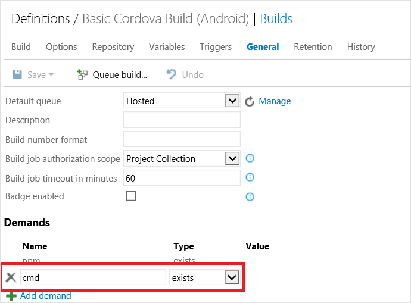
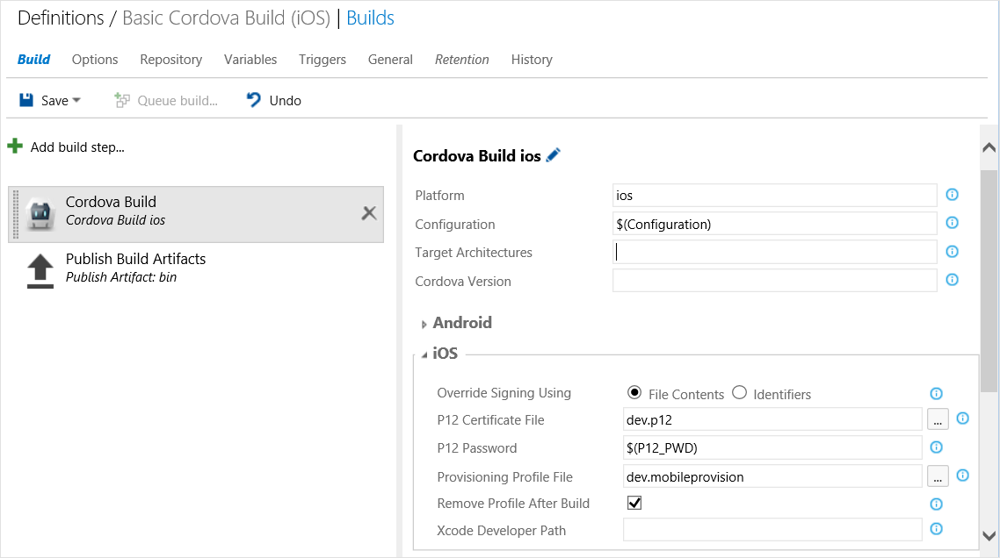
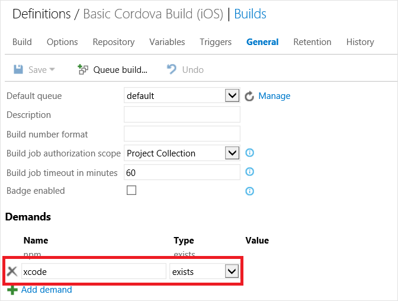
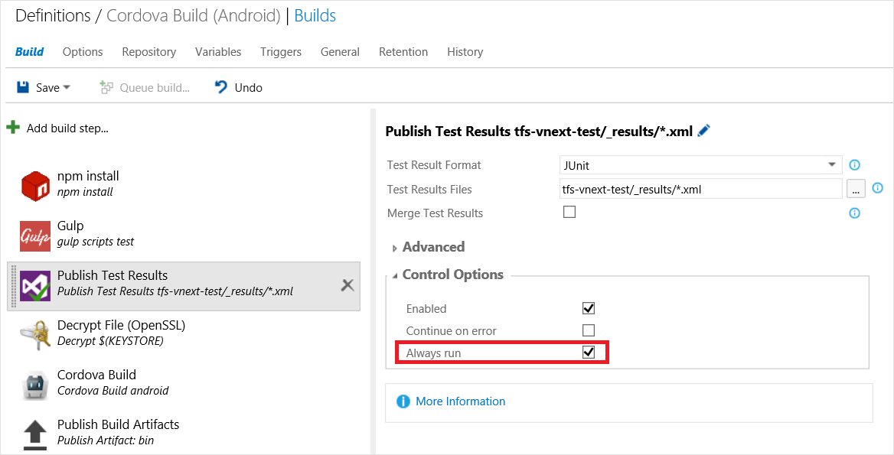

# Build Apache Cordova apps

[!INCLUDE [version-tfs-2015-rtm](../../../_shared/version-tfs-2015-rtm.md)]

> **Notice**: Apple's WWDR certificate expired on Feb 14th and as a result you may experience signing failures if you have not updated the cert and **removed the old one**. Follow the steps outlined by Apple under [What should I do if Xcode doesn't recognize my distribution certificate?](https://developer.apple.com/support/certificates/expiration/) to resolve the problem. Note that this also affects development certs despite the title.

Azure Pipelines (formerly Visual Studio Online) and Team Foundation Services (TFS) 2015 can be used for building and testing Cordova apps in a Continuous Integration (CI) environment thanks to a new [cross-platform agent](https://github.com/Microsoft/azure-pipelines-agent) that supports macOS. The end result is you can use Azure Pipelines or TFS to build projects created using [Tools for Apache Cordova](http://go.microsoft.com/fwlink/?LinkID=536496) or *any Cordova compliant CLI like the Ionic, PhoneGap, or TACO CLI*.

To streamline CI for Cordova-based projects, we have created a series of build tasks that you can use: **Cordova Build**, **[Cordova Command](./cordova-command.md)**, **[Ionic Command](./cordova-command.md)**, and **[PhoneGap Command](./cordova-command.md)**. These tasks will automatically handle fetching the correct version of the appropriate CLI and even setup the correct version of Node.js for you if not present!

**Article sections:**
* [Installing the Azure Pipelines Extension for Cordova](#install)
* [Building Android, Windows, or Windows Phone 8.0 on Windows](#win)
* [Building iOS on macOS](#osx)
* [Optional: Using gulp for script compilation and running tests](#gulp)
* [In Depth: Custom Build Agent Setup](#agentsetup)

<a name="install"></a>
## Installing the Cordova Build task
To setup a Cordova build in Azure Pipelines or TFS 2015, you will need to install the Cordova Build task in your collection.

* **Azure Pipelines**: Simply install the [VSTS Extension for Cordova](http://go.microsoft.com/fwlink/?LinkID=691835).
* **TFS 2015 Update 1 and Earlier**: TFS 2015 Update 1 and below does not support installing Azure Pipelines Extensions. Follow the instructions in the [cordova-tasks](http://go.microsoft.com/fwlink/?LinkID=691187) repository to install.

## Project setup and build definitions
We'll assume for the purposes of this tutorial that you want to build a Cordova app for Android, iOS, and Windows and you want to build everything on Windows except iOS. We will accomplish this by using the concept of a "demand" in two separate build definitions to route the work to the correct OS.

### Create the pipeline
1. Open your project in your web browser.

 * On-premises ```http://{your_server}:8080/tfs/DefaultCollection/{your_team_project}``` 
 * Azure Pipelines  ```https://{your_organization}.visualstudio.com/DefaultCollection/{your_team_project}```

0. Create a build pipeline.

 
 
0. Click Empty to start with an empty pipeline.

<a name="win"></a>
### Building Android, Windows, or Windows Phone 8.0 on Windows
Detailed instructions on creating build definitions in TFS 2015 can be found in [its documentation](http://go.microsoft.com/fwlink/?LinkID=533772), but here are the specific settings you will need to use to configure a build to run on a Windows agent. We'll start with Android but the steps here generally apply to the Windows and WP8 platforms as well.

1. First we need to ensure that this particular build runs on Windows rather than macOS. Under the **General** tab, add a demand that **cmd** exists.

  

2. Next we will add some build tasks.

  <table>
   <tr>
      <td><br />**Build: Cordova Build**</td>
      <td>
	  	<p>Settings:</p>
	  	<ul>
        <li>**Platform**: android</li>
		    <li>**Configuration**: debug or release. You can also use a variable from the Variables tab to allow you to select at build time.</li>
		    <li>**Cordova Version**: Version of the Cordova CLI you want to use to build. If you're using Tools for Apache Cordova you can leave this blank and the correct version will be used based on the contents of taco.json. Otherwise, if not specified, it uses the version specified by the CORDOVA_DEFAULT_VERSION environment variable (like in Azure Pipelines) and falls back to the latest version if no environment variable is set.</li>
		    <li>**Android**: You may use these values to specify signing information for this build. See **[securing your signing keys](../../../apps/mobile/secure-certs.md)** for details.</li>
		    <li>**Advanced &gt; Working Directory**: Location of the Cordova project itself inside your repository.</li>
		  </ul>
      </td>
   </tr>
   <tr>
    <td><br />**Utility: Copy and Publish Build Artifacts**</td>
	  <td>
	  	<p>Settings:</p>
	  	<ul>  	   
		  <li>**Copy Root**: Location specified in Advanced &gt; Output Directory in the Cordova Build task. Defaults to "bin."</li>
		  <li>**Contents**: \*</li>
		  <li>**Artifact Name**: bin</li>
		  <li>**Artifact Type**: Server</li>
		</ul>
	  </td>
   </tr>
  </table>

3. Finally, save and click "Queue Build..." to test it out!

That's it for Windows! You're now able to build Android. To build Windows or Windows Phone 8.0, follow these same steps and replace the "platform" value with "windows" or "wp8" respectively.

#### Optional: Multi-Configuration setup for Android, Windows, Windows Phone 8.0
If you intend to build more than just one platform on Windows you can use something called a "Multi-Configuration" setup to build for multiple platforms from a single build pipeline.

1. Go to the **Variables** tab and enter a variable called **Platform** with a comma separated list of platforms you want to build.  Ex: android, windows, wp8

2. Go to the **Options** tab, check **MultiConfiguration**, and set **Multipliers** to **Platform** 

3. Update the **Platform** value for the **Cordova Build** task to be **$(Platform)** and update any platform specific options as appropriate.

Next time you build, it will queue up and build all three platforms and store separate artifacts for each using the platform name.

<a name="osx"></a>
### Building iOS on macOS
Now let's create a version of this same build pipeline to target iOS that will run on a configured agent on macOS.

> **Troubleshooting Tip**: You should either setup the agent as a launch agent (./svc.sh install agent) or run it as an interactive process (node agent/vsoagent.js) when building an Cordova project targeting iOS due to issues with code signing certificate storage when using a launch daemon.

1. Right click on the Windows build pipeline and select "Clone." Once you save you should give this pipeline a name that indicates it's the iOS build.

2. Change the **Platform** value for the **Cordova Build** task to **ios** 

3. Update the **iOS** category for the **Cordova Build** task. See **[securing your signing keys](../../../apps/mobile/secure-certs.md)** for details on the appropriate options to set for your situation. Be sure to check out the "P12 Certificate File" and "Provisioning Profile File" options that can really streamline setup! The Xcode Developer Path option also allows you to specify the path of a different version of Xcode than you have installed locally.  (Ex: /Applications/Xcode6.4.app/Contents/Developer will use Xcode 6.4 in MacinCloud.)

	

4. Finally, we need to add a demand that will route builds to macOS machines rather than Windows. Under the **General** tab, remove the "cmd" demand and add a demand that **xcode** exists.

	

> **Troubleshooting Tip:** If you encounter a **spawn EACCES error** when building on Linux or macOS, be sure all files in the hooks folder have an "execute bit" set as this a requirement for Cordova. To resolve, add an execute bit to the files in source control or add the following using the Command Line task for each file in the folder: chmod +x &lt;file name goes here&gt;

You are now all set! You can configure either of these build definitions further as you see fit including having them automatically fire off on check-in or adding other validations.

>**Troubleshooting Tip**: See [Troubleshooting Tips for Building on a Mac in the general Tools for Apache Cordova CI tutorial](http://go.microsoft.com/fwlink/?LinkID=691194) for tips on resolving common build errors that can occur when building Cordova projects on that operating system.

<a name="gulp"></a>
## Optional: Using gulp for script compilation and running tests
Using gulp in a CI environment can allow you to easily compile / transpile scripts (TypeScript, LESS, SASS) and even run tests thanks to the "gulp" and "npm install" build tasks.

<a name="gulptypescript"></a>
###TypeScript example
To add TypeScript compilation into your build pipeline using gulp, follow these steps:

1. Take the sample files (gulpfile.js, package.json, karma.config.js) from the "samples/gulp" folder [in this GitHub repo](http://go.microsoft.com/fwlink/?LinkID=691189) and place them in the root of your project Cordova project

2. Add these files to source control with your project. From here you can modify gulpfile.js and add other gulp plugins as you see fit.

3. Next we will add some gulp related build tasks **before** the other tasks in the pipeline.

<table>
   <tr>
      <td><br />**Package: npm** (or the older npm install)</td>
      <td>
	  	<p>Settings:</p>
	  	<ul>
	    <li>**Command:** install</li>
	    <li>**Advanced &gt; Arguments:** --no-optional</li>
	    <li>**Advanced &gt; Working Directory**: Location of the Cordova project itself inside your solution (not the solution root).</li>
		  </ul>
      <p>If you encounter EPERM errors you may also need to specify the --force option.</p>
      </td>
   </tr>
   <tr>
    <td><br />**Build: gulp**</td>
	  <td>
	  	<p>Settings:</p>
	  	<ul>  	   
		  <li>**gulp File Path**: Location gulpfile.js in your Cordova project.</li>
		  <li>**gulp Task(s)**: The gulp task you want to run. In this case, we'll run **scripts**</li>
		  <li>**Advanced &gt; Working Directory**: Location of the Cordova project itself inside your repository.</li>
  		</ul>
	  </td>
   </tr>
</table>

<a name="gulptest"></a>
### Using gulp to run tests
You can also use the exact same gulp build tasks above to run your tests! The scripts [from the GitHub repo](http://go.microsoft.com/fwlink/?LinkID=691189) mentioned above are ready for use with [Jasmine](http://jasmine.github.io/), [Karma](http://karma-runner.github.io/), and [PhantomJS](http://phantomjs.org/). See the [Cordova test tutorials](http://go.microsoft.com/fwlink/?LinkID=691195) for details on setting up gulp to run your tests.

Next, we will configure the pipeline to publish your test results to Azure Pipelines or TFS.

<table>
   <tr>
    <td><br />**Build: gulp**</td>
	  <td>
      <p>Update the **gulp Task(s)** option in the gulp task above to reference your "test" task. A value of "scripts test" will first compile TypeScript (or anything else you have configured) and then run tests.</p>
 	  </td>
   </tr>
   <tr>
      <td><br />**Test: Publish Test Results**</td>
      <td>
	  	<p>Settings:</p>
	  	<ul>
      <li>**Test Result Format**: The Karma config in the sample is set up to output JUnit formatted results</li>
      <li>**Test Results Files:** The Karma config in the sample is set up to drop results in a _results folder</li>
      <li>**Control Options &gt; Always Run:** Be sure to check this option so your test results are published when the tests fail.</li>
      </ul>
      </td>
   </tr>
</table>



That's it!

<a name="agentsetup"></a>
##In Depth: Private build agent setup
As of this writing, you can build Cordova apps targeting Android, Windows, and Windows Phone using the Microsoft-hosted agent pool in Azure Pipelines. This allows you to build without setting up a Windows build agent on-premises. MacinCloud provides a [special plan](http://go.microsoft.com/fwlink/?LinkID=691834) and streamlined setup experience for Azure Pipelines agents targeted at building iOS in the cloud. All Cordova prerequisites should already be installed and configured when using the Microsoft-hosted agent pool in Azure Pipelines or MacinCloud's special Azure Pipelines plan.

If you are not using the Azure Pipelines Microsoft-hosted agent pool or MacinCloud's streamlined [Azure Pipelines plan](http://go.microsoft.com/fwlink/?LinkID=691834), you can use your own hardware instead. Because of its design, you can easily install the [agent](https://github.com/Microsoft/azure-pipelines-agent) on Windows or macOS and integrate with either TFS or Azure Pipelines. The build machine simply needs to have HTTP access to the server with your TFS collection or Azure Pipelines.

### Custom Agent Setup
Since the build pipeline we will describe here is not directly dependent on MSBuild or Visual Studio for Android, you have two options for installing prerequisites on Windows:

1. You can install Visual Studio 2015 and select the Tools for Apache Cordova option and let it install the prerequisites for you.

2. Otherwise you can manually install only the prerequisites needed for the specific platforms you intend to build. For example, you do not need to install Visual Studio at all if you only intend to target Android. See "Installing Dependencies" in the [general Tools for Apache Cordova CI tutorial](http://go.microsoft.com/fwlink/?LinkID=691196) for additional details.

Next you will need to install the [build agent](https://github.com/Microsoft/azure-pipelines-agent) to build apps for Android, iOS, Windows, or Windows Phone.  See [the new build system documentation](http://go.microsoft.com/fwlink/?LinkID=533772) for information on getting started with setting up an agent. It is important to note that you should setup the agent as a **launch agent** (./svc.sh install agent) or run it as an **interactive process** (node agent/vsoagent.js) when building an Cordova project targeting iOS due to issues with code signing certificate storage when using a launch daemon.

>**Troubleshooting Tip:** See [Internet Access & Proxy Setup" in the general Tools for Apache Cordova CI tutorial](http://go.microsoft.com/fwlink/?LinkID=691832) if your build servers have limited Internet connectivity or require routing traffic through a proxy.

###Environment variables
You should set the following environment variables if they have not already been configured on each server you have configured a build agent.

<table>
	<thead>
		<tr>
			<td><strong>Variable</strong></td>
			<td><strong>Required For</strong></td>
			<td><strong>Purpose</strong></td>
			<td><strong>Default Location (Visual Studio 2015)</strong></td>
		</tr>
	</thead>
	<tbody>
    <tr>
      <td><strong>ANDROID_HOME</strong></td>
      <td>Android</td>
      <td>Location of the Android SDK</td>
      <td>C:\Program Files (x86)\Android\android-sdk</td>
    </tr>
    <tr>
      <td><strong>JAVA_HOME</strong></td>
      <td>Android</td>
      <td>Location of Java</td>
      <td>C:\Program Files (x86)\Java\jdk1.7.0\_55</td>
    </tr>
    <tr>
      <td><strong>ANT_HOME</strong></td>
      <td>Android when building using Ant (not Gradle)</td>
      <td>Location of Ant</td>
      <td>C:\Program Files (x86)\Microsoft Visual Studio 14.0\Apps\apache-ant-1.9.3</td>
    </tr>
    <tr>
      <td><strong>GRADLE_USER_HOME</strong></td>
      <td>Optional</td>
      <td>Overrides the default location Gradle build system dependencies should be installed when building Android using Cordova 5.0.0+</td>
      <td>If not specified, uses %USERPROFILE%\.gradle on Windows or ~/.gradle on macOS or Linux</td>
    </tr>
    <tr>
      <td><strong>CORDOVA_CACHE</strong></td>
      <td>Optional</td>
      <td>Overrides the default location used by the Cordova Build Task to cache installs of multiple versions of Cordova.</td>
      <td>If not specified, uses %APPDATA%\cordova-cache on Windows and ~/.cordova-cache on macOS or Linux</td>
    </tr>
  </tbody>
</table>

#### Setting your path

The following will also need to be in your path:

* **Node.js** should already be in your path on Linux/macOS simply by the fact that you've setup the build agent. However, on Windows you should ensure **both** Node.js and the global modules folder (aka "prefix" location) is in your path as there a circumstances where one or the other may be missing. The default location of Node.js on Windows is **%PROGRAMFILES(x86)%\\nodejs** while the default location where global node modules are installed is **%APPDATA%\\npm**.

* **gulp** should also be installed globally if you intend to use the gulp task. Once Node.js is installed, simply type **npm install -g gulp** from the command line.

* **%ANT_HOME%\\bin** (or $ANT_HOME\bin on Linux or macOS) should be added to your path if you are using a version of Cordova < 5.0.0 or have checked the "Force Ant" build option.

## More information
* [Learn about the Cordova and Ionic Command tasks](./cordova-command.md)
* [Learn about securing your signing keys](../../../apps/mobile/secure-certs.md)
* [Check out the source code](http://go.microsoft.com/fwlink/?LinkID=691187)
* [Learn about Tools for Apache Cordova](http://go.microsoft.com/fwlink/?LinkID=618473)
* [Read tutorials and learn about tips, tricks, and known issues for Cordova](http://go.microsoft.com/fwlink/?LinkID=618471)
* [Download samples from our Cordova Samples repository](http://github.com/Microsoft/cordova-samples)
* [Follow us on Twitter](https://twitter.com/VSCordovaTools)
* [Visit our site https://aka.ms/cordova](https://aka.ms/cordova)
* [Ask for help on StackOverflow](http://stackoverflow.com/questions/tagged/visual-studio-cordova)

## Q & A

<!-- BEGINSECTION class="md-qanda" -->

[!INCLUDE [temp](../../../_shared/qa-definition-common-all-platforms.md)]

[!INCLUDE [temp](../../../_shared/qa-agents.md)]

::: moniker range="< azure-devops"
[!INCLUDE [temp](../../../_shared/qa-versions.md)]
::: moniker-end

<!-- ENDSECTION -->
