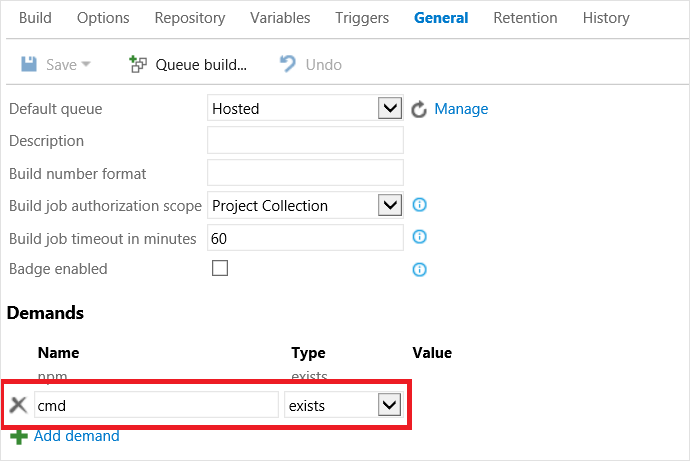
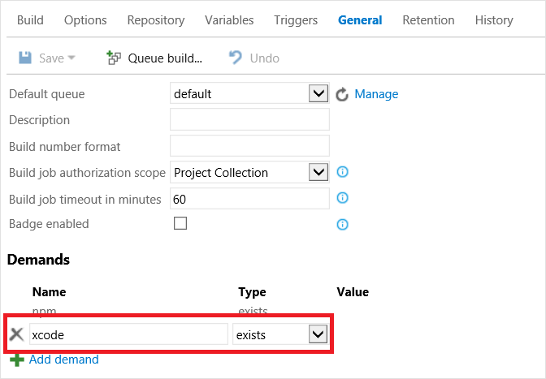

# The Cordova/Ionic/PhoneGap Command Tasks

[!INCLUDE [version-tfs-2015-rtm](../../../_shared/version-tfs-2015-rtm.md)]

> **Notice**: Apple's WWDR certificate expired on Feb 14th and as a result you may experience signing failures if you have not updated the cert and **removed the old one**. Follow the steps outlined by Apple under [What should I do if Xcode doesn't recognize my distribution certificate?](https://developer.apple.com/support/certificates/expiration/) to resolve the problem. Note that this also affects development certs despite the title.

Azure Pipelines and Team Foundation Services (TFS) 2015 can be used for building and testing Cordova apps in a Continuous Integration (CI) environment thanks to a new [cross-platform agent](https://github.com/Microsoft/azure-pipelines-agent) that supports macOS. The end result is you can use Azure Pipelines or TFS to build projects created using [Tools for Apache Cordova](http://go.microsoft.com/fwlink/?LinkID=536496) or *any Cordova compliant CLI like the Ionic, PhoneGap, or TACO CLI*.

To streamline CI for Cordova-based projects, we have created a series of build tasks that you can use: **[Cordova Build](./cordova-build.md)**, **Cordova Command**, **Ionic Command**, and **PhoneGap Command**. These tasks will automatically handle fetching the correct version of the appropriate CLI and even setup the correct version of Node.js for you if not present!

Generally you should only need to use the **[Cordova Build](./cordova-build.md)** task even when building something like an Ionic project (and it has some useful features in this specific area). However, if you want to run a non-build CLI related command, use the Cordova and Ionic Command tasks. You can also use the PhoneGap Command task to execute non-build related commands or use [PhoneGap Build](https://build.phonegap.com/).  See [PhoneGap CLI](http://docs.phonegap.com/references/phonegap-cli/remote-usage/) documentation for details. This article will specifically focus the Command tasks. See the [Cordova Build](./cordova-build.md) tutorial for details on building and testing along with information on setting up your own build agent.

## Installing the Command tasks
To setup a Cordova build in Azure Pipelines or TFS 2015, you will need to install the Cordova Build task in your collection.

- **Azure Pipelines **: Simply install the [VSTS Extension for Cordova](http://go.microsoft.com/fwlink/?LinkID=691835).
- **TFS 2015 Update 1 and Earlier**: TFS 2015 Update 1 and below does not support installing Azure Pipelines Extensions. Follow the instructions in the [cordova-tasks](http://go.microsoft.com/fwlink/?LinkID=691187) repository to install.

## The Cordova Command task
Add the Cordova Command task to your build pipeline by going to the "Build" tab, adding a new build task, and selecting **Cordova Command** from the **Build** category

Available Settings:
  - **Command**: The CLI command.  For example "plugin".
  - **Arguments**: Additional arguments for the command.  Ex: "add cordova-plugin-camera"
  - **Cordova Version**: Version of the Cordova CLI you want to use to run the command. If you're using Tools for Apache Cordova you can leave this blank and the correct version will be used based on the contents of taco.json. Otherwise, if not specified, it uses the version specified by the CORDOVA_DEFAULT_VERSION environment variable (like in Azure Pipelines) and falls back to the latest version if no environment variable is set.
  - **Advanced &gt; Working Directory**: Location of the Cordova project itself inside your solution (not the solution root).

Next, given the task is cross-platform, if you want to be sure this build pipeline only runs on Windows or macOS, you will need to add a demand that "cmd" exists for Windows...

... or "xcode" exists for macOS...  

## The Ionic Command task
The Ionic Command task is similar to the Cordova one. Add the Ionic Command task to your build pipeline by going to the "Build" tab, adding a new build task, and selecting **Ionic Command** from the **Build** category

Available Settings:
* **Command**: The CLI command.  For example "state".
* **Arguments**: Additional arguments for the command.  Ex: "restore"
* **Ionic Version**: If not specified, uses the Ionic CLI version specified by the IONIC_DEFAULT_VERSION environment variable (like in Azure Pipelines) or the latest if no environment variable is set.
* **Cordova Version**: Version of Ionic you want to use to run the command. If left blank it uses the version specified by the CORDOVA_DEFAULT_VERSION environment variable (like in Azure Pipelines) and falls back to the latest version if no environment variable is set.
* **Advanced &gt; Working Directory**: Location of the Cordova project itself inside your repository.

> **Troubleshooting Tip:** If you encounter a **spawn EACCES error** when building on Linux or macOS, be sure all files in the hooks folder to have an "execute bit" set as this a requirement for Cordova. To resolve, add an execute bit to the files in source control or add the following using the Command Line task: chmod +x hooks/after_prepare/010_add_platform_class.js

## The PhoneGap Command task
The PhoneGap Command task is similar to the Cordova one. Add the PhoneGap Command task to your build pipeline by going to the "Build" tab, adding a new build task, and selecting **PhoneGap Command** from the **Build** category

Available Settings:
* **Command**: The CLI command. For example "remote login".
* **Arguments**: Additional arguments for the command.  
* **PhoneGap Version**: If not specified, uses the PhoneGap CLI version specified by the PHONEGAP_DEFAULT_VERSION environment variable (like in Azure Pipelines) or the latest if no environment variable is set.
* **Advanced &gt; Working Directory**: Location of the Cordova project itself inside your repository.

## More information
* [Learn about the Cordova Build task and setting up your own agent](./cordova-build.md)
* [Check out the source code](http://go.microsoft.com/fwlink/?LinkID=691187)
* [Learn about Tools for Apache Cordova](http://go.microsoft.com/fwlink/?LinkID=618473)
* [Read tutorials and learn about tips, tricks, and known issues for Cordova](http://go.microsoft.com/fwlink/?LinkID=618471)
* [Download samples from our Cordova Samples repository](http://github.com/Microsoft/cordova-samples)
* [Follow us on Twitter](https://twitter.com/VSCordovaTools)
* [Visit our site https://aka.ms/cordova](https://aka.ms/cordova)
* [Ask for help on StackOverflow](http://stackoverflow.com/questions/tagged/visual-studio-cordova)

## Q&A

<!-- BEGINSECTION class="md-qanda" -->

::: moniker range="< azure-devops"
[!INCLUDE [temp](../../../_shared/qa-versions.md)]
::: moniker-end

<!-- ENDSECTION -->
