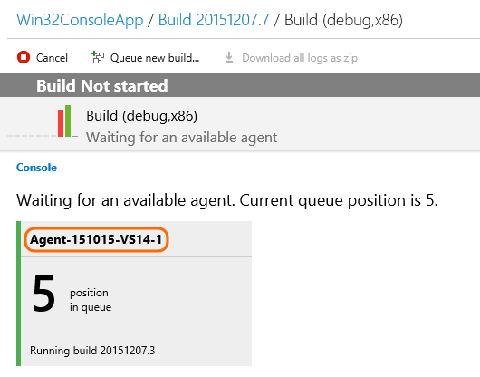
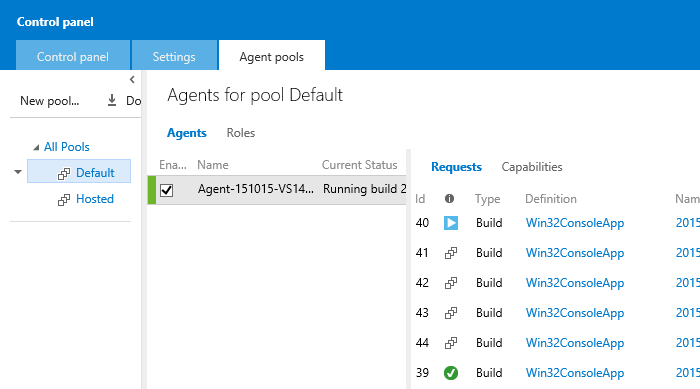
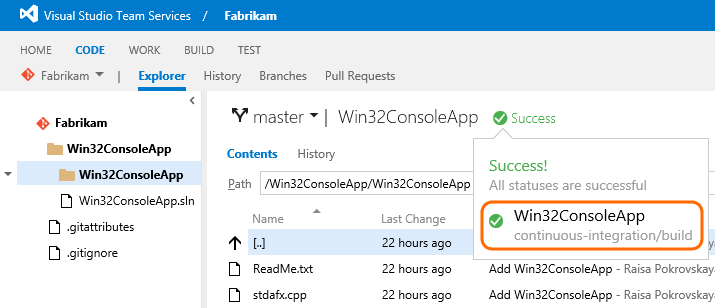

# 2015 Team Foundation Build release notes

**TFS 2017 | TFS 2015**

> [!NOTE]
> This topic is archived. For the latest news on Build and Release, see the [News about Azure Pipelines](https://visualstudio.microsoft.com/team-services/updates/).

## December 19

#### New documentation

Added:

* [Build: Grunt](../../tasks/build/grunt.md)

Updated:

* [Build your Visual Studio solution](../../apps/windows/dot-net.md)

* [Build your Java project](../apps/java/quick-to-azure.md)

Moved to this site from Azure Pipelines:

* [Hosted agents](../../agents/hosted.md)

* Hosted build controller for XAML builds

## December 15

#### Build Universal apps

You can [build Universal apps](../../apps/windows/universal.md).

#### Why hasn't my build started? What are my build agents doing?

You can see information about what's delaying your build from starting.





#### More efficient repo cleaning

On the **Repository** tab of the build definition, when you set **Clean** to true, the cleaning is now done this way:

 * Git: git clean -fdx, git reset -hard HEAD

 * TFVC: undo pending changes and scorch.

If you want this switch to work differently, then on the Variables tab, set the ```Build.Clean``` variable to:

* ```all``` if you want to delete Agent.BuildDirectory, which is the entire working folder that contains the sources folder, binaries folder, artifact folder, and so on.

* ```source``` if you want to delete Build.SourcesDirectory.

* ```binary``` If you want to delete Build.BinariesDirectory.

#### Access the OAuth token from your script

Scripts can now use the build pipeline OAuth token to access the Azure Pipelines REST API. See [Use a script to customize your build pipeline](../../scripts/powershell.md).

#### New documentation

New [home page](../../overview.md) and 3-column layout.

[Build your Windows Universal Platform app](../../apps/windows/universal.md)

Added and updated build tasks:

* Build

 - [Ant](../../tasks/build/ant.md)

 - [gulp](../../tasks/build/gulp.md)

 - [Gradle](../../tasks/build/gradle.md)

* Utility

 - [Batch script](../../tasks/utility/batch-script.md)

 - [Command line](../../tasks/utility/command-line.md)

 - [PowerShell](../../tasks/utility/powershell.md)

Updated:

* [Build and Deploy your Node.js Application to an Azure Web App](../apps/nodejs/nodejs-to-azure.md) (added missing argument)

* [Work with variables](../../build/variables.md)


## November 25

#### New things you can do

* You can [contribute build tasks as extensions](https://marketplace.visualstudio.com/vss/Build and release).

* See the build status for your repository in the code view.

 

* You can see what agents are currently running and have run on the agent pools tab.

* Added change account option for build agent.

* Added Node.js handler to windows agent to enable many build tasks to have a single implementation.

* Enabled Pull Requests build policy on cross-platform agent.

* Enabled cross-platform agent to publish markdown files to build summary via the ```##vso[build.UploadSummary]```local file path command.

#### New documentation

Added:

* [Build Apache Cordova apps with Azure Pipelines or Team Foundation Services 2015](../apps/mobile/cordova-build.md)

* [The Cordova/Ionic Command Tasks for Azure Pipelines and Team Foundation Services 2015](../apps/mobile/cordova-command.md)

* [Build and Test Xcode Projects with Azure Pipelines or Team Foundation Server 2015](../../languages/xcode.md)

* [Simple, Secure CI App Signing Using Azure Pipelines or Team Foundation Server 2015](../../apps/mobile/secure-certs.md)

* Build tasks

 - [MSBuild](../../tasks/build/msbuild.md)

 - [Visual Studio Build](../../tasks/build/visual-studio-build.md)

 - [Index Sources & Publish Symbols](../../tasks/build/index-sources-publish-symbols.md)

Updated:

* [Deploy a Windows build agent](../../agents/v1-windows.md)

## Q&A

<!-- BEGINSECTION class="md-qanda" -->

::: moniker range="< azure-devops"
[!INCLUDE [temp](../../_shared/qa-versions.md)]
::: moniker-end

<!-- ENDSECTION -->
