# 2016 Team Foundation Build release notes

**TFS 2017 | TFS 2015**

> [!NOTE]
> This topic is archived. For the latest news on Build and Release, see the [News about Azure Pipelines](https://visualstudio.microsoft.com/team-services/updates/).

## December 9

We've updated the hosted pool. We've changed permissions to enable you to build .NET 3.5 ASP.NET Web Forms projects. Also, we've updated and added new software:

* .NET Core 1.1
* Android SDK v25
* Azure CLI 0.10.7
* Azure PS 3.1.0
* Azure SDK 2.9.6
* CMake 3.7.1
* Git for Windows 2.10.2
* Git LFS 1.5.2
* Node 6.9.1
* Service Fabric SDK 2.3.311
* Service Fabric 5.3.311
* Typescript 2.0.6 for Visual Studio 2015

[Hosted agents](../../agents/hosted.md)

## November 29

### Build and deploy Docker apps to Azure more easily

We're doing a few things to make continuous integration and deployment (CI/CD) of Docker apps simpler. Last week we released Visual Studio 2017 RC to enable you to quickly and automatically create a CI/CD pipeline for ASP.NET Core projects with Docker [see below for details](#november-16).

This week we've updated the [Docker extension](https://marketplace.visualstudio.com/items?itemName=ms-vscs-rm.docker) with support for Azure Container Service and Azure Container Registry. We've also begun offering the hosted Linux pool.

### Preview: Hosted Linux pool

We're offering a preview of our new hosted Linux pool to enable you to build and release on Linux machines without having to configure a private agent.

The agents in the hosted Linux pool run on an Ubuntu Linux host inside the [vsts-agent-docker container](https://github.com/Microsoft/vsts-agent-docker). This container includes all the standard Java, Node, Docker and .NET Core tooling. When we start the container we map in the Docker socket from the host VM and the working folder from /opt/vsts/work. This enables you to create or spawn other Docker containers as part of your build or release pipeline using either a script or the [Docker extension](https://marketplace.visualstudio.com/items?itemName=ms-vscs-rm.docker) in the Visual Studio Marketplace.

To use the Hosted Linux pool in your build definition, go to the **General** tab, open the **Default agent queue** menu, and then select **Hosted Linux**.

If you don't see the option yet, just give it a little time. We're rolling this option out to accounts over the next few weeks.

### Definitions can be pinned to a specific task version

By popular request, we're giving you control over the major version of a task that you run in your build or release. We expect this change to result in fewer unpredictable errors that were caused by automatic updates to the agent and task version. You now specify the major version of the task on the **Build** tab of your definition.

When a minor version is released (for example, 1.2 to 1.3), you get that change automatically in your build. But if a new major version is released (for example 2.0), then your build stays locked to version 1.3 until you edit the definition and manually change to the new major version. A flag in the build definition alerts you to new major versions.

If you select a version named something such as **1.* (preview)**, keep in mind that this version is still under development and might have known problems.

> **Tip:** In a build definition you've got a few options to test a new major version of a task:
 * If you change the version and have problems, you can revert the change from the history tab.
 * Clone the build definition and test the cloned definition with the new major task version.

### Roll back changes to a build definition

You can now select a version in the build definition [history](../../build/history.md) and **Rollback** to that version.

## November 16

### Build and deploy ASP.NET apps to Azure

Today we're [announcing the Visual Studio 2017 release candidate](https://blogs.msdn.microsoft.com/visualstudio/2016/11/16/visual-studio-2017-rc/). You can use this version of Visual Studio to automatically set up a CI/CD pipeline to deploy your ASP.NET Core Web App with Docker to Azure.

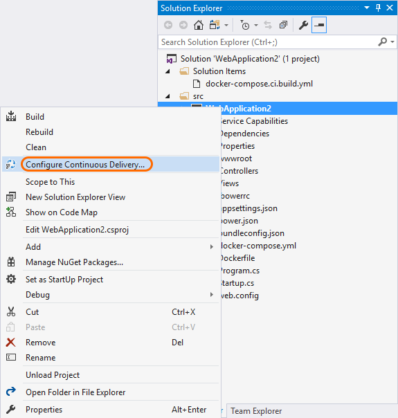

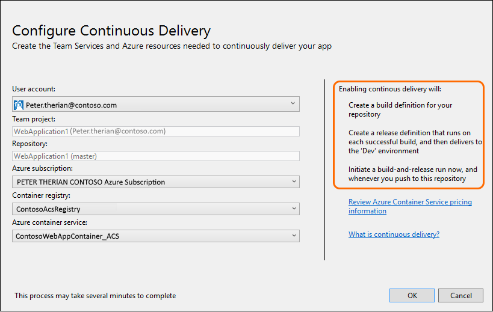

[Deploy ASP.NET Core Web App with Docker to Azure](../apps/aspnet/aspnetcore-docker-to-azure.md) so that you're set up to run an automated build and deployment to Azure Container Service with every Git push.

Also, we've updated these topics with more-end-to-end details:

* [Deploy ASP.NET 4 to Azure](../../apps/aspnet/build-aspnet-4.md)

* Deploy ASP.NET Core to Azure

### Pricing changes on Azure Pipelines

Later this month, on Azure Pipelines we're moving to a pricing model based on concurrent pipelines. (Previously you paid for agents.)

**No charge for private agents:** [Private agents](../../../pipelines/agents/agents.md) are now free. In Azure Pipelines, you used to have to license each private agent after the first. Now you can run deployments concurrently for no additional charge.

**Concurrent pipelines:** For each build that you want to run concurrently on Azure Pipelines, you need a concurrent pipeline. Some concurrent pipelines are included. If you need more, you can add more in a few ways.

> **On TFS** you don't need concurrent pipelines to run builds. You can run as many builds as you want at the same time for no additional charge.

[Concurrent pipelines for your builds and releases in Azure Pipelines](../../../pipelines/licensing/concurrent-jobs.md)

## November 10

### Don't sync sources

To bypass synchronizing source files, select one of the Git options as your [repository type](../../build/repository.md), and then select **Don't sync sources.** This can be useful if you want to handle Git version control operations yourself, or if you just want to run automation without version control dependencies.

## October 12

### Git LFS and shallow fetch

**Checkout files from LFS:** Download files from large file storage (LFS).

**Shallow fetch:** If your repository is large, this option might make your build pipeline more efficient.

> Your agent must be version 2.107.* or newer for this feature to work.

[Specify the repository](../../build/repository.md)

### New places to search

You can now search for builds in the **Mine** and **Queued** tabs.

### Visual Studio 15 Preview 5

Build apps developed in Visual Studio 15 Preview 5:

* [Build: Visual Studio Build task](../../tasks/build/visual-studio-build.md): For **Visual Studio Version** select _Visual Studio "15" (preview)_.

* [Build: MSBuild task](../../tasks/build/msbuild.md): For **MSBuild Version** select _MSBuild 15.0 (preview)_.

> At the moment you must [deploy your own Windows agent](../../agents/v2-windows.md) to build these apps. Visual Studio 15 Preview is not yet available on the hosted pool.

### New mobile app options, updated docs

[Build your Xamarin app](../../languages/xamarin.md)

[Build and Test Xcode Projects](../../languages/xcode.md)

[Build: Xcode](../../tasks/build/xcode.md) Added Xcode 8 automatic signing. Added options to support creating app packages.

### Updated hosted build pool

[Hosted agent software list](../../agents/hosted.md#software) added:

* Azure SDK 2.9.1
* WIX 3.10
* SQL lite for Windows Phone 8.1
* Xamarin Stable Cycle 8 SR 0
* Windows 10 SDK 14393
* .NET 4.6.2
* Git 2.10.1

## September 21

### Xcode task xcpretty formatting

We've added an option that enables you to use [xcpretty](https://github.com/supermarin/xcpretty/blob/master/README.md) to format your xcodebuild output and publish JUnit test results. See [Xcode](../../tasks/build/xcode.md).

### Publish Jenkins test and code coverage results

You can now use the **Jenkins Queue Job** build and release task to retrieve test and code coverage results from a Jenkins job or pipeline. See [Jenkins Queue Job](../../tasks/build/jenkins-queue-job.md).

### Build summary for Maven and Gradle tasks

When you enable the **Run SonarQube Analysis** option in the [Maven](../../tasks/build/maven.md) or [Gradle](../../tasks/build/gradle.md) build tasks, you get a link on the SonarQube project. You can request a full analysis to see the quality gates details, and choose to break the build if they are not met.

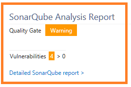

### FindBugs and CheckStyle in Maven build

You can now request FindBugs and CheckStyle standalone static analysis in the [Maven](../../tasks/build/maven.md) build task (in addition to the PMD analysis). The results of the static analysis appear in the build summary, and resulting files are available from the Artifact tab of the build result.

### New and updated content

[Administer permissions](../../policies/permissions.md) Added walkthrough with examples to grant permissions.

[Triggers](../../build/triggers.md#ci) Added some tips on filtering the file path for your CI trigger.

## September 2

### Queued tab redesigned

We've implemented a new design to more cleanly show a longer list of queued and running builds.

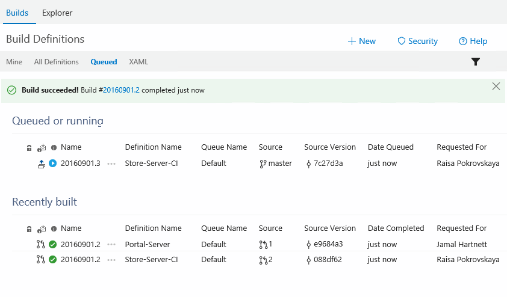

### Hosted pool agents are migrating to the v2 agent

We're switching from the [Windows v1 agent](../../agents/v1-windows.md) to the [Windows v2 agent](../../agents/v2-windows.md).

We expect this migration to be a non-event for the vast majority of users. However, we have seen a few cases where custom build tasks are not compatible due to reflection across internal APIs or reliance to specific agent folder layout. If you run into any issues [please let us know](../../../user-guide/provide-feedback.md).

### Xamarin builds simplified

You no longer need a Xamarin license to [build your Xamarin app](../../apps/mobile/xamarin.md). We're deprecating the [Utility: Xamarin license](../../tasks/utility/xamarin-license.md) task. We recommend that you remove this task from your build to avoid disruption when we remove the task from the product.

## August 19

We've had lots of exciting news this week. We're capping it off with a brand new user experience.

### New definitions experience

Welcome to the new definitions UX! The experience focuses on the builds you own and care about. We hope you enjoy the richer and more personalized views into the status and quality of your code.

### These builds are mine

Here you'll find the builds you care about most. The **Mine** tab features your favorites, team favorites, and builds of code that you've checked in.

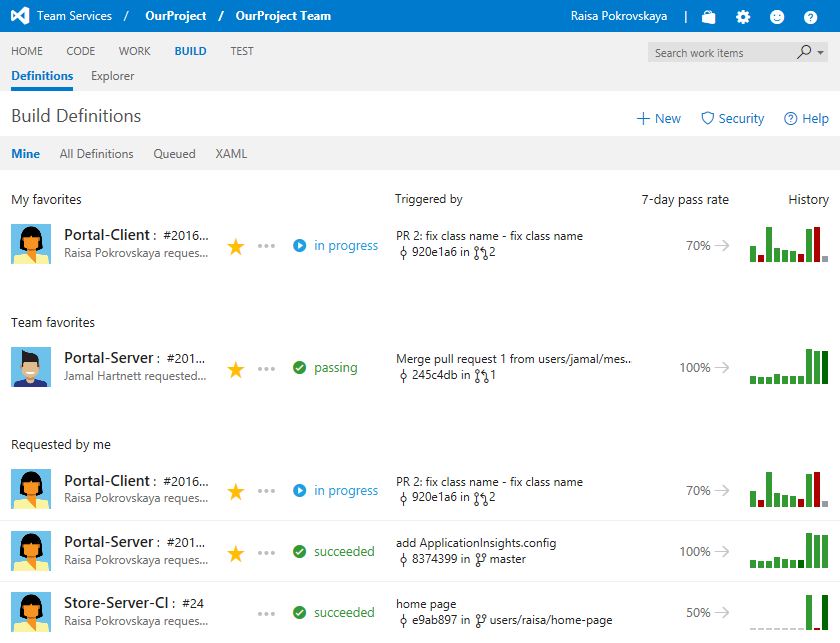

The 7-day pass rate shows the percentage of builds that succeeded or partially succeeded out of all the builds completed during the past week. The arrow tells you if today's builds are doing better or worse than the 7-day rate.

### What's happening right now?

When you want to see what's happening right now and in recent history, check out the **Queued** tab.

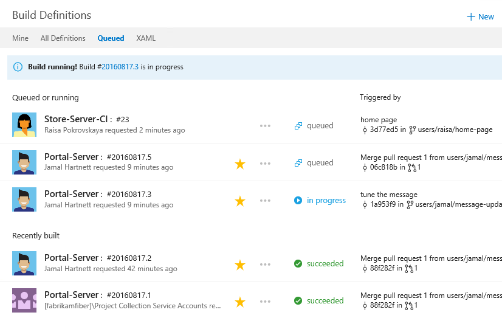

### Folders!

Does your team have a lot of build definitions. You can now use folders to keep them organized in the **All Definitions** tab.

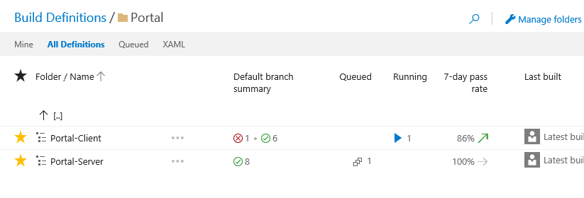

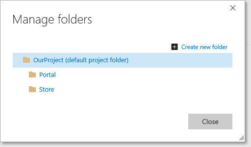

> **Tip:** Have a batch of definitions that need the same permissions? Put them in a folder and then you can give permissions to the folder.
 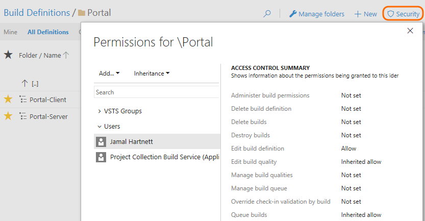

### Lots more data about the build

When you click down to focus on a specific build, we now give you a lot more information about what's happening and overall code quality.

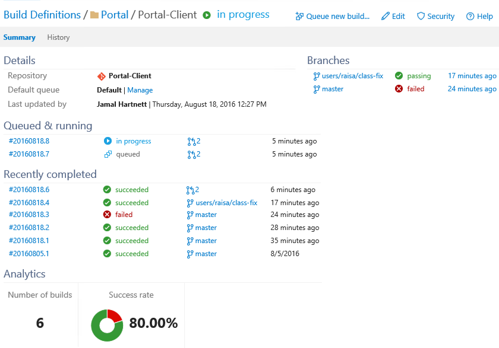

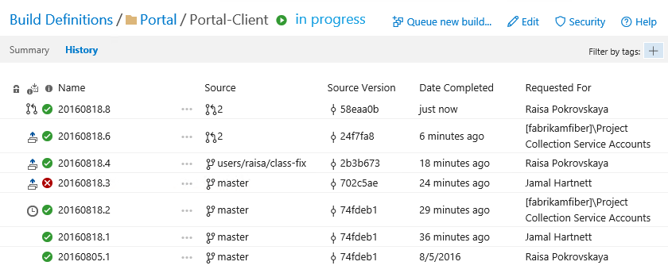

### XAML

Still have some XAML builds? Visual Studio is still your primary tool for editing and managing XAML builds. The **XAML** tab provides a companion experience so you can view and queue those builds in your web browser.

## August 18

### Run your agents behind a web proxy

Added info on using a web proxy. Also changed these topics to clarify permissions for deploying the agent.

* [Windows agent](../../agents/v2-windows.md)

* [macOS agent](../../agents/v2-osx.md)

* [Linux agent](../../agents/v2-linux.md)

## August 17

### New build steps

[Utility: FTP Upload](../../tasks/utility/ftp-upload.md)

[Deploy: Copy Files Over SSH](../../tasks/deploy/copy-files-over-ssh.md)

### Updated build steps

[Build: Jenkins Queue Job](../../tasks/build/jenkins-queue-job.md) Added arguments.

### Updated content

[Build](../../tasks/index.md) Added version qualifiers.

Deploy ASP.NET Core to Azure - Removed unnecessary step.

[Variables](../../build/variables.md) Added Build.RequestedForEmail, small corrections.

## August 1

### New build agents and admin content

Administer your build and deployment system

* [Windows agent](../../agents/v2-windows.md)

* [macOS agent](../../agents/v2-osx.md)

* [Linux agent](../../agents/v2-linux.md)

* [Hosted agents](../../agents/hosted.md)

<!--* [TFS 2015](../../admin/2015.md) -->

 - [Windows agent](../../agents/v1-windows.md)

### New build steps

[Utility: Update Service Fabric App Versions](../../tasks/utility/service-fabric-versioning.md)

[Deploy: Service Fabric App Deployment](../../tasks/deploy/service-fabric-deploy.md)

[Deploy: SSH](../../tasks/deploy/ssh.md)

### Updated content

Deploy ASP.NET Core to Azure

## July 14

[Hosted agent software list](../../agents/hosted.md#software) added:

* Visual Studio 2015 Update 3
* .NET Core 1.0 with Preview 2 Tooling
* Azure Service Fabric SDK 2.1
* Android support repository version 30
* Google Repository version 29
* Let's Encrypt root certs for JDK certificate store
* SQL Server Data Tools Visual Studio 2015

## July 7

### New build steps

[Build: Jenkins Queue Job](../../tasks/build/jenkins-queue-job.md)

[Utility: Archive files](../../tasks/utility/archive-files.md)

### Updated documentation

[Scale out and administer your build and deployment system](../../agents/pools-queues.md) agent queues tab moved to project

### Other news

[Azure Pipelines July 7 release notes](/azure/devops/release-notes/2016/jul-07-team-services#continuous-integration) see the **Continuous integration** section.

## June 14

### Extract files build step

[Utility: Extract Files](../../tasks/utility/extract-files.md)

### Git CI triggers with file path filters

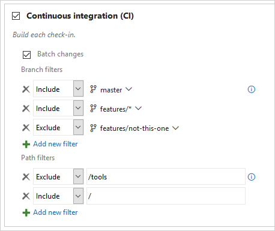

[Set build triggers](../../build/triggers.md)

### Hosted pool update

[Hosted agent software list](../../agents/hosted.md#software) added:

* .NET Core RC2 Tooling
* Service Fabric runtime, SDK, and tools for Visual Studio 2015

### New documentation

Build and deploy your ASP.NET Core RC2 app to Azure

[Deploy: SQL Server Database Deployment](../../tasks/deploy/sql-dacpac-deployment-on-machine-group.md)

### Updated documentation

[Use build variables](../../build/variables.md) completely overhauled with new structure and a lot more details.

[Deploy build steps](../../tasks/index.md#deploy)

[Test build steps](../../tasks/index.md#test)

## June 1

### Role-based agent queues

[Administration of agent queues](../../agents/pools-queues.md) is now role-based. You can now grant permissions to project-level groups. Updated administration content in this and other topics.

### New cross-platform agent

[New cross-platform agent](https://github.com/Microsoft/azure-pipelines-agent/blob/master/README.md)

### Updated documentation

[Hosted agents](../../agents/hosted.md) New software. Hosted build controller is deprecated.

[NuGet packager](../../tasks/package/nuget.md) Added examples of multiple patterns and negation pattern.

## April 22

### New documentation

[Utility: Shell script](../../tasks/utility/shell-script.md)

[Package: npm](../../tasks/package/npm.md)

[Utility: cURL Upload Files](../../tasks/utility/curl-upload-files.md)

### Updated documentation

[Home page](../../overview.md) - broadened coverage and implemented responsive design

[Hosted agent software list](../../agents/hosted.md#software)

## April 18

[Retention policies](../../policies/retention.md) can delete

* Artifacts that you've published to a UNC file share using the [Publish Build Artifacts](../../tasks/utility/publish-build-artifacts.md) build step.

* Symbols that you've published using the [Index Sources & Publish Symbols](../../tasks/build/index-sources-publish-symbols.md) build step.

## April 15

### New documentation

[Build: Xcode](../../tasks/build/xcode.md)

[Build: Xcode Package iOS](../../tasks/build/xcode-package-ios.md)

[Package: CocoaPods](../../tasks/package/cocoapods.md)

## April 13

### From build error to source

Have you ever wished you could just jump from a build error to the line of code that caused it?  Now you can.

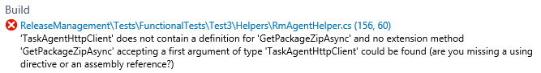

Click the error link to open the source file causing the build error.

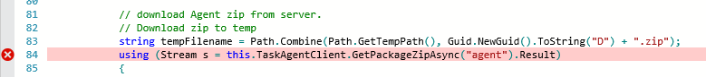

### Copy from console to clipboard

When you are viewing a build in progress, on the console there's now a button you can click to copy the output to your clipboard.

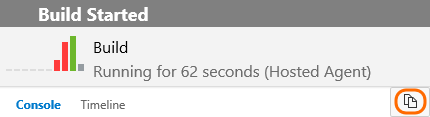

### View longer logs

When you are viewing the output from a build step in your web browser, you can now view much longer logs (up to 150,000 lines).

### Java build templates

We've made it even easier for Java developers to get started by adding templates for Ant, Maven and Gradle.

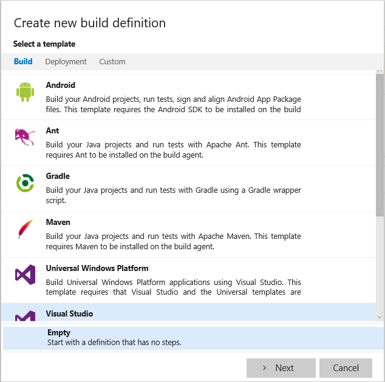

### New documentation

[Build: CMake](../../tasks/build/cmake.md)

### Updated documentation

[Build: gulp](../../tasks/build/gulp.md)

## March 29

### New capabilities and documentation

[Build your Xamarin app](../../apps/mobile/xamarin.md) now with enhanced templates.

[Build: Xamarin.Android](../../tasks/build/xamarin-android.md) now supports macOS and Linux.

[Build: Xamarin.iOS](../../tasks/build/xamarin-ios.md) now supports signing and packaging.

[Test: Xamarin Test Cloud](../../tasks/test/xamarin-test-cloud.md) results can now be displayed on the build summary page.

[Package: Xamarin Component Restore](/xamarin/cross-platform/troubleshooting/component-nuget)

[Utility: Xamarin License](../../tasks/utility/xamarin-license.md)

## March 23

### New documentation

[Deploy: Azure File Copy](../../tasks/deploy/azure-file-copy.md)

[Test: Cloud-based Load Test](../../tasks/test/cloud-based-load-test.md)

[Test: Cloud-based Web Performance Test](../../tasks/test/cloud-based-web-performance-test.md)

[Test: Run Functional Tests](../../tasks/test/run-functional-tests.md)

[Test: Visual Studio Test](../../tasks/test/vstest.md)

[Test: Visual Studio Test Agent Deployment](../../tasks/test/visual-studio-test-agent-deployment.md)

### Updated documentation

[Build: Ant](../../tasks/build/ant.md)

[Deploy a Windows build agent](../../agents/v1-windows.md)

Scale out and administer your build and deployment system

[Use variables](../../build/variables.md)

## March 3

You can [run Git commands in your build scripts](../../scripts/git-commands.md).

## February 19

### TFVC Gated Check-in

Use gated check-in to protect your TFVC codebase from build breaks.

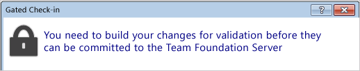

See [Triggers: Gated check-in](../../build/triggers.md#gated).

### Private shelveset builds

Manually queue a private build of a shelveset. See [Create a build definition](../../create-first-pipeline.md).

### New documentation

[Build: Android build](../../tasks/build/android-build.md)

[Build: Android signing](../../tasks/build/android-signing.md)

[Package: NuGet Installer](../../tasks/package/nuget.md)

[Package: NuGet Packager](../../tasks/package/nuget.md)

[Package: NuGet Publisher](../../tasks/package/nuget.md)

[Specify the repository](../../build/repository.md) (Q&A: What kinds of submodules can I check out?)

## January 25

### Retention policy minimums

You can now specify a minimum number of successful or partially successful builds to keep. See [Specify build retention policies](../../policies/retention.md).

### Delete Files build step

 [Delete Files](../../tasks/utility/delete-files.md)

### Deleted builds tab

You can view builds deleted by you or your retention policies. Deleted builds are destroyed after 30 days.

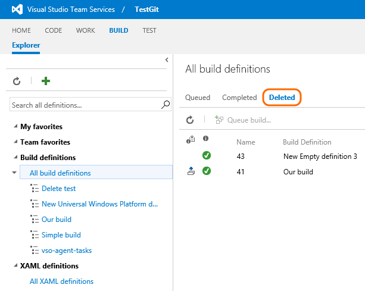

### New permission to register XAML build controllers

Project Collection Build Administrators can now register XAML build controllers on an Azure DevOps organization. Previously you had to be a member of the Project Collection Administrators group.

### More news

[Visual Studio Team System Release Notes - January 25](/azure/devops/release-notes/index) Improved views of your completed builds, release orchestration improvements, and more.

### New documentation: Define your process

Create a build definition (replaced in April 2017 with [CI/CD for newbies](../../create-first-pipeline.md))

[Specify build options](../../build/options.md)

[Specify the repository](../../build/repository.md)

[Set build triggers](../../build/triggers.md)

[Specify general build definition settings](../../build/options.md)

[Specify build retention policies](../../policies/retention.md)

[View the change history of your build definition](../../build/history.md)

### New documentation: Build steps

[Utility: Copy Files](../../tasks/utility/copy-files.md)

[Utility: Publish Build Artifacts](../../tasks/utility/publish-build-artifacts.md)

[Utility: Copy and Publish Build Artifacts](../../tasks/utility/copy-and-publish-build-artifacts.md)

## Q&A

<!-- BEGINSECTION class="md-qanda" -->

::: moniker range="< azure-devops"
[!INCLUDE [temp](../../_shared/qa-versions.md)]
::: moniker-end

<!-- ENDSECTION -->
