# Team Build and Release release notes

**TFS 2017 | TFS 2015**

> [!NOTE]
> This topic is archived. For the latest news on Build and Release, see the [News about Azure Pipelines](https://visualstudio.microsoft.com/team-services/updates/).

## June 23

### Export and import build definitions

Build definitions are implemented internally as .json files, and so you can see details on changes in history. And you can already clone and make templates from your build definitions. But many folks have wanted to take a copy of their CI build logic and reuse it in another project. In fact it's been a [top-ten request on user voice](https://visualstudio.uservoice.com/forums/330519-team-services/category/145254-ci-build).

So we're pleased to announce that now you can do it!


### Visual Studio latest and hosted agent pools

We're changing the model for how you deal with hosted agents and different versions of Visual Studio. Due to architectural, storage, and performance limitations, we're no longer going to offer multiple versions of Visual Studio on a single hosted agent pool. For details on the history and rationale for these changes, see https://github.com/Microsoft/azure-pipelines-tasks/blob/master/docs/vshostedpools.md.

In this release you'll see the following changes:

* You must now explicitly select a queue when you create a build definition (no default).

* To make it easier, we're moving the default queue to the **Tasks** tab, in the **Process** section.

 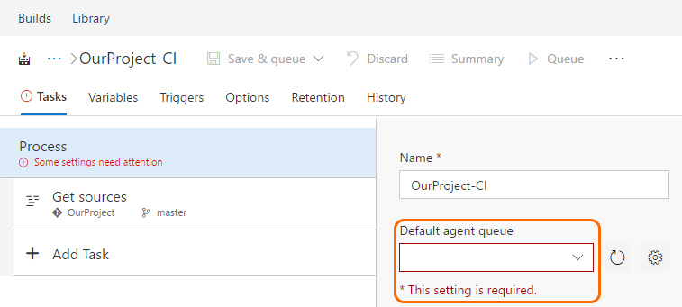

* The [Visual Studio Build](../../tasks/build/visual-studio-build.md) and [MSBuild](../../tasks/build/msbuild.md) tasks now default to the **Latest** setting for the version argument.

Coming soon you'll see more changes. For example, the following hosted pools (and corresponding queues) will be something like:

* Hosted VS2017

* Hosted VS2015

* Hosted Deprecated (previously called "Hosted Pool" and "Hosted")

* Hosted Linux Preview

### Reminder: The hosted XAML controller is going away

> [!IMPORTANT]
> We're going to shut down the deprecated hosted XAML build controller on July 1st, 2017. After this shutdown you'll no longer be able to use hosted agents to run your XAML builds.

We recommend that you migrate to our new task-based build system, which includes access to hosted agents to run your builds. See our recently published guide to [migrate from XAML builds to new builds](../../build/migrate-from-xaml-builds.md).

However, if you still need to run XAML builds during the migration, then you should set up a private XAML build controller now. To use private XAML controllers and agents, you need to have sufficient private pipelines in your account. For details, see [I'm looking for the hosted XAML build controller. Where did it go?](../../agents/hosted.md#q--a)

### Build definition menu on build summary page

From the build summary page you can now navigate to the build summary for other definitions.

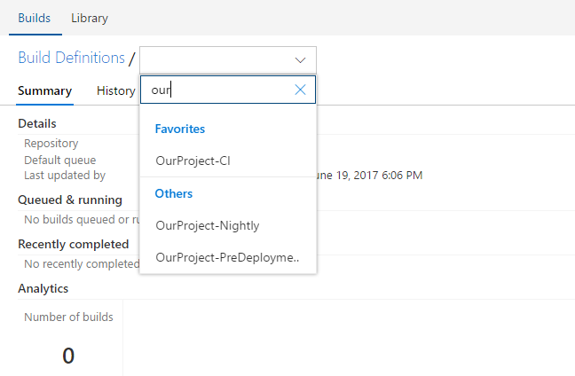

This control is also available on the history page.

### Version 1 agent deprecation on Azure Pipelines

We've been allowing [version 1 agents](../../agents/v1-windows.md) to connect to Azure Pipelines. These agents are supported only for Team Foundation Server 2015. On August 1 we'll block these agents from connecting to Azure Pipelines. If you've been using a version 1 agent, please take action now and set up a version 2 agent:

* [Windows](../../agents/v2-windows.md)

* [macOS](../../agents/v2-osx.md)

* [Linux](../../agents/v2-linux.md)


### Continuous deployment for changes pushed to a Git repository

Release Management has always provided the capability to configure continuous
deployment when a build completes. However, now you can also configure continuous
deployment on Git Push. This means that you can link GitHub and Team Foundation Git
repositories as artifact sources to a release definition and trigger releases automatically
for applications such as Node.JS and PHP that are not generated from a build, and so do not
expose a build action for continuous deployment.

### Enhancements to server-side tasks

We have made two enhancements to server-side tasks (tasks that run within a server phase).

We have added a new task that can be used to invoke any generic HTTP REST API as part
of the automated pipeline. For example, it can be used to invoke specific processing
with an Azure function, and wait for it to be completed.

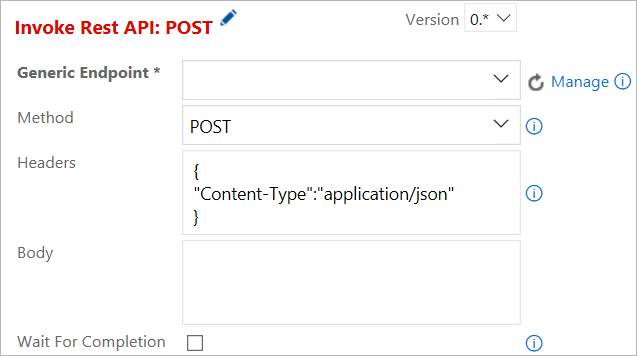

We have also added a **Control options** section to all server-side tasks. Task
behavior now includes the capability to set the **Enabled**, **Continue on error**, **Always run**,
and **Timeout** options.

### Consume Secrets from an Azure Key Vault as variables

We have added first class support for integrating with Azure Key Vault in Azure Pipelines
by linking variable groups to Key Vault secrets. This means you can consume secret
variables in Azure Pipelines and manage secret values completely within Azure Key Vault,
without changing anything on the Azure Pipelines side (for example, password rotation).

To enable this feature in the Variable Groups page, use the toggle button **Link
secrets from an Azure key vault as variables**. After configuring the vault details,
choose **+ Add** and select the specific secrets from your vault that are to be mapped
to this variable group.

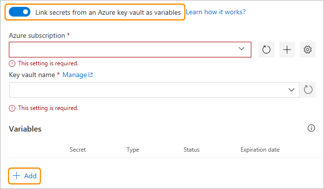

After you have created a variable group mapped to Azure Key Vault, you can link it
to your release definitions, as documented [here](../../library/variable-groups.md).

Note that it's just the secret names that are mapped to the variable group variables,
*not* the values. The actual values (the latest version) of each secret will be fetched
and consumed during the release.  

### Other updates

[Xamarin](../../apps/mobile/xamarin.md) Removed variables that are no longer needed.

[Hosted agents](../../agents/hosted.md) Added Cloud Foundry CLI 6.25.0.

## June 2

### Visual Studio Enterprise benefit for pipelines in Azure Pipelines

Until now, you were able to get a free private pipeline for every Visual Studio Enterprise subscription added to your on-premises TFS server. The same benefit was not available in Azure Pipelines.

Sometime in the next few weeks, we'll add the Visual Studio Enterprise subscriptions pipeline benefit to your Azure DevOps organization. The more Enterprise users you have in your account, the more concurrent builds and releases you can run on your private agents without having to pay anything extra.

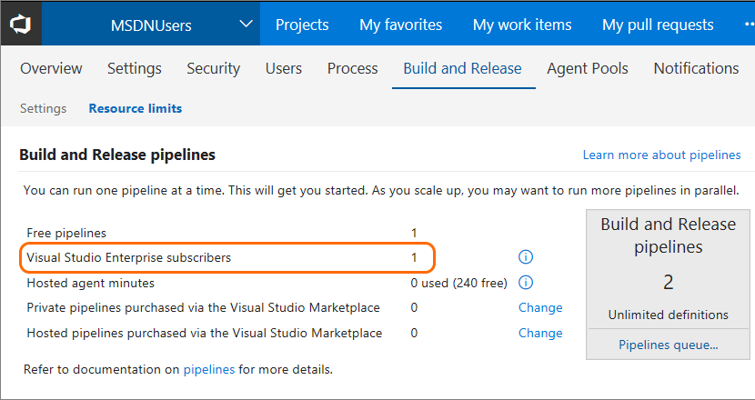

### Work with secure files such as Apple certificates

We've added a general-purpose [secure files library](../../library/secure-files.md).

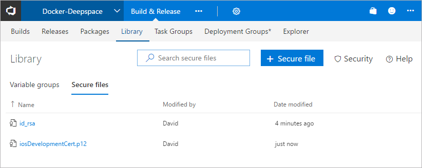

Use the secure files library to store files such as signing certificates, Apple Provisioning Profiles, Android Keystore files, and SSH keys on the server without having to commit them to your source repository.

The contents of secure files are encrypted and can only be used during build or release processes by referencing them from a task. Secure files are available across multiple build and release definitions in the project based on security settings. Secure files follow the Library security model.

We've also added some Apple tasks that leverage this new feature:

* [Utility: Install Apple Certificate](../../tasks/utility/install-apple-certificate.md)

* [Utility: Install Apple Provisioning Profile](../../tasks/utility/install-apple-provisioning-profile.md)

### Extensions with build templates

Build templates enable your team to quickly get started defining a build pipeline with predefined process parameters, tasks, and settings. Although we offer several templates to enable building some of the most common types of apps, now you can deliver custom build templates using extensions. For example:

```json
{  "id": "Template1", 
   "type": "ms.vss-build.template", 
   "targets": [ "ms.vss-build.templates" ], 
   "properties": { "name": "Template1" } }
```

For the full example, see https://github.com/Microsoft/vsts-extension-samples/tree/master/fabrikam-build-extension.

> [!TIP]
> You can use this capability to offer and share the same custom template across all your projects.

### Release Triggers for Git repositories as an artifact source

Release Management now supports configuring a continuous deployment
trigger for Git repositories linked to a release definition in any
of the projects in the same account. This enables you to
automatically trigger a release when a new commit is made to the
repository. You can also specify a branch in the Git repository for
which commits will trigger a release

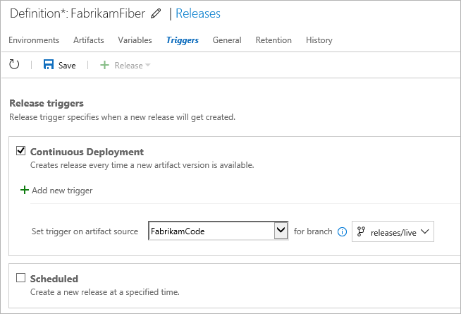

### Control releases to an environment based on the source branch

A release definition can be configured to trigger a deployment
automatically when a new release is created, typically after a build
of the source succeeds. However, you may want to deploy only builds
from specific branches of the source, rather than when any build
succeeds.

For example, you may want all builds to be deployed to _Dev_ and _Test_ environments,
but only specific builds deployed to _Production_. Previously you were
required to maintain two release pipelines for this purpose, one for
the _Dev_ and _Test_ environments and another for the _Production_
environment.

Release Management now supports the use of artifact filters for each
environment. This means you can specify the releases that will be
deployed to each environment when the deployment trigger conditions
(such as a build succeeding and creating a new release) are met.
In the **Trigger** section of the environment **Deployment conditions** dialog,
select the artifact conditions such as the source branch and tags for
builds that will trigger a new deployment to that environment.

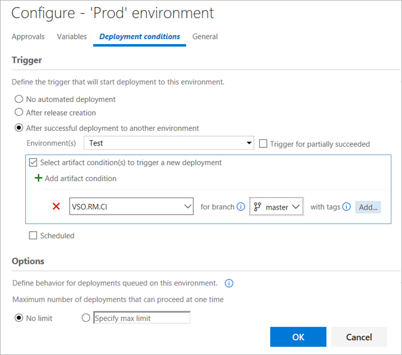

In addition, the release summary page now contains a pop-up tip that
indicates the reason for all "not started" deployments to be in that
state, and suggests how or when the deployment will start.

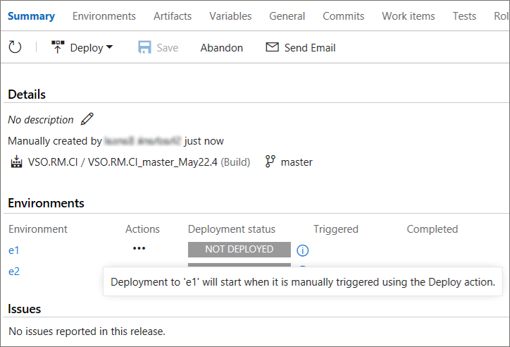

### Manual Intervention task variable support for instructions

The **Manual Intervention** task now supports the use of variables
within the instruction text shown to users when the task runs, at the
point where the user can resume execution of the release pipeline or
reject it. Any variables defined and available in the release can be
included, and the values will be used in the notifications as well as
in the email sent to users.

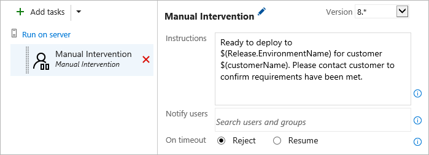

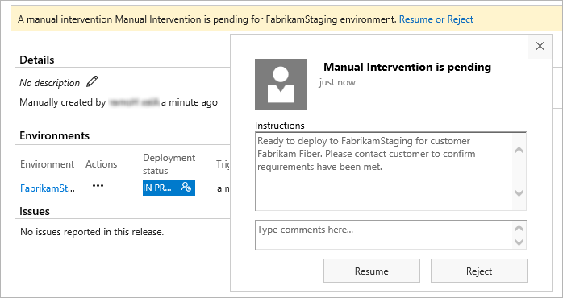

### Deprecate a task in an extension

You can now deprecate a task in your extension. To make it work you must add the following variable to the latest version of your task:

```json
"deprecated": true
```

When the user searches for deprecated tasks, we push these tasks to the end and group them under a collapsible section that's collapsed by default. If a definition is already using a deprecated task, we show a deprecated task badge to encourage users to switch to the replacement.

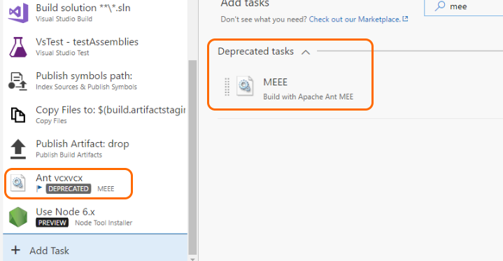

You can help your users learn about the replacement task by mentioning it in the task description. The description will then point folks using the task in the right direction from both the task catalog and the existing build/release definitions.

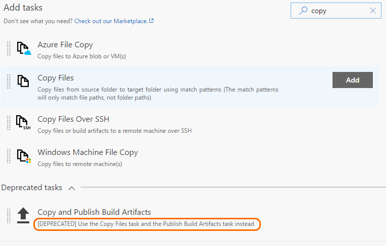

### Task group references

Task groups let you define a set of tasks that you can add to your build or release definitions. This is handy if you need to use the same grouping of tasks in multiple builds or releases. To help you track the consumers of a task group, you now have a view into the build definitions, release definitions, and task groups that reference your task group.

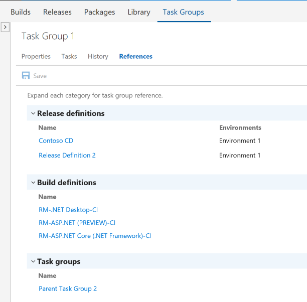

When you try to delete a task group that's still referenced, we warn you and give you a link to this page.

### New content

* [Migrate from XAML builds to new builds](../../build/migrate-from-xaml-builds.md) Because the systems are so different, there's no automated or general way to migrate a XAML build definition into a new build definition. We hope you find this new guide to be helpful.

### Updated Build content

* Build and deploy your ASP.NET Core app to Azure, Build your ASP.NET Core app - Added ASP.NET Core (PREVIEW) template.

* [Build variables](../../build/variables.md) Added AGENT_JOBSTATUS variable

### Updated Release Management content

* [Phases in Build and Release Management](../../process/phases.md) Details of Deployment Group Phases.

* [Deployment groups](../../release/deployment-groups/index.md) Additional information.

* [Service endpoints for Build and Release](../../library/service-endpoints.md) Additional endpoints.

## May 12

One of our goals is to keep
lowering the barrier to entry for automating your application deployment.
The ease with which teams can deploy and validate their application is a
huge part of how quickly they are able to ship. While our CI/CD system is
completely open, we can make setting up deployments extremely simple
through deep integration with Azure. It also unlocks many opportunities for richer
workflows that span both development and operations. To that end, we are
continuing to strive to make Azure Pipelines with Azure the best end-to-end DevOps experience.

This release adds several new capabilities that help to realize that goal.

* We have significantly expanded the breadth of app type we support.

* We now support using the automation agent on the VMs to which you deploy to drive your
  application deployment. This has easily been our most requested feature for
  Release Management.

* We continue to increase our focus on containers. In this release we
  introduce native support for Kubernetes and Service Fabric, the latter
  being a great option for Windows containers.

* We've expanded Azure Web Apps deployment with our native task to include
  Node, PHP, and Linux Web Apps with containers. We've also expanded the entry
  point for setting up CI/CD with more options in the Azure portal configuration
  UI, and introduced the ability to set up CI/CD for Azure Web Apps by using the Azure CLI.

### Deployment Groups in Release Management

Release Management now supports robust, out-of-the-box, multi-machine deployment.
You can now orchestrate deployments across multiple machines and perform rolling updates,
while ensuring high availability of the application throughout.

Agent-based deployment capability relies on the same build and deployment agents.
However, unlike the current approach where you install the build and deployment agents
on a set of proxy servers in an agent pool and drive deployments to remote target servers,
with deployment groups you install the agent on each of your target servers directly
and drive rolling deployment to those servers. You can use the full task catalog on your target machines.

A deployment group is a logical group of targets (machines) with agents installed on each of them.
Deployment groups represent your physical environments, such as single-box Dev, multi-machine QA,
and a farm of machines for UAT/Prod. They also specify the security context for your physical environments.

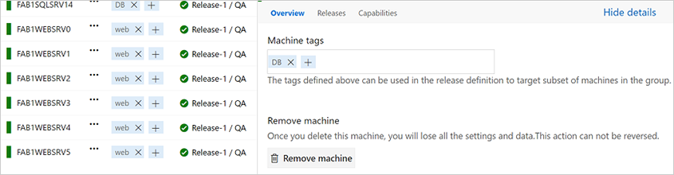

You can use this against any VM that you register our agent with.
We've also made it very easy to register with Azure with support for
an Azure VM extension that auto-installs the agent when the VM spins
up. We will automatically inherit the tags on the Azure VM when it's
registered in Azure Pipelines.

Once you have a deployment group, you simply configure what you want
to execute on that group. You can control what runs on each
machine using tags, and control how fast or slow the rollout happens.

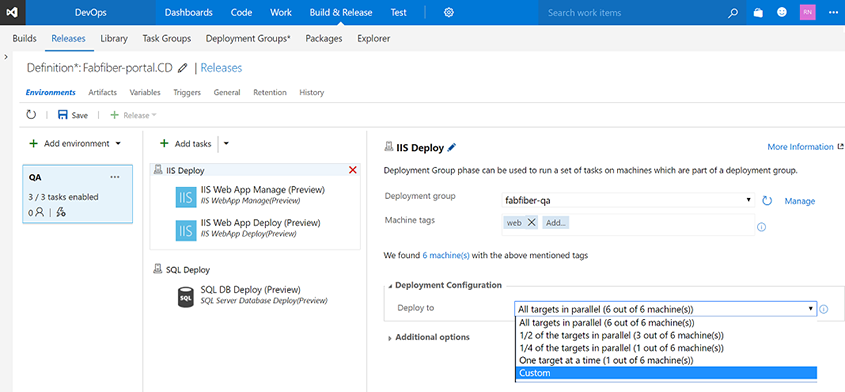

When the deployment runs, the logs show the progression across the entire
group of machines you are targeting.

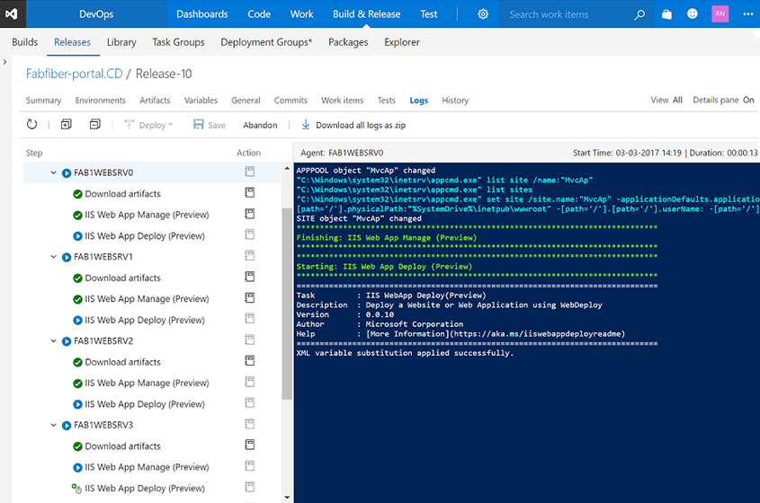

This feature is now an integrated part of Release Management. There are no additional licenses required to use it.
See [Deployment groups](../../release/deployment-groups/index.md).

### Azure virtual machine scale set deployment

Another common pattern used for deployment is to create a full machine
image for each version of the application and then deploy that. To make
this easier, we have a new **Build immutable machine image** task that uses
**Packer** to generate a machine image after deploying applications and
all the required prerequisites. The task uses either a deployment script
or a Packer configuration template to create the machine image, and stores
it in an Azure storage account. This image can than be used for Azure
Virtual Machine Scale Set deployments that work well for this type of
immutable image deployment. See [Deploying Applications to Azure Virtual Machine Scale Sets](https://blogs.msdn.microsoft.com/visualstudioalm/2017/05/15/deploying-applications-to-azure-vm-scale-sets/).

### Retiring the old editor

Over the next few weeks we'll be retiring the old build definition editor. We've designed the new editor to provide a more intuitive experience, fix some pain points, and add new capabilities. We hope that you'll find it easier to use templates, add tasks, and change settings. And now you can use process parameters to make it easier to specify the most important bits of data without having to go deep into your tasks. [Learn more](https://blogs.msdn.microsoft.com/visualstudioalm/2017/05/10/announcing-general-availability-of-the-new-build-editor)

### Heads up: The hosted XAML controller is going away

We will shut down the deprecated hosted XAML build controller on July 1st, 2017. After this shutdown you'll no longer be able to use hosted agents to run your XAML builds.

We recommend that you migrate to our new task-based build system, which includes access to hosted agents to run your builds.

However, if you still need to run XAML builds during the migration, then you should set up a private XAML build controller now. To use private XAML controllers and agents, you need to have sufficient private pipelines in your account. For details, see [I'm looking for the hosted XAML build controller. Where did it go?](../../agents/hosted.md#q--a)

### Tasks fail if Visual Studio 2017 is specified but not present on agent

The [Visual Studio Build](../../tasks/build/visual-studio-build.md) and [MSBuild](../../tasks/build/msbuild.md) tasks enable you to select a specific version of Visual Studio. Until now, if the **Visual Studio 2017** version was not available, these tasks would automatically pick the next available version.

We're changing this behavior. Now the build will fail if you select **Visual Studio 2017** but it is not present on the agent.

We made this change for the following reasons:

* Newer app types such as .NET core do not compile with older build tools. They explicitly require Visual Studio 2017 or newer.

* You get more consistent and predictable results when you use the same exact version of Visual Studio.

* Whenever the tasks falls back, you might get compilation errors that are difficult to understand.

> [!TIP]
> 
> If you're using hosted agents on Azure Pipelines, make sure to select the **Hosted VS2017** queue. If you're using private agents, make sure to use a queue connected with a pool that has agents with Visual Studio 2017, and no agents that have only earlier versions of Visual Studio.

### NuGet Restore, Command, and Tool Installer build tasks

We've made major updates to the __NuGet Installer__ (now called __NuGet Restore__) task, and added two new NuGet tasks: __NuGet Command__ and __NuGet Tool Installer__. Most notably, the __NuGet Command__ and __NuGet Restore__ tasks now use nuget.exe 4.0.0 by default.

The __NuGet Tool Installer__ puts you in control of the version of NuGet used by both the __NuGet Restore__ and __NuGet Command__ tasks. By default, the tasks will use a well-known, tested version. If you want to override that, simply add a __NuGet Tool Installer__ task before your other NuGet build tasks.

__NuGet Restore__ is now optimized for the most common scenario of restoring packages before a Visual Studio Build task. It also has better support for small projects that share a single NuGet feed: you can now pick an Azure Artifacts feed and have it added to an auto-generated NuGet.Config.

### Install an SSH key during a build or release

A new preview task, **Install SSH Key** (Preview), installs an SSH key
prior to a build or release, and removes it from the agent when the
build or release completes. The installed key can be used for fetching
code from a Git repository or submodules, running deployment scripts,
or other activities that require SSH authentication.
It will be improved in the future to support passphrases and other capabilities.

### Azure Web App deployment updates

Enhancements for Azure Web Applications include:

* Azure App Service deployment task supports Node.js, Python applications to be deployed.
* Azure App Service deployment task supports deploying to Azure Web App for Linux using containers.
* Azure portal Continuous Delivery is expanded now support Node applications.

We have also introduced CI/CD support into the latest version of the Azure CLI for configuring CI/CD. Here is an example:

```
az appservice web source-control config --name mywebapp --resource-group mywebapp_rg --repo-url https://myaccount.visualstudio.com/myproject/_git/myrepo --cd-provider vsts --cd-app-type AspNetCore
``` 

### Built-in tasks for building and deploying container based applications

With this release we have pulled most of the tasks in our Docker
extension into the product by default, improved them, and introduced
a set of new tasks and templates for making a set of container scenarios easier.

* **Docker**: Build, push, or run Docker images, or run a Docker command. This task can be used with Docker or Azure Container registry. You can now use our built-in service principal authentication with ACR to make it even easier to use.
* **Docker-Compose**: Build, push, or run multi-container Docker applications. This task can be used with Docker or Azure Container registry.
* **Kubernetes**: Deploy, configure, or update your Kubernetes cluster in Azure Container Service by running kubectl commands.
* **Service Fabric**: Deploy containers to a Service Fabric Cluster. Service Fabric is the best choice today for running Windows Containers in the cloud. In fact, this is where more and more of Azure Pipelines itself is running each sprint.

### New content

[Deploy: IIS Web App Deploy](../../tasks/deploy/iis-web-app-deployment-on-machine-group.md)

[Deploy: IIS Web App Manage](../../tasks/deploy/iis-web-app-management-on-machine-group.md)

[Test: Publish Code Coverage Results](../../tasks/test/publish-code-coverage-results.md)

[Test: Publish Test Results](../../tasks/test/publish-test-results.md)

### Updated content

[Build variables](../../build/variables.md) Added section on setting variables from scripts.

[Concurrent build and release pipelines in Azure Pipelines](../../licensing/concurrent-jobs.md)

[Deploy your Web Deploy package to IIS servers](../../apps/cd/deploy-webdeploy-iis-deploygroups.md)

[File matching patterns reference](../../tasks/file-matching-patterns.md) Added exclude pattern examples

[Hosted agents](../../agents/hosted.md) Updated hosted Visual Studio 2017 queue and software.

[Phases in Build and Release Management](../../process/phases.md) More details about using Run on Deployment Group phase.

[Task Groups](../../library/task-groups.md)

[Test: Cloud-based Web Performance Test](../../tasks/test/cloud-based-web-performance-test.md)

[Troubleshooting build](../../troubleshooting.md)

[Deployment groups](../../release/deployment-groups/index.md) More details about creating and using Deployment Groups.

[Variable groups](../../library/variable-groups.md)

[Variables in Release Management](../../release/variables.md) Added section on setting variables from scripts.

## April 19

### Build tool installers

> **Preview feature**
>
> To use this capability you must enable the **Task tool installers** [preview feature](../../../project/navigation/preview-features.md) for your account.

Have you been wishing you could install a tool or runtime on the fly (even on a hosted agent) just in time for your CI build? Do you need to validate your app or library against multiple versions of a dependency such as Node.js? Today we're announcing tool installers that enable you to install one or more versions of tools sets on the fly.

For example, you could set up your build pipeline to run and validate your app for multiple versions of Node.js. First specify a comma-delimited list of versions in a variable that you can modify at queue time.

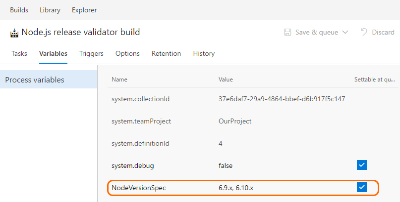

Next enable multi-configuration. If you've got enough agents and concurrent pipelines, you can even run the builds in parallel.

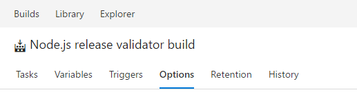

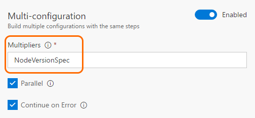

And last, add the Node.js tool installer task.

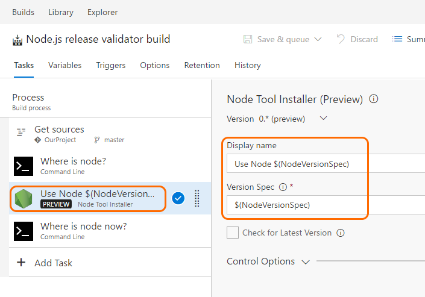

Save and queue the build, to see your app validated with multiple versions of Node.js.

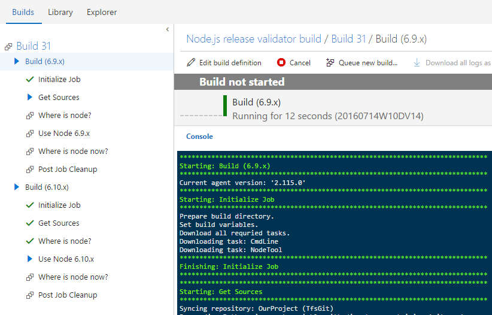

At the moment we've got the Node Tool Installer task. We don't yet have runtime environments like Java, or tools like NuGet or cURL.

Want to try it? See [Tool installers](../../process/tasks.md#tool-installers).

### SSH deployment improvements
The __Copy Files Over SSH__ build/release task now supports tildes(~) in the destination path to simplify copying files to a remote user's home directory. Also, a new option allows causing the build/release to fail when no files are found to copy.

The SSH build/release task now supports running scripts with Windows line endings on remote Linux or macOS machines.

### Deploy to Azure Government Cloud
Customers with Azure subscriptions in Government clouds can now configure [Azure Resource Manager service endpoint](../../library/connect-to-azure.md) to target national clouds.

With this, you can now use Release Management to deploy any application to Azure resources hosted in government clouds, using the same deployment tasks.

### Timeout enhancements for the Manual Intervention task 
The __Manual Intervention__ task can now be automatically rejected or resumed after it is pending for the specified timeout or 60 days, whichever is earlier. The timeout value can be specified in the control options section of the task.

### Release Logs Page Improvements
In this deployment, we have improved the release logs page experience:
* You can directly click the URLs in the log viewer.
* You can search for keywords in the logs.
* You can view large log files without downloading them.

### Azure App Service task enhancements and templates for Python and PHP applications
New __Azure App Service__ release definition templates have been added for deploying Python (Bottle, Django, Flask) and PHP applications. The new template contains the updated __App Service Deploy__ task.

When the Python release definition template is used, the __App Service Deploy__ task gets prepopulated with an inline deployment script which makes pip (dependency manager) install the applications dependencies. The correct web.config gets generated based on the Python framework used.

When the PHP release definition template is used, the __App Service Deploy__ task gets pre-populated with a deployment script which makes Composer (dependency manager) install the application's dependencies.

### Deploy Java to Azure Web Apps
The __Azure App Service Deploy__ build/release task now supports deployment of Java WAR files to an Azure Web App. When creating a new build definition, you can choose to begin with a new build template: __Java Deploy to Azure Web App.__ This simplifies getting started by building your project with Ant, Gradle, or Maven, and deploying the results to Azure. An Azure Web App slot can be specified to allow uploading to a staging slot before swapping that deployment with a production slot.

### New content

By popular request, we've published these new build topics:

* [CI/CD for newbies](../../create-first-pipeline.md) What is continuous integration (CI)? What is continuous deployment (CD)? Why should I care? How do I get started?

* [Build artifacts](../../build/artifacts.md) Examples and tips on publishing and using build artifacts.

New Release Management topic:

* [Azure Government Cloud](../../library/government-cloud.md) Azure Pipelines is not available in Azure Government Clouds, so there are some special considerations when you
want to deploy apps to Government Clouds.


### Updated build content

How do I configure the agent to bypass a web proxy and connect to Azure Pipelines on a  [Windows](../../agents/v2-windows.md), [macOS](../../agents/v2-osx.md), or [Linux](../../agents/v2-linux.md) agent?

[Troubleshooting build](../../troubleshooting.md)

### Updated release content

[Service endpoints](../../library/service-endpoints.md)

[Environments](../../release/environments.md)

[Generated by Azure](/azure/app-service/app-service-continuous-deployment)

### New build editor

Our thanks to those of you who tried the early previews of our new build editor and gave us feedback. We're getting ready to retire the old build editor. So if you haven't yet gotten familiar with the new build editor, we encourage you to do so now. [Learn more](https://aka.ms/newci-optin).

## March 29

### Conditional build tasks

Have you been looking for more control over your build tasks? For example, do you want to clean things up, send a message, or do some other kind of housekeeping when something goes wrong? We're now offering four built-in choices to control when a task is run:

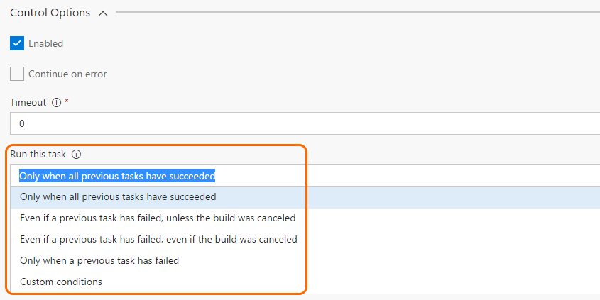

> This feature is available only in the new build editor.

But what if you need fine-grained control over when a task runs? For example, you want to run a task only when the build was triggered by a CI build. And it needs to run even if the build is failing. But only on feature branches.

Now we're giving you this kind of control. On your task, select **custom conditions**, and then enter:

```
and(failed(), in(variables['Build.Reason'], 'IndividualCI', 'BatchedCI'), startsWith(variables['Build.SourceBranch'], 'refs/heads/features/'))
```

See [Specify conditions for running a task](../../process/conditions.md).

### Build.Reason variable

In support of conditional tasks, we're offering a new build variable: `Build.Reason`. You can use this variable to check for CI, scheduled, and other triggers. See [variables](../../build/variables.md).

### New build editor will soon be the default

[Earlier this year](#january-25) we announced a preview of the new build editor. Thank you to all who have been trying it and giving us feedback! If you haven't done so already, please try the [new editor](../preview/2017-user-experience.md) and let us know what you think. Soon we'll be switching your account to make it the default editor.

### Override template parameters in Azure resource group deployments

Currently in Azure resource group deployment tasks, users select the template.json and the parameters.json and provide the override parameter values in a text box, following a specific syntax. This experience is now enhanced so the template parameters are rendered in a grid which allows them to be edited and overridden. Users can access this feature by clicking the __...__ next to the override parameters field, which opens a dialog with the template parameters along with their default values and allowed values (if defined in the template and parameter .json files). This feature requires that CORS rules are enabled at the source. If template and parameter json files are in Azure storage blob, refer to [this documentation](/rest/api/storageservices/fileservices/Cross-Origin-Resource-Sharing--CORS--Support-for-the-Azure-Storage-Services?redirectedfrom=MSDN#understanding-cors-requests) to enable CORS.

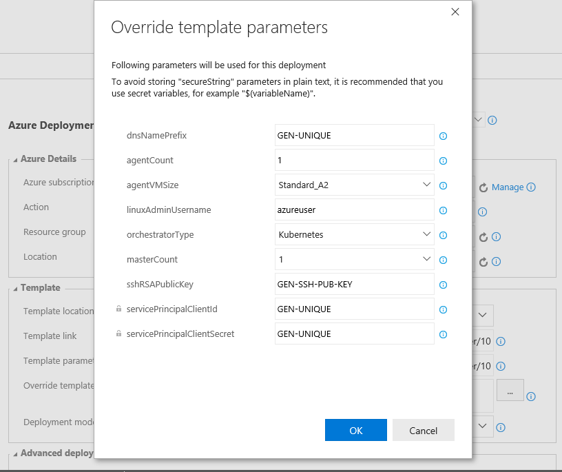

### Continuous Delivery in the Azure portal supports any Git repo

You can now configure a continuous delivery (CD) workflow for the __Azure App Service__ no matter which Git repository you use to manage your code. Until now, you could select an App Service in the Azure Portal and setup continuous delivery for that service in just a few clicks, but only if you managed your code either in an Azure Repos Git repository or in GitHub. You can now get the same simple experience for any public or private Git repository, provided that repository is accessible from the Internet. With a few clicks in the Azure portal, you can set up a build and release definition in Azure Pipelines that will periodically check your Git repository for any changes, sync those changes, run an automated build and test, followed by a deployment to Azure App Service. As your needs evolve, you can customize these definitions to support multiple environments, more complex testing, or deployment upon manual approval.

### Separation of duties for deployment requester and approvers

Previously, environment owners could restrict release creators from approving deployments of the release to an environment. Users could, however, manually start deployment of a release created by another user, and approve it themselves.

We have now filled this gap by considering the deployment creator as a separate user role for deployments. Either the release creator or deployment creator can be restricted from approving the deployments.

### Set maximum number of parallel deployments

This feature gives you control on how multiple pending releases are deployed into a given environment. For example, if your release pipeline performs validation of builds in a QA environment and the rate of generation of builds is faster than the rate of completion of the deployments, you may configure multiple agents and as many builds to get validated in parallel. That means each of the builds generated gets validated, and the wait time is dependent in the number of available agents.

With this feature, we let you optimize validations by enabling you to perform validation on the _n_ most recent builds in parallel and cancel the older deployment requests.

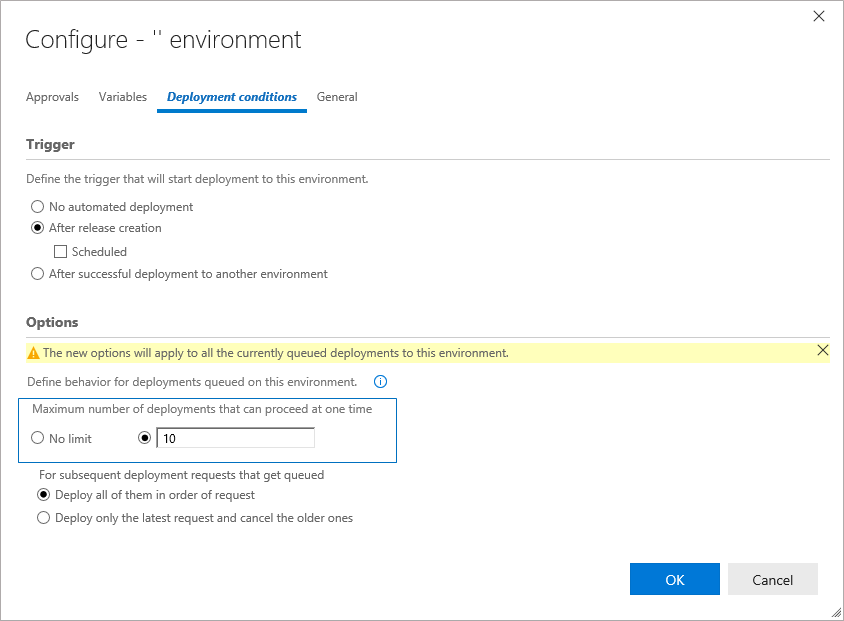

### Unified Build and Release docs

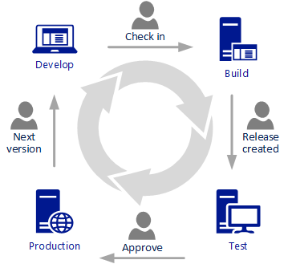

You might have noticed that the build and release docs have been coming closer together over the past couple of months. Today it's official. Just as Build and Release is joined in Azure Pipelines, and they're now also [joined in our docs](../../overview.md).

<div style="clear:both;"></div>

### New topic on TFS authentication

Configure TFS authentication to enable your agents to use different authentication methods.

### Other notable content updates

[Android signing](../../tasks/build/android-signing.md)

[Xamarin.iOS](../../tasks/build/xamarin-ios.md)

[Xcode](../../tasks/build/xcode.md)

## March 17

### Visual Studio 2017 and Hosted Linux Preview hosted agents

[Hosted agents](../../agents/hosted.md) You can now use our hosted agents to build your Visual Studio 2017 apps. We've also added information about the Hosted Linux Preview queue.

Build and deploy your ASP.NET Core app to Azure - includes the ability to use hosted agents to build ASP.NET Core apps.

### Keep track of your free hosted agent minutes

You can now see how many free hosted agent minutes you've used.

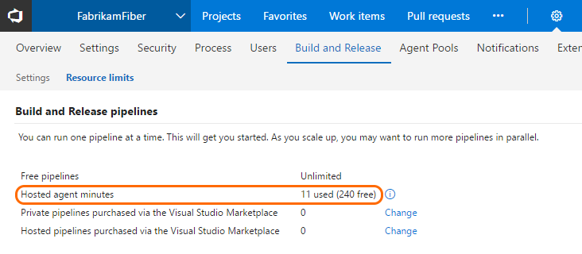 

## March 7

### See when agents in your pool are upgrading

When an agent is being upgraded, it now indicates the status of the upgrade in the queue and on the agent pools tab.

### Agent content (new and updated)

We've made several updates aimed at clarifying how to configure your private agents.

New: Configure TFS authentication for your private build and release agents

Updated: [Build and release agents](../../agents/agents.md), [Windows](../../agents/v2-windows.md), [Windows (TFS 2015)](../../agents/v1-windows.md), [macOS](../../agents/v2-osx.md), and [Linux](../../agents/v2-linux.md)

### Guidance on file matching patterns

We're now advising you to use [File matching patterns](../../tasks/file-matching-patterns.md) from these tasks: [Copy Files](../../tasks/utility/copy-files.md), 
[Extract Files](../../tasks/utility/extract-files.md), and [FTP Upload](../../tasks/utility/ftp-upload.md).

### Other updated content

[Node.js](../apps/nodejs/nodejs-to-azure.md) Moved deployment step out of CI build and into Release Management. Gave web deployment artifact a useful file name.

[Pipelines in Azure Pipelines](../../licensing/concurrent-jobs.md) Added clarification to Q&A about control of pipeline allocation.

## February 14

### GitHub pull request builds

For a while we've provided CI builds from your GitHub repo. Now we're adding a new trigger so you can automatically build your GitHub pull requests. After the build is done, we report back with a comment in your GitHub pull request.

For security, we build only pull requests when both the source and target are within the same repo. We don't build pull requests from a forked repo.

To enable this capability, on the build editor **Trigger** tab, select **Pull request**.

### Selection of private agents on machines not in use

The system now uses machine name as a factor when allocating a build or a release to a private agent. As a result, the system will prefer an agent on an idle machine over an agent on a busy machine when it allocates the job.

### Run tests using Agent Phases

Using the __Visual Studio Test task__, you can now run automated tests using agent phases.

We now have a unified automation agent across build, release and test. This brings in the following benefits:

1.	You can leverage an agent pool for your testing needs.

2.	Run tests in different modes using the same __Visual Studio Test task__, based on your needs&mdash;single agent&ndash;based run, multi-agent&ndash;based distributed test run or a multi-configuration run to run tests on, say, different browsers.

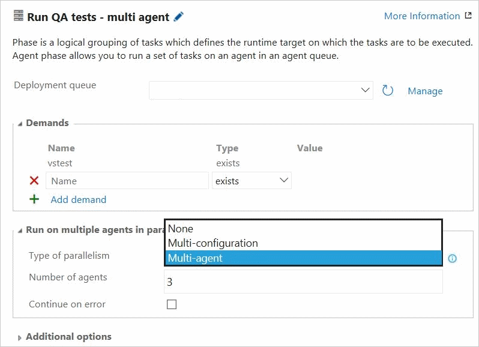

For more information, see [this post](https://aka.ms/testingwithphases).

### Private agent automatic workspace cleanup

You can now configure an agent pool to periodically clean up stale working directories and repositories. For example, the pool will delete workspaces left behind by deleted build and release definitions.

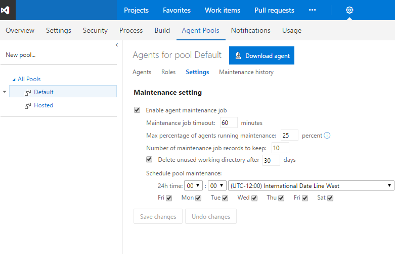

Using this option should reduce the potential for your private build and release agents to run out of disk space. The maintenance is done per agent (not per machine), so if you have multiple agents on a single machine you could still run into disk space issues.

### Multiple versions of extension tasks

Extension authors can now create extensions with multiple versions of a given task which enables them to ship patches for each major version they have in production.

See [Reference for integrating custom build tasks within extensions](../../../extend/develop/integrate-build-task.md)

### Changes to concurrent pipelines

[Concurrent pipelines in Azure Pipelines](../../licensing/concurrent-jobs.md) We've begun charging for concurrent pipelines.

[Concurrent pipelines in TFS](../../licensing/concurrent-pipelines-tfs.md) Manual intervention does not consume a pipeline in TFS 2017 Update 1 and newer.

The __Pipelines queue__ feature provides users with more visibility into where their builds or releases are.

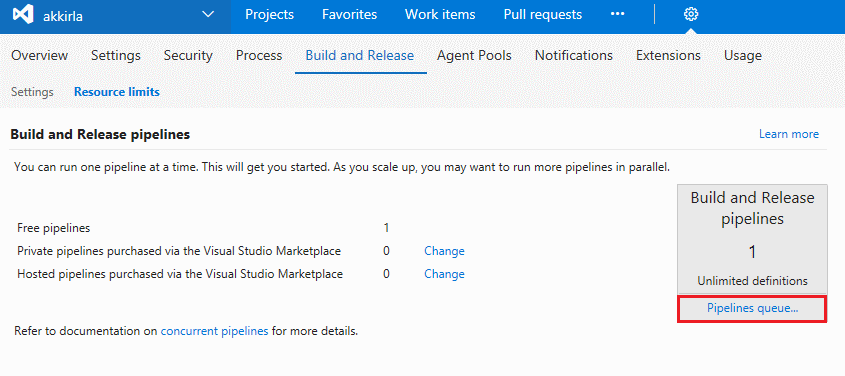

On launching the __Pipelines queue__, you can see the following information:

1. Builds and releases waiting for a pipeline to execute and their position in the waiting queue.

2. Builds and releases currently running using available pipelines.

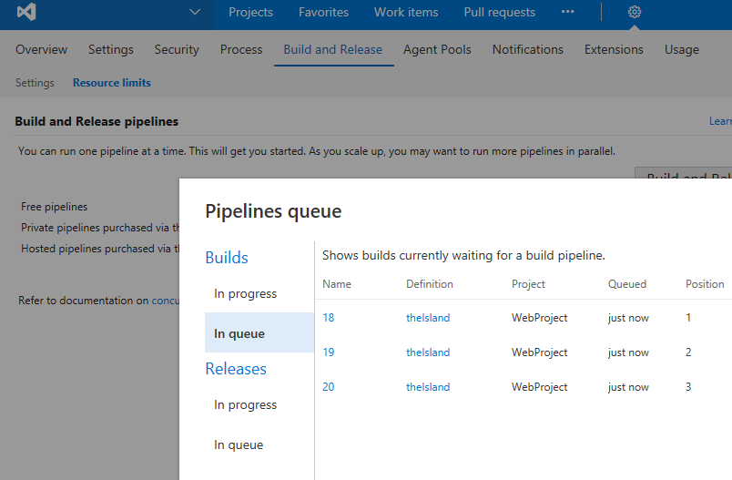

While your build/release is waiting for a pipeline, you can also directly launch this view from inside the build/release logs page and find its current position in the pipeline queue and other details.

### Machine groups deprecated

We've deprecated **Machine Groups**. Instead of creating a machine group,
use a comma-delimited list of machine names or a variable in the
following tasks:

* [Run Functional Tests task](../../../pipelines/tasks/test/run-functional-tests.md)
* [Visual Studio Test Agent Deployment task](../../../pipelines/tasks/test/visual-studio-test-agent-deployment.md)
* [PowerShell on Target Machines task](../../../pipelines/tasks/deploy/powershell-on-target-machines.md)

### Merging and updating build and release content

As build and release are more integrated as a product, we've begun to also integrate the content. We've created, updated, and reorganized a lot of topics. Look for the content to continue merging in the coming weeks.

#### Updated get started CI/CD to Azure

[CI/CD ASP.NET 4 generated by Azure](/azure/app-service/app-service-continuous-deployment)

[CI/CD ASP.NET 4 Generated by Visual Studio](../apps/aspnet/aspnet-4-ci-cd-vs-automatic.md)

[CI/CD ASP.NET 4 do it yourself](../../apps/aspnet/build-aspnet-4.md)

[CI/CD ASP.NET Core with Docker, generated by Visual Studio](../apps/aspnet/aspnetcore-docker-to-azure.md)

CI/CD ASP.NET Core do it yourself

#### Updated ASP.NET build (CI)

[ASP.NET 4](../../apps/aspnet/build-aspnet-4.md)

ASP.NET Core

[Azure Cloud Service](../../apps/aspnet/build-aspnet-cloudservice.md)

[SQL Server Database](../../apps/aspnet/build-aspnet-dacpac.md)

#### Updated ASP.NET deploy (CD)

[Azure web sites](../../apps/cd/deploy-webdeploy-webapps.md)

[Azure Cloud Service](../../apps/cd/deploy-cloudservice-cloudservice.md)

Azure SQL Database (DACPAC)

Azure SQL Database (SQL scripts)

[IIS Servers](../../apps/cd/deploy-webdeploy-iis-deploygroups.md)

[IIS Servers (WinRM)](../../apps/cd/deploy-webdeploy-iis-winrm.md)

#### Updated agent content

[Deploy a Windows v2 agent](../../agents/v2-windows.md)

[Deploy a Windows v1 agent (TFS 2015)](../../agents/v1-windows.md)

[Deploy a macOS agent](../../agents/v2-osx.md)

[Deploy a Linux agent](../../agents/v2-linux.md)

[Hosted agents](../../agents/hosted.md)

#### New concepts section with new and updated topics

[Build and release agents](../../agents/agents.md) and related topics

[Build options](../../build/options.md) and related topics

[Release definitions](../../release/index.md) and related topics

[Retention policies](../../policies/retention.md)

[Permissions](../../policies/permissions.md)

## January 25

### Build editor preview

[Last year we introduced a more personalized user experience](2016.md#august-19) to help you easily monitor and manage the builds you own and care about.

This month we're offering a preview of a new design aimed at making it easier for your to create and edit build definitions. Click the switch to give it a try.

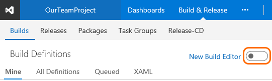

If you change your mind, you can toggle it off. However, eventually after we feel it's ready for prime time, the preview editor will replace the current editor. So please give it a try and [give us feedback](https://visualstudio.uservoice.com/forums/330519-team-services).

The new editor has all the capabilities of the old editor along with several new capabilities and enhancements to existing features.

#### Search for a template

Search for the template you want and then apply it, or start with an empty process.

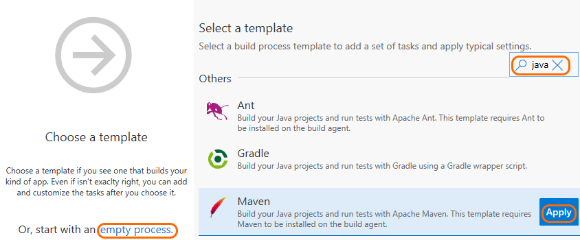

#### Quickly find and add a task right where you want it

Search for the task you want to use, and then after you've found it, you can add it after the currently selected task on the left side, or drag and drop it where you want it to go.

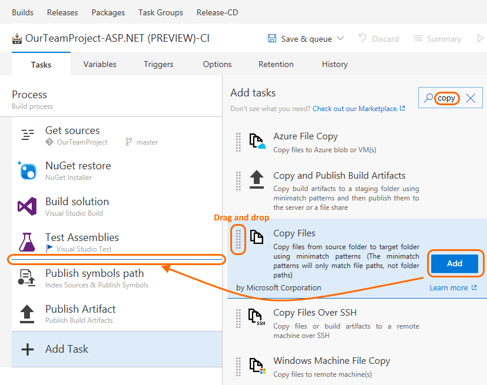

You can also drag and drop a task to move it, or drag and drop while holding the Ctrl key to copy the task.

#### Use process parameters to pass key arguments to your tasks

You can now use process parameters to make it easier for users of your build definition or template to specify the most important bits of data without having to go deep into your tasks.

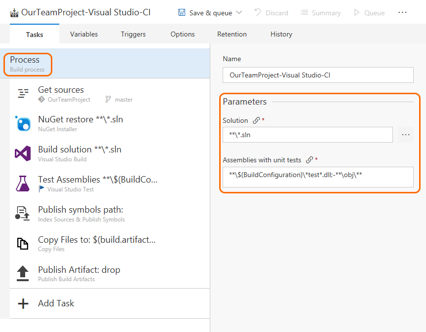

If you create a new build from some of the built-in templates (for example **Visual Studio** and **Maven**) you can see examples of how these work.

#### Learn more

The new editor includes a few other enhancements, such as giving you quicker access to your sources settings. For more details, see [Preview of our new build editor](../preview/2017-user-experience.md).

### Release action in the build summary

We've added a Release action to the build summary to make it easy for you to create a release for your build.

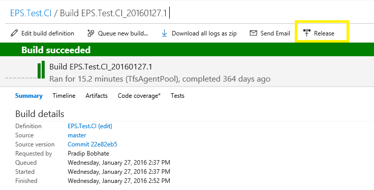

### Role-based security for variable groups

You now manage security for variable groups using roles.

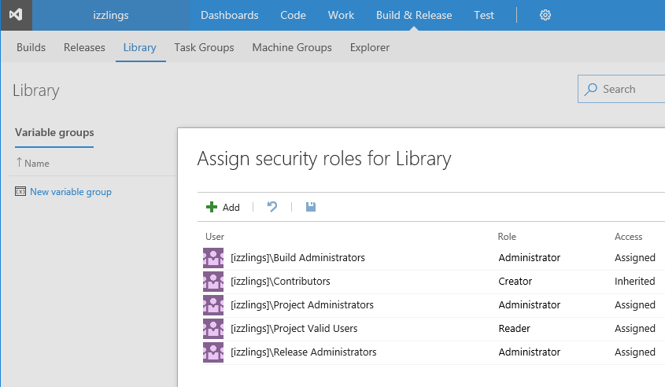

You can modify roles for a specific variable group, or for all of them at once.

### Web app deployment history in Azure portal

Release Management now updates the deployment logs of Azure App Service when a deployment is done by using the App Service deployment task. Users can view deployment history in the Azure portal by clicking on the Continuous delivery option in the App Service blade.

### New content

[Build your C++ app for Windows](../../apps/windows/cpp.md)

### Updated content

[Pipelines in TFS](../../licensing/concurrent-pipelines-tfs.md)

[Pipelines in Azure Pipelines](../../licensing/concurrent-jobs.md)

[Release Management queuing policies](../../release/environments.md#queuing-policies)

[How to deploy? Tasks in Microsoft Release Management](../../process/tasks.md)

### Hosted pool internal changes

We recently changed our [hosted agents](../../agents/hosted.md) to sync sources on the D drive instead of the C drive. This might cause issues if you've defined a build that depends on hard coded paths to the sources directory.

> [!NOTE]
> We recommend that you avoid using hard coded paths to resources on the hosted agent. Instead, you should always use [variables](../../build/variables.md) to construct any references that you need to make to resources used by your build.
