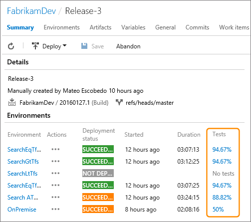
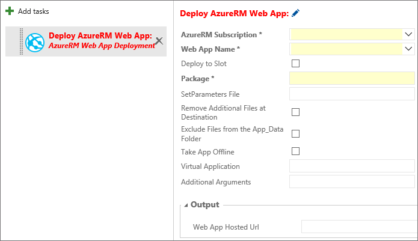

# Archived release notes for Microsoft Release Management

[!INCLUDE [version-tfs-2015-rtm](../../_shared/version-tfs-2015-rtm.md)]

**NOTE**: Release Management has now been combined with the Build features
of Azure Pipelines and Team Foundation Server (TFS) in the new 
**Pipelines** hub. For details of new features and changes, see
[Team Foundation Build and Release release notes](2017.md).

<a name="whatsnew"></a>
## What's new?

The following changes, categorized by release date, were added to Release Management:

* **Team Foundation Server**
 - [November 16, 2016 Update](#update-nov16)
 - [Mar 3, 2016 Update](#update-mar3-16)
 - [Feb 12, 2016 Update](#update-feb12-16)
* **Azure Pipelines**
 - [November 23, 2016 Update](#update-nov23-16)
 - [November 16, 2016 Update](#update-nov16)
 - [October 12, 2016 Update](#update-oct12-16)
 - [September 21, 2016 Update](#update-sep21-16)
 - [September 2, 2016 Update](#update-sep2-16)
 - [July 28, 2016 Update](#update-jul28-16)
 - [June 24, 2016 Update](#update-jun24-16)
 - [May 23, 2016 Update](#update-may23-16)
 - [April 26, 2016 Update](#update-apr26-16)
 - [April 8, 2016 Update](#update-apr8-16)
 - [March 15, 2016 Update](#update-mar15-16)
 - [February 24, 2016 Update](#update-feb24-16)
 - [February 11, 2016 Update](#update-feb11-16)
 - [December 1, 2015 Update](#update-dec1-15)
 - [November 18, 2015 Update](#update-nov18-15)
 - [November 03, 2015 Update](#update-nov3-15)
 - [October 19, 2015 Update](#update-oct19-15)
 - [September 21, 2015 Update](#update-sep21-15)
 - [September 4, 2015 Update](#update-sep4-15)

<a name="update-nov23-16"></a>
### November 23, 2016 Update (Azure Pipelines)

This update has the following new features:

* [New licensing model for Build and Release Management](#nov2316-license)
* [Build and deploy Docker apps to Azure more easily](#nov2316-dockerapps)
* [Hosted Linux pool preview](#nov2316-hostedlinux)
* [Task versioning for Build and release pipelines](#nov2316-taskversion)
* [Inline service connections in Build and Release](#nov2316-inlineservices)
* [Link build artifacts from another project](#nov2316-linkartifacts)

<a name="nov2316-license"></a>
**New licensing model for Build and Release Management**

Build and Release Management has moved from the current agent-based
licensing model to a concurrent pipeline based licensing model.
Each pipeline lets you run one build or deploy one release at a time.
The maximum number of concurrent builds you can run and releases
you can deploy at the same time is limited only by the number
of pipelines you have.

Your organization includes these free amounts:

* One free Hosted Pipeline: With this free hosted pipeline, you get
  four hours (240 minutes) per month and a maximum duration of 30
  minutes per build or deployment. If you just need more build time
  for once concurrent build or release, buy another hosted pipeline
  without the four hour limit to increase your maximum duration per
  build or deployment up to six hours. For more concurrent builds
  or releases, buy more hosted pipelines.
* One free Private Pipeline: With this free private pipeline, run
  unlimited concurrent builds or deploy one release at a time in
  Team Foundation Server 2017, or run one build or deploy one release
  at a time in Azure Pipelines on agent software from Microsoft.
  Private agents are now free and unlimited. In TFS, each Visual
  Studio Enterprise subscriber also contributes a private pipeline
  that you can use. You can also buy more private pipelines.

For more information, see
[Concurrent build and release pipelines in Azure Pipelines](../../licensing/concurrent-jobs.md)
and [Concurrent release pipelines in TFS](../../licensing/concurrent-pipelines-tfs.md).

If you previously bought private agents in the Azure portal, they'll
automatically roll into private pipelines. Similarly, any hosted agents
that you purchased become Hosted pipelines. With the new licensing model,
you can register any number of private agents with your account.
In effect, the new model gives you more than the previous model, for the same price.

<a name="nov2316-dockerapps"></a>
**Build and deploy Docker apps to Azure more easily**

To make continuous integration and deployment (CI/CD) of Docker apps a lot simpler, we have:

* Updated the [Docker extension](https://marketplace.visualstudio.com/items?itemName=ms-vscs-rm.docker)
  with support for Azure Container Service and Azure Container Registry.
* Begun a preview of the [Hosted Linux pool](#nov2316-hostedlinux) so that you don't have to set up your own Docker hosts.
* Released [Visual Studio 2017 RC](https://visualstudio.microsoft.com/vs/visual-studio-2017-rc/)
  and included [new continuous delivery tools](../apps/aspnet/aspnetcore-docker-to-azure.md)
  for ASP.NET Core Preview apps. You can use these tools to configure a
  CI/CD pipeline quickly in Azure Pipelines. Any ASP.NET Core project with
  Docker support enabled can be set up to run an automated build and
  deployment to Azure Container Service with every Git push.

<a name="nov2316-hostedlinux"></a>
**Hosted Linux pool preview**

We're offering a preview of our new hosted Linux pool to enable you
to build and release on Linux machines without having to configure a private agent.

The agents in the hosted Linux pool run on an Ubuntu Linux host inside the
[vsts-agent-docker container](https://github.com/Microsoft/vsts-agent-docker).
This container includes all the standard Java, Node, Docker and .NET Core tooling.
When we start the container we map in the Docker socket from the host VM and the
working folder from /opt/vsts/work. This enables you to create or spawn other
Docker containers as part of your build or release pipeline using either a script or the
[Docker extension](https://marketplace.visualstudio.com/items?itemName=ms-vscs-rm.docker)
in the Visual Studio Marketplace.

To use the Hosted Linux pool:

* In your build pipeline, go to the **General** tab, open the **Default agent queue** menu, and then select **Hosted Linux**.
* In your release pipeline, go to the **Environments** tab, select your **Run on agent** task,
  open the **Deployment queue** menu, and then select **Hosted Linux**.

If you don't see the option yet, just give it a little time. We're rolling this option out to accounts over the next few weeks.

<a name="nov2316-taskversion"></a>
**Task versioning for build and release pipelines**

By popular request, we're giving you control over the major version of a task
that you run in your build or release. We expect this change to result in
fewer unpredictable errors that were caused by automatic updates to the agent
and task version. You now specify the major version of the task on the **Build**
tab of your definition, or on the **Environments** tab of your release pipeline.

When a minor version is released (for example, 1.2 to 1.3), you get that change
automatically in your build. But if a new major version is released (for example 2.0),
your build stays locked to version 1.3 until you edit the definition and manually
change to the new major version. A flag in the build pipeline alerts you to new major versions.

If you select a version named something such as **1.\* (preview)**, keep in mind
that this version is still under development and might have known problems.

>**Tip**: In a build pipeline, you have a few options to test a new major version of a task.
If you change the version and have problems, you can revert the change from the **History** tab.
Clone the build pipeline and test the cloned definition with the new major task version.

<a name="nov2316-inlineservices"></a>
**Inline service connections in Build and Release**

With this feature, you can create service connections right in the build or release
definition without having to navigate to the **Services** tab. This will be auto-enabled
for all extensions which are defined declaratively, such as Docker, Jenkins, VMWare, and SCVMM.

<a name="nov2316-linkartifacts"></a>
**Link build artifacts from another project**

Until now, release pipelines could only link artifact sources from the
current project. Now, you can now link build artifacts from another project
as well. While linking an artifact, the project drop down will list all
the projects in the account.


<a name="update-nov16"></a>
### November 16, 2016 Update (Azure Pipelines, TFS 2017)

Today we're announcing TFS 2017, which includes all the Release Management features that you currently get on Azure Pipelines. We're introducing a pricing model based on concurrent pipelines for Release Management in TFS 2017.

We're also announcing general availability of Release Management in Azure Pipelines. Also, later this month, we're moving to a pricing model based on concurrent pipelines for both Team Foundation (TFBuild) and Release Management in Azure Pipelines. (Previously you paid for agents.)

**Release Management users are free:** Your team members no longer need subscriptions to author definitions. Azure Pipelines users (with [basic access](https://visualstudio.microsoft.com/products/visual-studio-team-services-feature-matrix-vs)) and users with a TFS Client Access License (CAL) can author releases for no additional charge. All types of users (including stakeholders) can approve releases for free.

**No charge for private agents:** [Private agents](../../agents/agents.md) are now free. In Azure Pipelines, you used to have to license each private agent after the first. Now you can run deployments concurrently for no additional charge.

**Concurrent pipelines:** For each release pipeline that you want to run concurrently, you need a concurrent pipeline. Some concurrent pipelines are included. If you need more, you can add more in a few ways.

[Concurrent pipelines for your releases in Team Foundation Server](../../licensing/concurrent-pipelines-tfs.md)

[Concurrent pipelines for your builds and releases in Azure Pipelines](../../licensing/concurrent-jobs.md)

<a name="update-oct12-16"></a>
### October 12, 2016 Update (Azure Pipelines)

This update has the following new features:

* [Multiple schedules in releases](#oct12-sched)
* [Azure Resource Group improvements](#oct12-argimp)
* [Azure CLI task](#oct12-clitask)
* [Simplified Azure endpoint creation](#oct12-azureep)

<a name="oct12-sched"></a>
**Multiple schedules in releases**

Want to schedule your releases to be created more
than one time in a day? You can now configure
multiple scheduled triggers in a release pipeline.

<a name="oct12-argimp"></a>
**Azure Resource Group improvements**

Currently, when using the Azure Resource Group task,
there is no way to validate if the ARM template is
syntactically correct and would be accepted by the
Azure Resource Manager without actually deploying
the resources. This enhancement allows a new deployment
mode called **Validation Only** where users can find
problems with the template authoring before creating
actual Azure resources.

Another enhancement to the Azure Resource Group task
is to allow either incremental or complete deployments.
Currently, the task deploys the ARM templates using the
**Incremental** mode. This mode handles deployments
as incremental updates to the resource group. It does not
modify resources that exist in the resource group but are
not specified in the template. **Complete** mode deletes
resources that are not in your template. By default,
**Incremental** mode is used.


See [Azure Resource Group Deployment Task](https://github.com/Microsoft/azure-pipelines-tasks/tree/master/Tasks/AzureResourceGroupDeploymentV2).

<a name="oct12-clitask"></a>
**Azure CLI task**

The new Azure CLI task supports running Azure CLI
commands on cross-platform agents such as Linux, macOS,
and Windows. The task supports both Classic and ARM subscriptions.
It also supports two modes of providing the script:
as a linked artifact or as an inline script.


See [Deploy: Azure CLI](../../tasks/deploy/azure-cli.md).

<a name="oct12-azureep"></a>
**Simplified Azure endpoint creation**

In an earlier sprint, we made it easier to create a new
Azure Resource Manager service connection from Azure Pipelines.
That experience only worked in accounts that are backed by
Azure Active Directory. In this deployment, we are bringing
the same simplified experience for all the other accounts
not backed by an Azure AD. So, if you have a Microsoft account
and an Azure subscription that you would like to deploy to
from Azure Pipelines, you can create an Azure Resource Manager
endpoint without needing to run tedious PowerShell scripts
or follow the steps in a blog.

See [Azure Resource Manager service connection](../../library/connect-to-azure.md).

<a name="update-sep21-16"></a>
### September 21, 2016 Update (Azure Pipelines)

**Deployment Status widget**

A build can be deployed and tested in different release
environments across multiple release pipelines. In such
a scenario, the Deployment Status widget shows you a
consolidated status of the deployment and test pass rate
across multiple environments for a recent set of builds
from a build pipeline.

<a name="update-sep2-16"></a>
### September 2, 2016 Update (Azure Pipelines)

This update has the following new features:

* [Jenkins with untrusted SSL certificates](#sep2-jenkins)
* [Deployment manual intervention](#sep2-manualinter)
* [service connection improvements](#sep2-servendpoint)
* [SQL database deployment task scripts](#sep2-sqldeploy)

<a name="sep2-jenkins"></a>
**Jenkins with untrusted SSL certificates**

Jenkins connections can now be configured to accept
untrusted SSL certificates of Jenkins servers. This is
useful when Azure Pipelines service hooks, or build and
release processes, integrate with Jenkins. For example,
if a Jenkins server is configured to use SSL with a
self-signed certificate or a certificate that cannot be
verified by a Certificate Authority (CA), this setting
lets administrators deliberately trust the certificate.


For more information about Jenkins integration
capabilities, see
[Azure Pipelines Integration with Jenkins Jobs, Pipelines, and Artifacts](https://blogs.msdn.microsoft.com/visualstudioalm/2016/08/18/tfs-integration-jenkins-jobs-pipelines-artifacts/).

<a name="sep2-manualinter"></a>
**Deployment manual intervention**

You can now pause execution during deployment to an environment.
Including a **Manual Intervention** task in an environment enables you to temporarily halt a deployment,
perform manual tasks, and then resume further automated tasks.
You can also reject the deployment and prevent further tasks from
executing after a manual intervention.

<a name="sep2-servendpoint"></a>
**service connection improvements**

An option to validate the connection has been added to all
service connection dialogs so that users can test that the parameters
they entered are correct. The link uses a REST call to the
external service using the information entered, and returns
success when the REST call passes.

service connections have also been enhanced by the introduction of icons.
service connection authors can specify the icon to be displayed for
each endpoint they create.

<a name="sep2-sqldeploy"></a>
**SQL database deployment task scripts**

The **Azure SQL Database Deployment** task has been
enhanced to run SQL scripts against an Azure SQL Database.
The scripts can be provided as a file, or inline within the task.


<a name="update-jul28-16"></a>
### July 28, 2016 Update (Azure Pipelines)

This update has the following new features:

* [Task groups](#jul28-metatask)
* [Create agent queues](#jul28-createqueue)
* [Easier Azure deployment](#jul28-azuredeploy)
* [Soft delete of releases](#jul28-softdelete)
* [Retain releases and builds for each environment](#jul28-retainspecific)
* [Filter releases by source code branch](#jul28-filterbuild)
* [Linked artifact improvements](#jul28-linkedartifact)
* [Rollback and redeploy earlier releases](#jul28-rollback)

<a name="jul28-metatask"></a>
**Task groups**

A *task group* lets you to encapsulate a sequence of tasks already defined
in a build or a release pipeline into a single reusable task that can be
added to a build or release pipeline just like any other task. You can
choose to extract the parameters from the encapsulated tasks as configuration
variables, and abstract the rest of the task information. The new task group
is automatically added to the task catalogue, ready to add to other release
and build pipelines.


For more details, see [Task groups](../../library/task-groups.md).

<a name="jul28-createqueue"></a>
**Create agent queues**

You can now create agent queues from within a project by selecting a
pool that is not referenced by any other queue in the project,
or create a queue with a new pool.

For more details, see [Configure agent pools and queues](../../agents/pools-queues.md).

<a name="jul28-azuredeploy"></a>
**Easier Azure deployment**

Two new features make it easier to deploy applications to Azure:

* **Simplified Service Principal Authentication configuration**.
  If the Azure Pipelines or TFS instance you are using is backed by Azure Active
  Directory authentication, a simplified version of the service connection dialog
  allows you to select an existing Azure subscription. This automatically
  creates a new Azure service principal that is assigned the **Contributor** role
  and so has access to all resources within the subscription. For more details, see
  [Azure Resource Manager service connection](../../library/connect-to-azure.md).

 

* **Deployment to national Azure clouds**. Use the new **Environment** setting in an
  Azure Classic service connection to target a specific Azure cloud, including pre-defined
  national clouds such as Azure China cloud, Azure US Government cloud, and Azure German cloud.
  For more details, see
  [Azure Classic service connection](../../library/service-endpoints.md#sep-azure-classic).

 

<a name="jul28-softdelete"></a>
**Soft delete of releases**

When you delete a release, or it is automatically deleted by a retention policy,
the release is removed from the overview and details lists.
However, it is retained with the release pipeline for a period (typically
14 days) before it is permanently deleted. During this period, it is shown in
the **Deleted** tab of the overview and details lists. You can restore any of
these releases by opening the shortcut menu and choosing **Undelete**.

<a name="jul28-retainspecific"></a>
**Retain releases and builds for each environment**

The release retention policy for a release pipeline determines how long a release
and the build linked to it are retained. By default, a release
is retained for 60 days - releases that have not been
deployed or modified during that time will automatically be
deleted. However, you may want to retain more releases that have been deployed
to specific environments, such as your production environment,
or retain them longer than those that were just deployed to other environments
such as test, staging, and QA. You can also retain the build linked to a release
for the same period as the release to ensure that the
artifacts are available if you need to redeploy that release.

<a name="jul28-filterbuild"></a>
**Filter releases by source code branch**

Use the new **Branch** drop-down list to filter the
list of releases by the branch from which the artifacts were generated.

<a name="jul28-linkedartifact"></a>
**Linked artifact improvements**

Two new features make it easier to work with artifacts and artifact sources:

* You can link multiple artifact sources to a release pipeline.
  Each of the artifacts is downloaded into a folder on the agent called the _source alias_.
  You can now edit the source alias of a linked artifact. For example, when you change the
  name of the build pipeline, you can edit the source alias to reflect the name of the
  build pipeline.

 For more details, see [Artifact source alias](../../release/artifacts.md#source-alias).

* A number of variables of the format Build.\* (such as Build.BuildId and Build.BuildNumber)
  are exposed for use in task parameters. When multiple sources are associated with a release,
  these variables are now populated with values from the artifact source you specify as the
  primary source. For more details, see
  [Artifact variables](../../release/variables.md#artifact-variables).

<a name="jul28-rollback"></a>
**Rollback and redeploy earlier releases**

If a deployment to an environment fails, you may want to redeploy an older
release that already succeeded in that environment. Now, when you start to deploy an older
release, you see a list of commits and work items that will be rolled back. You just need
to make sure that the automation scripts for the deployment can handle the rollback scenario.

<a name="update-jun24-16"></a>
### June 24, 2016 Update (Azure Pipelines)

This update has the following new features:

* [Clone, export, and import release pipelines](#jun24-clone)
* [Test results displayed in the release summary](#jun24-testresults)
* [Pass OAuth tokens to scripts](#jun24-tokens)
* [Task-level timeouts](#jun24-timeouts)
* [Trigger on partially successful deployments](#jun24-partsuccess)
* [Consume artifacts stored in GitHub directly](#jun24-github)
* [Jenkins plug-in for Release Management](#jun24-jenkins)
* [Add attachments to release summaries](#jun24-attachments)
* [Deploy SQL DACPACs](#jun24-dacpac)
* [Web app deployment using ARM](#jun24-webappdeploy)

<a name="jun24-clone"></a>
**Clone, export, and import release pipelines**

By popular demand, we have incorporated the ability to
clone, export, and import release pipelines within the Release hub
in Azure Pipelines, without requiring installation of an extension.
If you are using Team Foundation Server 2015 Update 2 or higher, you
can download and install **[this extension](https://marketplace.visualstudio.com/items?itemName=ms-devlabs.rm-import-export)**
from Visual Studio Marketplace to get the same functionality.


<a name="jun24-testresults"></a>
**Test results displayed in the release summary**

In the release summary page, we have enabled a contribution point for an
external service to show environment-specific information. In Azure Pipelines,
this functionality is used to display a summary of test results when tests
are run as part of a release environment.



<a name="jun24-tokens"></a>
**Pass OAuth tokens to scripts**

If you need to run a custom PowerShell script that invokes the REST APIs
on Azure Pipelines, perhaps to create a work item or query a build for information,
you need to pass the OAuth token in the script. A new option when you configure
an environment allows scripts run as tasks in the environment to access the
current OAuth token.


This is a simple example showing how to get a build pipeline:

```powershell
$url = "$($env:SYSTEM_TEAMFOUNDATIONCOLLECTIONURI)$env:SYSTEM_TEAMPROJECTID/_apis/build-release/definitions/$($env:SYSTEM_DEFINITIONID)?api-version=2.0"
Write-Host "URL: $url"
$definition = Invoke-RestMethod -Uri $url -Headers @{
       Authorization = "Bearer $env:SYSTEM_ACCESSTOKEN"
}
Write-Host "Definition = $($definition | ConvertTo-Json -Depth 1000)"
```

<a name="jun24-timeouts"></a>
**Task-level timeouts**

In addition to specifying the timeout for an entire deployment, you
can now specify the timeout for every task individually; in both
release and build pipelines. This allows you to exert more
fine-grained control over the release and deployment process. The
value is specified in the **Control Options** parameters for each
task as a number of minutes. The default is zero (infinite timeout).


For more details, see [Out-of-the-box tasks](../../process/tasks.md#task-control-options)

<a name="jun24-partsuccess"></a>
**Trigger on partially successful deployments**

Build and release tasks have an option to **Continue on error** in
the **Control Options** parameters for each task. In a build
definition, this results in a **Build partially succeeded** result
if a task with this option set should fail. The
same behavior is now available in release pipelines. If a task fails,
the overall release result will show as "Release partially succeeded".


By default, a partially successful release will not automatically trigger
a release to a subsequent environment, even if this behavior is specified
in the environment deployment options. However, a new option can be set in
each release environment that instructs Release Management to trigger a
release to a subsequent environment when the previous release is partially
successful.


For more details, see [Environment deployment triggers](../../release/triggers.md#env-triggers)

<a name="jun24-github"></a>
**Consume artifacts stored in GitHub directly**

Sometimes you may want to consume artifacts stored in a version control system
directly, without passing them through a build pipeline, as described in
**[this topic](../../release/artifacts.md#tfvcsource)**.
You can now do the same if your code in stored in a GitHub repository.


For more details, see [TFVC, Git, and GitHub sources](../../release/artifacts.md#tfvcsource)

<a name="jun24-jenkins"></a>
**Jenkins plug-in for Release Management**

Users of Jenkins CI can now create releases more easily by using the
**[VS Azure Pipelines Continuous Deployment Plugin](https://wiki.jenkins-ci.org/display/JENKINS/VS+Team+Services+Continuous+Deployment+Plugin)**,
available from the Jenkins website. This plugin triggers a release in
TFS or Azure Pipelines when a build completes successfully. Use it to
add post-build tasks right into Jenkins CI projects to create a new release.
This, along with the ability for Release Management to understand and download
Jenkins artifacts, provides great end-to-end integration between these two tools.

For more details, see [Jenkins sources](../../release/artifacts.md#jenkinssource)

<a name="jun24-attachments"></a>
**Add attachments to release summaries**

You can upload additional files, images, logs, or other diagnostics aids
when running tasks in a release. The files are uploaded during the
deployment and are then included in the release summary and "Download all log files"
actions. To upload a new file, use the following agent command in your script:

`Write-host "##vso[task.uploadfile]<filename>"`

<a name="jun24-dacpac"></a>
**Deploy SQL DACPACs**

The **[IIS Web App deployment using WinRM](https://marketplace.visualstudio.com/items?itemName=ms-vscs-rm.iiswebapp)**
extension available from Visual Studio Marketplace now supports
deployment of database DACPACs. Use this capability to deploy
IIS web apps and databases from Azure Pipelines and TFS.

<a name="jun24-webappdeploy"></a>
**Web app deployment using ARM**

A new version of the **Azure Web App Deployment** task is available, called
**[AzureRM Web App Deployment](https://github.com/Microsoft/azure-pipelines-tasks/blob/master/Tasks/AzureRmWebAppDeploymentV4/README.md)**.
It uses MSDeploy and an Azure Resource Manager service connection connection.
Use this task to deploy Azure Web Jobs and Azure API apps, in addition to
ASP.NET 4, Node, and Python based web apps. The task also supports common
publishing options such as the ability to retain app data, take an app off-line,
and remove additional files at the destination. More features, such as
configuration transformations, may appear in forthcoming versions.



<a name="update-may23-16"></a>
### May 23, 2016 Update (Azure Pipelines)

This update has the following new features:

* [Docker integration](#may23-docker)
* [Service hooks integration](#may23-hooks)
* [TeamCity integration](#may23-teamcity)
* [Release Management client SDK](#may23-clientsdk)

<a name="may23-docker"></a>
**Docker integration**

Take advantage of the Azure Pipelines cloud based build
capabilities to build your Docker images, and upload
them to Docker Hub as part of your continuous integration flow.
Then deploy those images to a number of Docker hosts as
part of Release Management. The [Docker extension](https://marketplace.visualstudio.com/items?itemName=ms-vscs-rm.docker)
in VisualStudio Marketplace adds all the service connection
types and tasks necessary for you to work with Docker
from Azure Pipelines.

<a name="may23-teamcity"></a>
**TeamCity integration**

If you are a TeamCity user, you can now consume TeamCity
builds as artifacts in Release Management. Install the
[TeamCity artifacts](https://marketplace.visualstudio.com/items?itemName=ms-devlabs.vss-services-teamcity)
extension from VisualStudio Marketplace to setup a TeamCity
service connection. Then configure your release pipelines
to deploy artifacts produced by TeamCity builds.
See [TeamCity artifact sources](../../release/artifacts.md#teamcitysource).

<a name="may23-hooks"></a>
**Service hooks integration**

Send release notifications when new releases are created,
deployments are started or completed, or when approvals
are pending or completed. Integrate with third party tools
such as Slack to receive such notifications.

<a name="may23-clientsdk"></a>
**Release Management client SDK**

In the last update, we published the
[Release Management REST APIs](/azure/devops/integrate/).
In this update, we are publishing a C# client SDK
to help you easily integrate your applications with
Release Management. The SDK is available as a
[NuGet package](https://www.nuget.org/packages/Microsoft.VisualStudio.Services.Release.Client/).
Example usage for this SDK can be found
[here](http://blogs.msdn.com/b/chandananjani/archive/2016/04/28/using-releasehttpclient-for-interacting-with-releasemanagement-service.aspx).

<a name="update-apr26-16"></a>
### Apr 26, 2016 Update (Azure Pipelines)

This update provides several major improvements to Release Management:

* [Simplified release pipeline wizard](#apr26-wizard)
* [View the history of a release](#apr26-history)
* [TFVC and TF Git as artifact sources](#apr26-tfsonprem)
* [Promote releases at a specific time](#apr26-timedrelease)
* [REST APIs for Release Management](#apr26-restapi)
* [Import, export, and clone release pipelines](#apr26-import)
* [Additional variables for job execution](#apr26-newvars)

<a name="apr26-wizard"></a>
**Simplified wizard to create a release pipeline**

Try the simplified wizard for creating a release pipeline. You can
enter most of the inputs in this wizard to set up a definition with a
single environment. We have also simplified the process of adding more
environments to a definition, and cloning an environment.


<a name="apr26-history"></a>
**View the history of a release**

View all the activity on a release in one place; including deployments,
approvals, configuration edits, and more.

_**NOTE**: This feature is being rolled out over time to all regions;
therefore, it may not yet be available in your region._

<a name="apr26-tfsonprem"></a>
**TFVC and TF Git as artifact sources**

Do you develop apps (such as PHP) that can deployed directly,
without having to be built first? Do you manage your config
files in source control repositories, and would like to consume
them directly in Release Management without needing to publish
build artifacts with the same files?

Release Management supports
linking Team Foundation Version Control (TFVC) and Team Foundation
Git repositories as artifact sources in a release pipeline.
At present there is no support for auto-triggering new releases when a
commit is made into these repositories.


<a name="apr26-timedrelease"></a>
**Promote releases to an environment at a specific time**

Want all of your production deployments to happen at midnight? You can
configure a condition on an environment that selects a successful
deployment (or just the latest one) from another environment, and deploys
it at the specified time.


<a name="apr26-restapi"></a>
**REST APIs for Release Management**

You can use the REST APIs for the Release Management service to
create release pipelines and releases, and manage many aspects of
deploying a release. Most of these APIs also work with the
on-premises releases of Release Management in TFS 2015 Update 2
(the differences between TFS and Azure Pipelines versions are indicated
in the documentation). You'll find some basic examples that use the APIs in
[this blog post](http://blogs.msdn.com/b/chandananjani/archive/2016/04/15/using-releasemanagement-rest-api-s.aspx).

<a name="apr26-import"></a>
**Import, export, and clone release pipelines**

Looking for a way to clone release pipelines? Or copy release
definitions from one project to another? These features will be
available out-of-the-box soon, but until then you can use an
[extension available from Visual Studio Marketplace](https://marketplace.visualstudio.com/items?itemName=ms-devlabs.rm-clone-rd).

<a name="apr26-newvars"></a>
**Additional variables available during job execution**

When there are multiple artifact sources linked to a release pipeline,
you can access information about all the artifact sources when
executing deployment jobs. The information is available from
variables of the format:

`RELEASE_ARTIFACTS_[alias]_[variable-name]`

When used in a script, replace the underscore with a period:

`RELEASE.ARTIFACTS.[alias].[variable-name]`

Replace `[alias]` with the name of the alias for the artifact source
included in the release pipeline. You can find the alias name in the
**Artifacts** tab of a release pipeline.

Replace `[variable-name]` with one of the following:

* DEFINITIONID
* BUILDNUMBER
* BUILDID
* REPOSITORY\_NAME
* SOURCEBRANCH
* SOURCEBRANCHNAME
* SOURCEVERSION
* BUILDURI
* REQUESTEDFORID
* REPOSITORY\_PROVIDER
* REQUESTEDFOR
* TYPE

<a name="update-apr8-16"></a>
### Apr 8, 2016 Update (Azure Pipelines)

**Consume TFS build artifacts in Azure Pipelines Release Management**

A new extension makes it easy to deploy on-premises
TFS builds with Azure Pipelines Release Management,
even if the TFS machine is not reachable directly
from Azure Pipelines. The extension adds a TFS
service connection connection, and you use a new type of
artifact named **Team Build (external)** through
which you deploy builds from the TFS machine.

You must install a non-hosted agent on a machine
that is able to connect to your TFS machine and
configure this agent in Azure Pipelines. The extension
does not yet work for deploying XAML builds.

For more information, see [this blog post](https://blogs.msdn.microsoft.com/visualstudioalm/2016/04/05/deploy-artifacts-from-onprem-tfs-server-with-release-management-service/).

**Email release summary**

Send the details of a release, including all the
sections (such as deployment status, work items,
commits, and build details) to email recipients.

**release pipeline summary - dashboard widget**

Pin a release pipeline to the dashboard - an
easy way to make a summary of releases for that
definition visible to all your team.

**Deploy based on conditions in multiple environments**

Until now, you could do parallel deployments (_fork
deployments_), but you could not start a deployment
to an environment based on the status of multiple
environments (_join deployments_). Now you can, as
this video demonstrates.

For more details, see [Parallel forked and joined deployments](../../release/triggers.md#parallel-forked-and-joined-deployments)

<a name="update-mar15-16"></a>
### Mar 15, 2016 Update (Azure Pipelines)

**Inline scripting with the PowerShell task**

You can now author an inline PowerShell script
within a release pipeline by using the
**PowerShell** task. This is ideal for those simple
scenarios where you do not want to check in and
publish the script as part of a build artifact.


**Release management utilities extension**

Token replacement in configuration files and
support for rolling back a deployment and leaving
an environment in a clean state are two of the
most requested features in Release Management.
It will take us some time to get these features
into the product in a more integrated manner, but
in the meantime we have provided a
[convenient extension](https://marketplace.visualstudio.com/items?itemName=ms-devlabs.utilitytasks)
you can install from Visual Studio Marketplace
to satisfy these requirements. The extension adds
a number of tasks to your task catalog:

* The **Tokenization** task helps in replacing
special tokens in any configuration file with the
required environment-specific values at release time.

 

* The **Rollback** task that checks whether any of
 the previous tasks in the environment have failed,
 and provides that information to your custom
 PowerShell script. Based on information about
 which task has failed, your custom script can run
 appropriate cleanup logic.

<a name="update-mar3-16"></a>
### Mar 3, 2016 Update (Team Foundation Server)

All the features of Release Management described
in this guidance are now available within Team
Foundation Server 2015 Update 2 Release Candidate 2.

<a name="update-feb24-16"></a>
### Feb 24, 2016 Update (Azure Pipelines)

This update provides several major improvements to Release Management:

* [Test results in releases](#feb24testtab)
* [Integration with VMWare](#feb24vmware)
* [Integration with System Center Virtual Machine Manager (SCVMM)](#feb24scvmm)
* [Deployment to Tomcat server](#feb24tomcat)
* [Deployments shown in build summary](#feb24buildsummary)
* [Specify the target environments to deploy to when creating a release](#feb24targetenv)
* [Scheduled trigger for creating new releases](#feb24schedtrigger)
* [Retention policies for releases](#feb24retention)

<a name="feb24testtab"></a>
**Test results in releases**

The new **Tests** tab in a release gives you a
complete picture of the tests that were run in
each environment of the release, and helps you
analyze their trends.


<a name="feb24vmware"></a>
**Integration with VMware**

With the new [VMware extension](https://marketplace.visualstudio.com/items?itemName=ms-vscs-rm.vmwareapp)
published to Visual Studio Marketplace, you can
connect to a VMware vCenter server from Azure Pipelines
or Team Foundation Server and create, delete, or
apply snapshots to virtual machines managed in
vCenter.

This allows you to create build and release pipelines
in which you deploy to virtual machines managed in
VMware after dynamically provisioning them, or after
restoring them from a clean snapshot.

<a name="feb24scvmm"></a>
**Integration with System Center Virtual Machine Manager (SCVMM)**

With the new [SCVMM extension](https://marketplace.visualstudio.com/items?itemName=ms-vscs-rm.scvmmapp)
published to Visual Studio Marketplace, you can
connect to the SCVMM servers managed in the SCVMM
administration console. You can then use the extension
to create virtual machines from a template;
create, delete, and apply checkpoints;
or run PowerShell scripts with SCVMM cmdlets.

This allows you to replicate one of the key features
from Team Foundation Server Lab Management. You can
now create build and release pipelines in which
you deploy to virtual machines managed in SCVMM
after restoring them to a clean checkpoint.
Additional actions to create and delete virtual
machines may be available in future revisions of
this extension.

<a name="feb24tomcat"></a>
**Deployment to Tomcat server**

You can deploy your Java web applications to a
Tomcat server using the new
[Apache Tomcat extension](https://marketplace.visualstudio.com/items?itemName=ms-vscs-rm.apachetomcat)
available from Visual Studio Marketplace.

<a name="feb24buildsummary"></a>
**Deployments shown in build summary**

Continuing our theme of great integration between
Build and Release Management, you can now see a new
section in your build summary that shows a list of
environments into which that build has been deployed
through Release Management. You can also create a
new release from this section.

<a name="feb24targetenv"></a>
**Specify the target environments to deploy to when creating a release**

After you create a new release, it may be deployed
automatically to the configured environments based
on the deployment conditions you defined for each
of the environments. However, there are situations
where you might not want to deploy a release
automatically to certain environments, and instead
want to override these conditions.

The **Automated deployments** section of the **Create
new release** dialog now provides the capability to
"turn off" automatic deployment to environments
when creating a new release.


A note on security: this feature does not offer full
flexibility for editing the deployment flow graph
across environments to all those with permission to
create a new release. That flexibility is still only
available to release pipeline authors.

<a name="feb24schedtrigger"></a>
**Scheduled trigger for creating new releases**

Until now, you could only specify a continuous
deployment trigger that automatically created a new
release immediately. With this update, you can also
specify a schedule for the creation of new releases.
The latest version of successfully built artifacts
are used when creating the release at the scheduled
time.

After the release is created, the way that it
is automatically deployed to environments is
determined by the deployment conditions configured
on those environments. You configure a scheduled
trigger for creating new releases on the **Triggers**
tab of a release pipeline.


<a name="feb24retention"></a>
**Retention policies for releases**

You can now control how long releases are retained
by setting a retention policy for each release
definition. The default retention policy for all
release pipelines is 60 days and so
releases that have not been deployed or modified
during that time will automatically be deleted.

This policy comes into effect only for new releases
that you create after this version update has been
deployed. Releases created prior to this change will
be retained for 365 days.


At present retention policies for Release Management
are independent of the retention policies for builds.

<a name="update-feb12-16"></a>
### Feb 12, 2016 Update (Team Foundation Server)

All the features of Release Management described in this guidance
are now available within Team Foundation Server 2015 Update 2 Release Candidate 1.

<a name="update-feb11-16"></a>
### Feb 11, 2016 Update (Azure Pipelines)

This update provides several major improvements to
Release Management:

* [More control over the order of deployments to environments in a release](#feb11-1)
* [More control over queuing of deployments into the same environment](#feb11-2)
* [Know before you deploy](#feb11-3)
* [More control over time of deployment into an environment](#feb11-4)
* [More control over approvals](#feb11-5)
* [Add your own release summary sections](#feb11-7)

<a name="feb11-1"></a>
**More control over the order of deployments to environments in a release**

You now have the flexibility to implement triggered deployment
orchestration on each environment in a release pipeline.
No longer are you constrained to a linear deployment pipeline.
For example, these scenarios can be easily implemented:

* After a build is completed, you can deploy and run
automated tests in parallel on multiple environments or configurations.
* After a release is successfully deployed to a development
environment, you can deploy and test it on multiple
QA environments in parallel.
* You can specify that a deployment to production must
always be triggered manually.
* You can skip environments and manually promote the release to a selected environment.


For more details, see [Environment deployment triggers](../../release/triggers.md#env-triggers)

<a name="feb11-2"></a>
**More control over queuing of deployments into the same environment**

To give you better control over how multiple pending
releases are deployed into a given environment, we have
introduced _queuing policies_ for environments. Your
CI pipeline may produce builds faster than they can be
deployed to environments in a release management
process, or multiple releases may be queued up on a
production environment awaiting approval after they
have passed QA. Queuing policies allow you to deploy in
parallel, deploy in sequence, or just deploy the latest one.
See [Queuing policies](../../release/environments.md#queuing-policies)


<a name="feb11-3"></a>
**Know before you deploy**

Every time you start to manually deploy a release to an
environment, you see a summary of what is being deployed
into that environment. This is based on computing the
difference between the current release and the last
release that was deployed into that environment.

<a name="feb11-4"></a>
**More control over time of deployment into an environment**

You may want to approve a release now, but have it
deployed to the target environment at a specific time
in the future. We have added the capability to schedule
a deployment; for example, deployment to a production
environment at a specified time such as midnight.


<a name="feb11-5"></a>
**More control over approvals**

We added approval options that enable you to configure
multiple approvers for an environment, and control
whether these approvers can approve in parallel or in
a specified order.
See [Approvals and approvers](../../release/approvals/approvals.md).


<a name="feb11-7"></a>
**Add your own release summary sections**

You can now publish new sections into the release
summary by using a specific syntax. For example,
having the following line in your task will produce a
new section called **Attachments** containing the
contents of the file you specify:

`Write-Verbose ##vso[Task.UploadSummary] Attachments.md`

<a name="update-dec1-15"></a>
### December 1, 2015 Update (Azure Pipelines)

* **More tasks**. Until now, only a subset of tasks that were available in Build were available in Release Management.
With this update, the set of tasks that you can use in Build and Release Management are exactly the same.

* **Simplified file copy and remote PowerShell tasks**. Copy files to Windows machines or run remote PowerShell scripts easily by directly
specifying a list of machines as inputs.

* **Provision Azure virtual machines and run remote scripts on them**. Use the **Azure Resource Group Deployment** task to
dynamically provision virtual machines, and run remote PowerShell scripts using the **PowerShell on Target Machines** task.
Tie the output of the first task to the input list of machines in the second task.

<a name="update-nov18-15"></a>
### November 18, 2015 Update (Azure Pipelines)

* **Public preview**. Release management service is open to everyone as part of the public preview program.

<a name="update-nov3-15"></a>
### November 03, 2015 Update (Azure Pipelines)

* **Work items and commits in a release**. You can now see the new work items and
  commits that went into a release when compared with the previous release. This
  will help you understand the contents of a release. There is more work needed
  in this space, but this is a start.

* **release pipeline history**. You can now see what's changed in a release
  definition. Track the changes in a release pipeline using the **History** tab.

* **Configurable email settings**. Choose whether the environment owner should be
  notified of all deployments, or only failed deployments.

<a name="update-oct19-15"></a>
### October 19, 2015 Update (Azure Pipelines)

* **Hosted agents support**. You can now use hosted agent pool for running
  deployment tasks in your releases. To start using the hosted agent, select
  each environment in a release pipeline in turn, open the shortcut menu
  from the ellipses (...), and select **Agent options**. In the CONFIGURE
  dialog for each environment, select **Hosted** as the default queue.

  

* **Branch information in releases**. View information about the code branch
  in the **Releases** status list. This gives a better understanding of what
  your releases contain.

  

<a name="update-sep21-15"></a>
### September 21, 2015 Update (Azure Pipelines)

* **Live logs**. Live view in your browser of deployment logs streamed from the automation agent.

* **Release name configuration**. Specify the name and sequential numbering format for releases by
  entering a format mask.

* **Deploy from Build hub**. Create a release and deploy it right from
  the Build hub. Simply right click on a completed build, and select the
  **Release** menu.

* **Integration with TFS on-premises builds**. Now you can start using
  Release Management service in Azure Pipelines, even when you have been using
  an on-premises TFS server for your builds. See
  [On-premises TFS sources](../../release/artifacts.md#onpremtfssource)
  for more details.

* **IIS and SQL Database deployment tasks**. Deploy IIS web applications
  and DACPACs with ease using these tasks.

<a name="update-sep4-15"></a>
### September 4, 2015 Update (Azure Pipelines)

 * **Consume Build artifacts more easily**. You can now easily consume multiple
  artifacts published within a Team Build from RM. Linking a build
  definition to a release pipeline has also been simplified.

   However, this change is a breaking change that requires you to edit
   and save your release pipelines again. In particular, the paths to
   which artifacts are downloaded by the agent have changed. With this
   update, all artifacts provided by a source (build pipeline) are
   downloaded to the **$(System.DefaultWorkingDirectory)\\{**_build pipeline name_**}**
   folder by the agent. Use the artifact file picker whenever possible
   to specify the paths to files as you set the parameters of tasks.

   If you already have release pipelines created prior to this update,
   open each release pipeline in turn and:

   - Remove the artifacts that were added to the definition
   - Re-link the artifact sources (add them back) to the definition
   - Re-establish the trigger to that artifact source
   - Edit the properties of the tasks to ensure that the input paths are correctly specified
   - Save the release pipeline


 * **Select artifacts more easily**. A file picker has been introduced
   for selecting files from the artifact folder structure when setting the parameters for tasks. This is one of the features most requested
   by early users.

 * **Agent queues**. The Release Management agent pools now use queues.
   Build and Release Management use the same pools and queues with this update.

 * **Compare and view configuration variables**. Users can now view all
   of the configuration variables across environments in a release
   definition or in a release using the **Variables** page.

 * **Re-assign approvals**. Instead of approving or rejecting an approval
   request, approvers can now re-assign the approval to another user or
   group.

 * **Notification emails**. Release Management now sends email messages
   to approvers when an approval is pending, and to environment owners
   when the deployment to an environment has completed.

 * **Azure Service Principals**. When adding an Azure service connection,
   you can now specify a service principal based authentication. This
   will be required if you use 2-Factor Authentication with Azure Active Directory.

