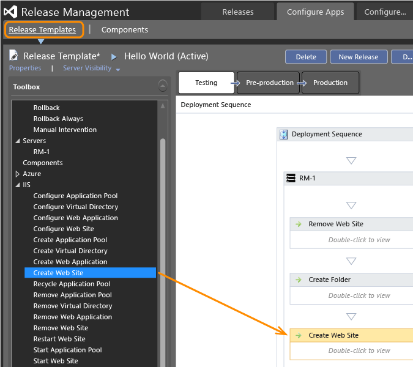

# Release Management 2013 (server and client version)

**Visual Studio 2013 | Azure Pipelines | Team Foundation Server 2013**  

Go to the **[Release Management 2013 documentation in MSDN Library](https://msdn.microsoft.com/library/dn217874%28v%3Dvs.120%29.aspx)**.

 
Go to the **[Release Management 2013 documentation in MSDN Library](https://msdn.microsoft.com/library/dn217874%28v%3Dvs.120%29.aspx)**.

