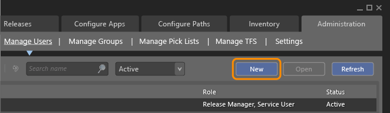
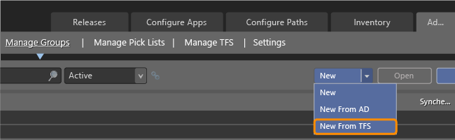
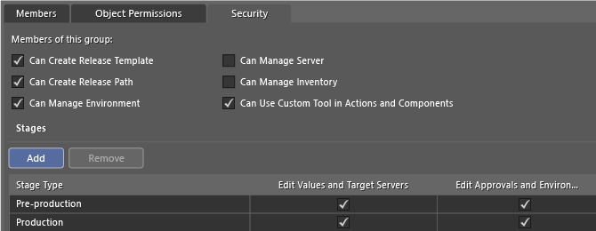
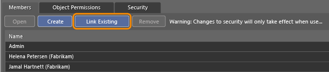

# Add users and groups, and control access to Release Management

[!INCLUDE [previous-version-header](../_shared/previous-version-header.md)]

You must add the user account of anyone who wants to set up, start, or approve
releases to Release Management. Also, you must add the service accounts that 
are used in deploying applications in your release environment. You can add 
**[individual user accounts](#add_user)** or a 
**[group of users](#add_group)** 
defined in Team Foundation Server (TFS), Active Directory (AD), or Release 
Management. Control access to release functions based on user role or group 
permissions.

All users you add, whether individually or through a group, belong to the 
**Everyone** group. By default, members of the Everyone group have access to 
all Release Management operations, including adding users and setting 
permissions.

If you want to restrict access, then you'll want to follow these steps: 

1. [Determine the groups you need](#control_access).

1. [Define these groups in TFS](https://msdn.microsoft.com/library/bb558971%28v%3Dvs.140%29.aspx) 
   or in [Active Directory](/azure/devops/server/admin/setup-ad-groups).

1. [Add the groups to Release Management, set their permissions, and change the Everyone group permissions](#add_group).

## Add an individual user or service account
 
1. If you haven't installed the Release Management client, 
   **[do that now](install-release-management/install-server-and-client.md#installclient)**.

1. If you haven't been added to the **Release Manager** role, get added now 
   from someone with that role. This role is required to manage security.

1. Open the New User page from the **Administration** | **Manage Users** tab.

   

1. Choose a user account using the ellipsis (**...**) button, and set the 
   user role.

   Do not assign any role when you want to restrict access to functional areas.
   Instead, link the user account to the group where you set permissions.

   Assign the **Release Manager** role to grant access to the following 
   functions: 

   * Manage the connection between TFS and Release Management.
   * View and edit all release paths and stages that are defined in a release path.
   * For release templates, create and edit the templates, view and edit the deployment sequence and configuration variables for all stages that are defined, and add custom tools and actions.
   * Manage servers, environments, actions, tools, and security.

## Add a group

1. Choose the type of group you want to add from the **Administration** | 
   **Manage Groups** tab.

    

   The **Manage Groups** tab is available only when you are connected to 
   Release Management Server. You cannot add groups when you are connected
   to Azure Pipelines.

1. On the **Security** tab, select the permissions that you want to enable 
   for this group.

   

1. Under **Stages**, keep the default **All Stage Types** or add one or more 
   stages.

   * **Edit Values and Target Servers**: Users in this group can edit 
     deployment sequence and configuration variables for a release or stage.
     Without this permission, stage information is read-only.

   * **Edit Approvals and Environment**: Users in this group can edit 
     approvals and environments for a stage. Without this permission, stage 
     information is read-only.

1. If you create a Release Management group (one not associated with TFS or 
   AD), link existing user accounts to be members of this group.
 
   

   Or, you can add a user account by choosing the **Create** button.

1. Edit the **Everyone** group to remove permissions to which you want to 
   restrict access.

1. Notify the users that you added. Let them know that they have to install 
   the Release Management client, or restart their client. This is required 
   for their client to register the changes in permission.

## Q&A

### Q: Who needs to be added as a user to Release Management?
  
**A**: These users: 

* Any user who needs to create, start or approve a release.
* Any user who needs to manage the release configuration, servers, 
  environment, and inventory of tools and actions used in deploying 
  applications.
* Service accounts that are used to deploy apps or manage web services.

### Q: What groups should I define to control access?

**A**: Define groups based on the restrictions you want to enforce. For 
example, you can restrict access based on one or more of the following 
functional user roles. You can define these groups in TFS, AD, or through the 
Release Management client itself: 

* **Approvers**: These users approve or validate a task or stage during a 
  release cycle. They need the **Edit Approvals and Environment** permission set 
  for all stage types that they will be required to approve.

* **Deployers**: These users will create release templates and initiate 
  releases based on the release paths created by the release architects. They 
  need the **Can Create Release Template** and **Edit Values and Target 
  Servers** permissions for all stage types.

* **Tool and action developers**: These users will add or modify tools and 
  actions. Release actions define the deployment sequence for each stage of a 
  release. Each action uses a specific tool to run a command with a set of 
  arguments. Enable these permissions for these users: **Can Manage Inventory**
  and **Can Use Custom Tool in Actions and Components**. To learn more, see 
  [Release actions to deploy an app](release-actions.md).

* **Administrators**: These users will manage the servers and security for 
  all release management operations. Enable all permissions for users in this
  group. If you add users individually, assign them to the Release Manager 
  role.
 
* **Release architects**: These users will create release paths that define 
  the deployment stages and test the design of these paths. They will also need 
  to test the release paths. Enable the following permissions:
  - **Can Create Release Template** 
  - **Can Create Release Path** 
  - **Can Manage Environment**
  - **Can Use Custom Tool in Actions and Components** 
  - **Edit Approvals and Environment** 
  - **Edit Values and Target Servers**

### Q: I don't see some tabs or UI elements. Why not?

**A**: Based on your user role or the permissions assigned to your group, some
UI elements may not appear. For example, if you do not have permissions to 
**Can Manage Inventory**, the **Inventory** tab does not display.

Similarly, if you don't have permissions to edit an object, you might be able 
to view it, but the **Save** button will be inactive. If you don't have one 
of the permissions listed in the following table, the corresponding UI element
will either be hidden or disabled. Release Managers, however, can view and 
edit all information.

| **Permission** | **UI element** |
|----------------|----------------|
| Can Create Release Template | Configure Apps - Release Template tab (hidden) |
| Can Create Release Path | New button on the Configure Paths - Release Paths tab (hidden) | 
| Can Manage Environment | Configure Paths - Environments tab (hidden) | 
| Can Manage Server | Configure Paths - Server tab (hidden) | 
| Can Manage Inventory | Inventory tab (which provides access to Actions and Tools) (hidden) | 
| Can Use Custom Tool in Actions and Components | Command and Arguments fields cannot be edited when No Tool is selected | 
| Edit Values and Target Servers | For Release Templates: If the user does not have this permission set for a stage type, the information of the Deployment Configuration and Configuration Variables tabs are read-only. For Releases: If the user does not have this permission set for a stage type, the information of the Deployment Configuration and Configuration Variables panel is read-only. | 
| Edit Approvals and Environment | All stage information is read-only | 

### Q: What happens when I deactivate a group?

**A**: Members that you add through an Active Directory or TFS group remain 
active members, even if you deactivate or delete the group. To remove these 
members, you must delete them manually from the Manage Users page.

## Related topics

* [Overview of Release Management](release-management-overview.md)
* [Install Release Management](install-release-management.md)
* [Manage your release](manage-your-release.md)
* [Release without deployment agents](release-without-agents.md)
* [Release with deployment agents](release-with-agents.md)
* [Trigger a release from a build](trigger-a-release.md)
* [Deploy continuously to Azure](deploy-continuously-to-azure.md)

[!INCLUDE [wpfver-back-to-index-shared](../_shared/wpfver-back-to-index-shared.md)]
 
[!INCLUDE [wpfver-support-shared](../_shared/wpfver-support-shared.md)]
