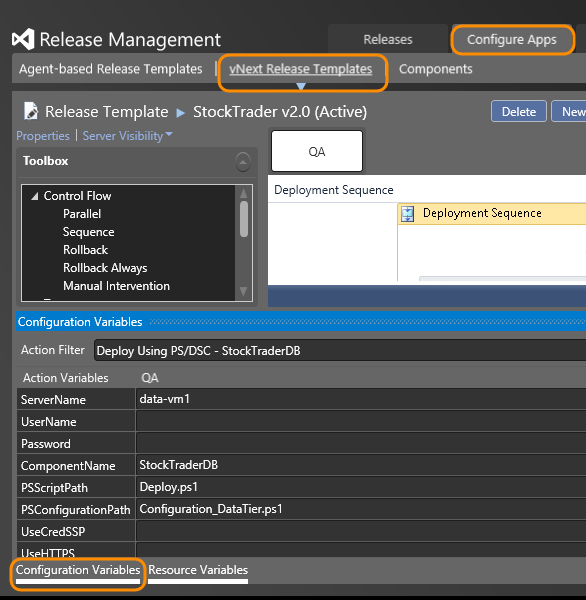
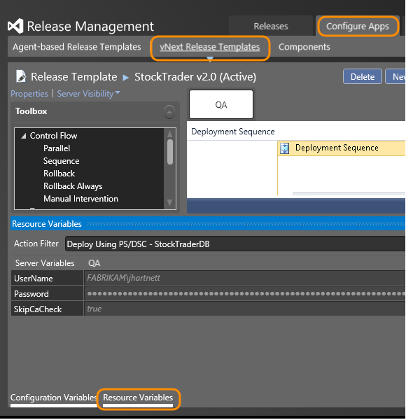
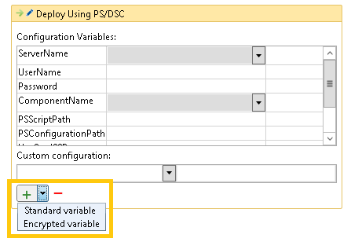
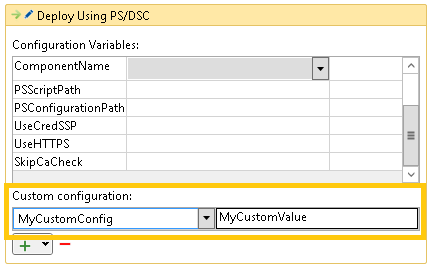
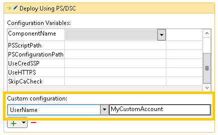

# Configuration variables and system variables

[!INCLUDE [previous-version-header](../_shared/previous-version-header.md)]

Often when you deploy your app, you need access to configuration or system 
settings for your script. That way you don't have to hardcode values in 
multiple locations when the values may change depending on a configuration, 
build, server, or release. To avoid hardcoded values, you can use 
configuration and system variables within your scripts for vNext releases.

## Configuration variables

Configuration variables provide reusable and customizable settings that are 
available during action execution. You can set configuration variables and 
default values on servers, components and globally, and then use those 
values in your PowerShell scripts and configuration scripts. And, if you 
don't want to use a default value during a deployment, you can override it.
An example for using configuration variables is setting the user name and 
password used for deploying your app on the server.

Configuration variables can be set at the global, server, component, and 
action levels.

* Global configuration variables: Set from **Administration**, **Settings**,
  **Configuration Variables**. Available everywhere.

* Server configuration variables: Set from **Configure Paths**, **Server**,
  select a server, **Configuration Variables**. Available to actions that 
  deploy your app to the server. Use for server-specific variables, such 
  as for a UserName and a Password.

* Component configuration variables: Set from **Configure Apps**, 
  **Component**, select a component, **Configuration Variables**. Available 
  to actions that use the component.

* Action configuration variables: Set within the **Release Template** designer, 
  available to the actions.

The order of precedence, from highest to lowest, when a configuration 
variable name is used in more than one level is **Configuration Script** 
file, **Action**, **Component**, **Server**, **Global**.

To manage configuration variables, in the bottom left corner of the **Release 
Templates** and **Releases** views are tabs named **Configuration Variables**
and **Resource Variables**.

The **Configuration Variables** tab shows the configuration variables in 
effect for the action, for each stage.

The **Resource Variables** tab shows the configuration variables and values 
that are set globally, for servers, and for components. (These are current 
values, not a snapshot from a previous time.) Changes to resource variables
will be in effect by in-flight releases that start a new deployment.

To add a configuration variable within an action, in the **Release Templates**
designer, open an activity, click the dropdown arrow in the **Custom 
configuration** section, and specify **Standard** or **Encrypted** for the 
type of configuration variable. (If using **Encrypted**, ensure the HTTPS 
listener is configured on the server where you deploy your app.)

Type in the name of the new variable, and provide its value.

To override a value in a resource variable, click the **+** sign and then 
click the dropdown arrow in the **Custom configuration** section. Select 
the variable to customize and provide a value.

## System variables
 
In addition to configuration settings, your script might also need access 
to system settings. For example, if your script needs to perform special 
action when you deploy your app to a Production environment, the script can 
examine the Environment variable. The following system variables are 
available:

* **ApplicationPath**: Destination path, including the component name, 
  where the component is copied.

* **ApplicationPathRoot**: Destination path where the component is copied.
  The default is C:\\Windows\\dtlDownloads. You can over-ride this value to 
  specify an alternative destination path.

* **BuildDefinition**: Build definition for the component.

* **BuildNumber**: Build number for the component.

* **Environment**: The environment for the release.

* **PackageLocation**: The source path from which the component is copied.
  For builds dropped to a Standard server, the path points to the 
  container-id. For builds dropped to Azure, the path points to the storage 
  blob GUID.

* **ReleaseId**: The ID of the release; this is assigned by Release Management.

* **ReleaseNumber**: The number of the release.

* **Stage**: The stage of the release.

* **Tag**: Tag used to group the server which is running the action.

* **TeamProject**: Project for the component.

* **TFSUrl**: TFS URL for the component.

When using configuration or system variables in scripts, prefix the variable 
name with a dollar sign (**$**). For example: **$Stage**.

Note a value could be unassigned. For example, if you are deploying your 
app to a server that wasn't grouped by a tag, the value of the **$Tag**
variable will be unassigned.

## Related topics

* [Overview of Release Management](release-management-overview.md)
* [Install Release Management](install-release-management.md)
* [Manage your release](manage-your-release.md)
* [Release without deployment agents](release-without-agents.md)
* [Release with deployment agents](release-with-agents.md)
* [Trigger a release from a build](trigger-a-release.md)
* [Deploy continuously to Azure](deploy-continuously-to-azure.md) 
 
[!INCLUDE [wpfver-back-to-index-shared](../_shared/wpfver-back-to-index-shared.md)]
 
[!INCLUDE [wpfver-support-shared](../_shared/wpfver-support-shared.md)]
