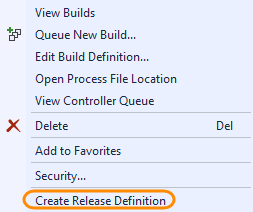
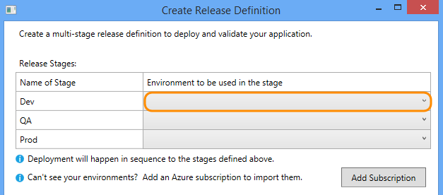
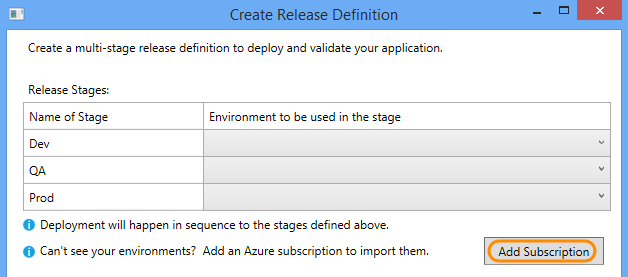
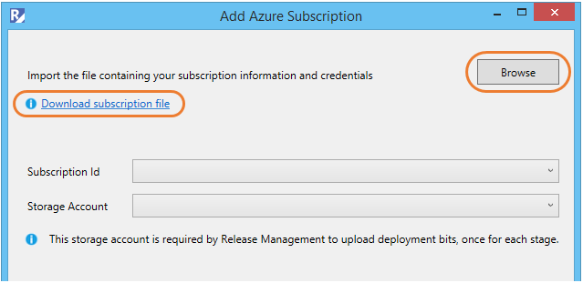
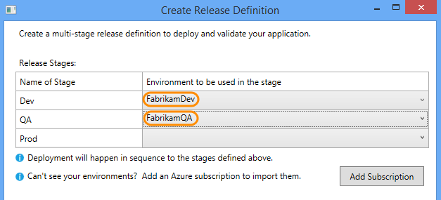
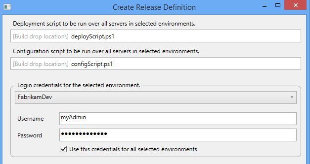
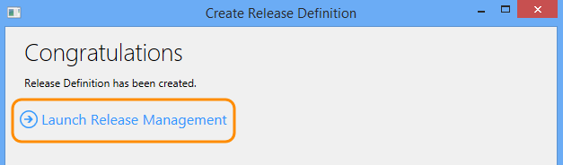
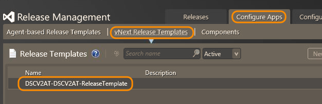
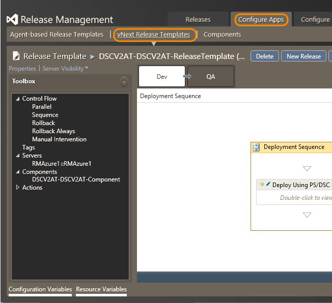

# Deploy continuously to Azure

[!INCLUDE [previous-version-header](../_shared/previous-version-header.md)]

With Visual Studio 2015 and Azure Pipelines you can easily 
set up continuous deployment to Azure VMs.

To automate your deployments, deploy the same way to multiple environments, 
and run deployment and validation scripts, follow these steps.
For less complex scenarios, such as deploying to Azure websites or cloud services, 
follow steps to set up continuous deployment from 
**[TFVC](http://azure.microsoft.com/documentation/articles/cloud-services-continuous-delivery-use-vso/)** 
or 
**[Git](http://azure.microsoft.com/documentation/articles/cloud-services-continuous-delivery-use-vso-git/)** 
instead.

Before you start, you'll need:

* **An Azure DevOps organization**.
* **A project**.
* **Azure VMs**. If you need to create them, 
  **[here's how](http://azure.microsoft.com/documentation/articles/virtual-machines-windows-tutorial/)**.
* **An Azure storage account.** Create one 
  **[here](http://azure.microsoft.com/documentation/articles/storage-create-storage-account/)**.
* **Release Management for Visual Studio extension.** To install in Visual Studio, 
  go to **Tools**, **Extensions and Updates**, and search for **Release Management for Visual Studio**.
* **A deployment script.**  Find out how to set up and check-in this script 
  **[here](http://go.microsoft.com/fwlink/?LinkId=518666)**.

## Create a release definition

Set up stages for each step you need in the release pipeline of your app, 
along with the environments. You can add stages and environments, too.

1. In Visual Studio Team Explorer, right-click a build definition and 
   choose **Create Release Definition**.

    

2. Set each stage and its environment. To skip a stage, do not set its environment.
   Dev, QA and Prod stages are created for you automatically.
 
    

3. If you don't see any environments:

   * Add an Azure subscription.

    

   * Provide Azure subscription details. If you have an Azure subscription file 
   (.publishsettings file) on your computer, you can browse to that file.
   If you do not have a local copy of this file, you can
   **[download a subscription file](https://manage.windowsazure.com/publishsettings)**.
   Once you select the file, the tool will detect all the Azure subscriptions 
   available to you and show them in the **Subscription ID** dropdown list.
   For the subscription selected, you need to provide a storage account to 
   Release Management tool where the deployment bits can be uploaded during actual deployment.

   

   * You can update to the latest VSIX by selecting **Tools** and then **Extensions 
   and Updates** and searching for **Release Management**.
    
   * Then set your environments.

    

4. Provide the path name and file name of the deployment script that you want 
   to run. Same for the configuration script, if your deployment script needs it.
   For each environment, provide the credentials for an account that has access 
   to run the script. You can use the same credentials for all environments if you want.

    

5. After you create the release definition, launch the Release Management client 
   (you'll be asked to install it if you don't have it already).

    

6. You can see your release definition in the Release Management client. If you 
   don't see it automatically, go to **Configure Apps**, **vNext Release Templates**.

   

   Each new build will trigger a release. You can also manually trigger a new release.

###Q: How can I view and customize the deployment actions for each stage of my release?

**A**: In the Release Management client, go to **Configure Apps**, **vNext Release 
Templates** and open your release template.
Learn more **[here](release-without-agents.md)**.

###Q: How can I use a different Azure Pipelines account for my releases?

**A**: In the Release Management client, go to **Administration**, **Settings**, and edit the URL.

## Related topics

* [Overview of Release Management](release-management-overview.md)
* [Install Release Management](install-release-management.md)
* [Manage your release](manage-your-release.md)
* [Release without deployment agents](release-without-agents.md)
* [Release with deployment agents](release-with-agents.md)
* [Trigger a release from a build](trigger-a-release.md)
 
[!INCLUDE [wpfver-back-to-index-shared](../_shared/wpfver-back-to-index-shared.md)]
 
[!INCLUDE [wpfver-support-shared](../_shared/wpfver-support-shared.md)]
