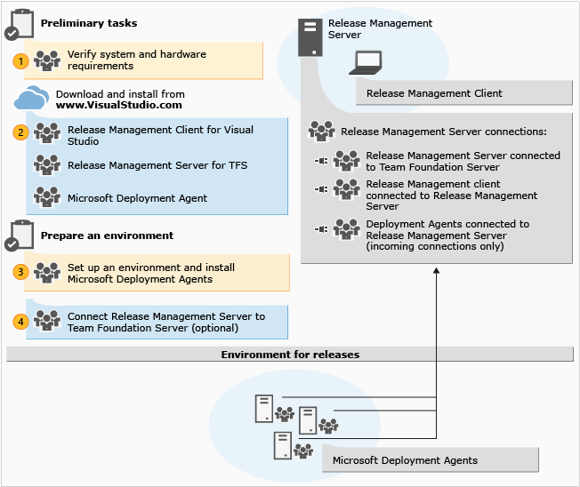
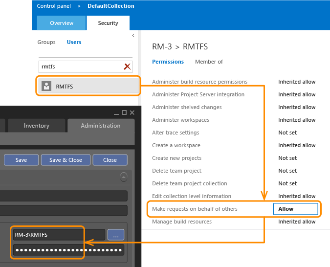

# Install Release Management server/client for VS 2015 and TFS 2015

[!INCLUDE [previous-version-header](../_shared/previous-version-header.md)]

Release Management provides a continuous deployment solution that makes release
cycles repeatable, visible, and more efficient by automating deployments 
through every environment from test to production.

To get started, install Release Management Server. If you are going to use TFS, 
you should already have it installed and ready to use. See 
**[system requirements](install-release-management/system-requirements.md)** 
for details of compatible versions. If you haven't set up TFS yet, 
**[do that now](../../../../organizations/accounts/organization-management.md)**.
You can use the same SQL Server instance for TFS and the 
Release Management server (as we will in this guide) or you can use a 
different SQL Server instance (or even 
**[install a new instance](/azure/devops/server/install/sql-server/install-sql-server)**).
Next, install Release Management Client. After the client and the server are set up, 
you'll set up the machines to deploy your app for your releases. You can 
install deployment agents on each machine. Or, you can use Windows PowerShell, 
Windows PowerShell Desired State Configuration (DSC), or Chef to deploy your 
app to machines without installing a deployment agent. To learn about how to 
do this, go **[here](release-without-agents.md)**. Finally, if you're using 
TFS, you'll connect your Release Management deployment to TFS and then you're 
ready to manage releases.

## To install Release Management and set up  an environment
 
* Verify that your operating system and hardware meet the requirements for 
  Release Management. Release Management Server requires a SQL Server 
  instance but has no dependency on using the same SQL Server instance for 
  TFS-it's just convenient. For more information, see 
  [System requirements for Release Management](install-release-management/system-requirements.md)

* If you are upgrading to the latest version of Release Management, first 
  uninstall the previous update of the Release Management server, client and 
  deployment agents. No data will be lost when you uninstall because the SQL 
  Server instance is not removed. When you configure the latest update for your Release 
  Management server, use the same SQL Server instance that you used before for 
  the database server.

* Consider your Release Management topology, especially if you will use TFS.
  You should install the server separately from 
  the application tier of the TFS server (as we will) although nothing prevents 
  you from installing the Release Management server together with TFS. If you 
  will use TFS with Release Management, you'll want to install the Release 
  Management client on a TFS build server with at least one build agent, so that
  the build server can create releases automatically as part of its execution, 
  which is especially practical for continuous integration and deployment.

* Download Release Management Server, its client, and the deployment agent from
  [VisualStudio.com](https://visualstudio.microsoft.com/downloads/download-visual-studio-vs)
  and then 
  **[install the server and client](install-release-management/install-server-and-client.md)**.

  ***Important:*** _This is a 90-day trial version of Release Management. For information about obtaining 
  a non-trial version, see 
  [How to buy Release Management](http://visualstudio.microsoft.com/products/how-to-buy-release-management-vs)
  or 
  [Release Management Licensing](http://visualstudio.microsoft.com/release-mgmt-licensing-vs).
  If you are an MSDN subscriber, you can download a non-trial version from the 
  [MSDN Subscriber website](https://msdn.microsoft.com/subscriptions/downloads/)._ 

* On computers that will make up the environments where you will deploy 
  your release, 
  **[install the deployment agent](install-release-management/install-deployment-agent.md)**.
  These computers can be test, QA, or production environments.

* In the Release Management client, you can 
  **[configure the connection](install-release-management/connect-to-tfs.md)**
  between Release Management and TFS, but this isn't necessary. You can run 
  Release Management separately from TFS. You might also want to tackle some 
  other optional tasks such as 
  **[adding team members to Release Management](add-users-and-groups.md)**, 
  or configuring an SMTP server for email notifications.

   

## Related topics

* [Overview of Release Management](release-management-overview.md)
* [System requirements for Release Management](install-release-management/system-requirements.md)
* [Install Release Management server and client](install-release-management/install-server-and-client.md)
* [Install deployment agents](install-release-management/install-deployment-agent.md)
* [Connect Release Management to TFS](install-release-management/connect-to-tfs.md)
* [Manage users, groups, and permissions](add-users-and-groups.md)
* [Manage your release](manage-your-release.md)
 
[!INCLUDE [wpfver-back-to-index-shared](../_shared/wpfver-back-to-index-shared.md)]
 
[!INCLUDE [wpfver-support-shared](../_shared/wpfver-support-shared.md)]
